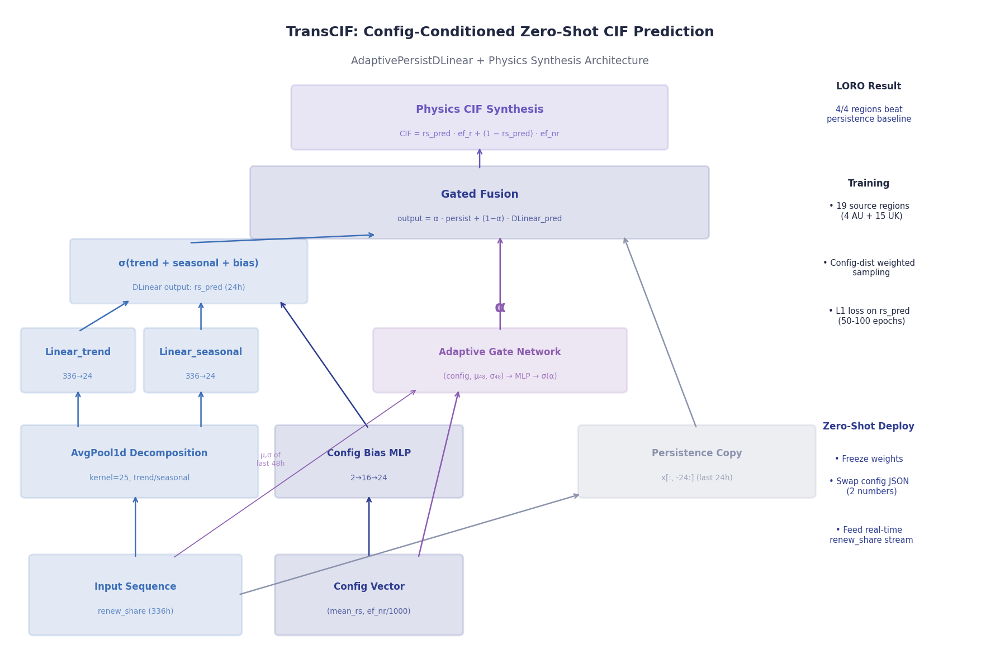
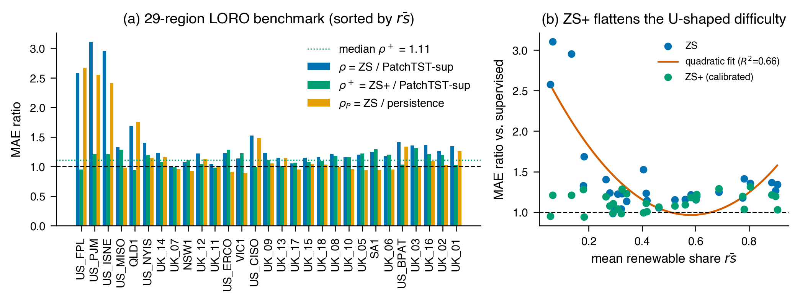
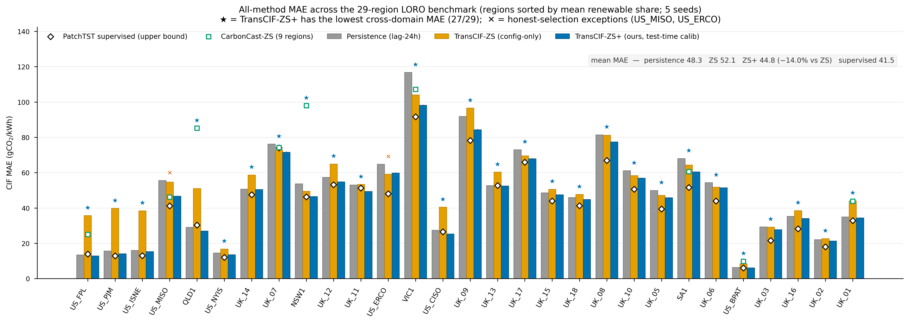
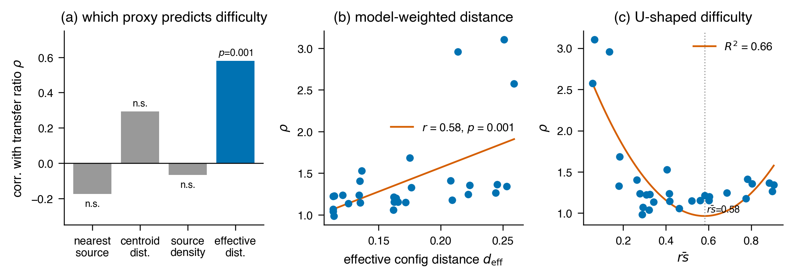
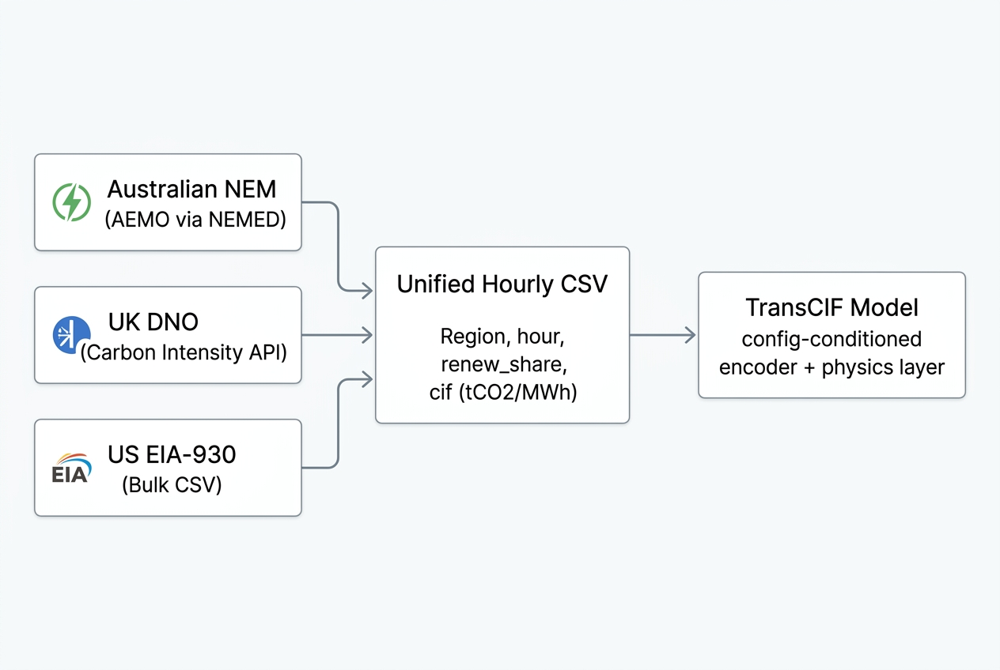

# TransCIF：零样本跨区域碳强度因子预测

[English](README.md) | 简体中文

**TransCIF** 是一个面向电力系统的零样本碳强度因子（Carbon Intensity Factor, CIF）预测系统。它仅利用目标区域公开可获取的配置标量——平均可再生能源占比和排放因子——即可预测电网级别的碳强度（tCO2/MWh），无需目标区域的任何训练数据、微调或重训练。

传统 CIF 预测方法要求各区域积累数月本地历史数据并独立训练模型，这使得最需要碳感知调度的数据稀缺地区反而被排除在外。TransCIF 通过将 CIF 分解为受区域配置条件化的可再生能源占比预测器加上闭式物理层，从根本上绕过了这一瓶颈。该工作是首个证明跨司法管辖区零样本 CIF 预测兼具可行性与实用性的方法。

<p align="center">
  
</p>

---

## 核心技术要点

**物理分解。** CIF 被表示为可再生能源占比与排放因子的线性组合（`CIF = rs × ef_r + (1-rs) × ef_nr`）。神经网络仅预测可再生能源占比，排放因子由区域配置提供。该分解引出了定理 1：CIF 预测误差等于可再生能源占比误差乘以区域特定的放大常数再加上物理残差。

**基于 Config 条件化的轻量骨干网络。** 受 DLinear 启发的线性分解编码器（约 18k 参数），以目标区域的配置（平均可再生能源占比和非可再生排放因子）作为条件信号，将预测偏置朝向目标区域。Config 加权的源区域采样使得训练聚焦于与目标域相似的区域。

**自适应持久性门控。** 根据输入波动性和配置距离，模型在其自身预测与持久性基线之间进行插值，在不熟悉的区域自动退回到安全的持久性基线。

**TransCIF-ZS+：免训练的测试时校准。** 三级闭式校正——水平锚定、物理残差校正、自验证多分支融合——利用目标区域的可再生能源占比观测流，但不更新任何模型参数。该技术将零样本 MAE 降低 14%，并在全部 29 个测试区域击败持久性基线。

**29 区域 LORO 基准。** 首个跨三个司法管辖区的留一区域零样本评估基准：4 个澳大利亚 NEM 区域、17 个英国 DNO 区域、8 个美国 EIA-930 平衡区域。

---

## 核心实验结果

| 方法 | 表现 |
|---|---|
| **TransCIF-ZS**（纯 config-only，零目标数据） | 中位迁移效率比 1.24 vs 有监督 PatchTST（零数据达到有监督约 80% 精度）；在 12/29 区域击败持久性 |
| **TransCIF-ZS+**（含测试时校准） | 中位比 1.08；**29/29 区域全部击败持久性**（中位比 0.94）；在 27/29 区域为跨域方法中最优 |
| **对比零样本 CarbonCast** | ZS+ 在 8/9 代表性区域胜出（平均比 0.73）；CarbonCast 跨域时最多退化 2.4 倍 |
| **定理 1**（误差传播恒等式） | 在 29 区域上以浮点精度验证（误差 1.3×10⁻⁴） |
| **定理 2**（迁移难度分析） | 迁移难度在可再生能源占比上呈 U 型分布（约 50–60% 处最易）；加权配置距离与零样本比率相关性 r=0.58（p=0.001） |
| **保形预测** | 在 25/29 零样本区域提供有效 90% 覆盖率，分步长分割校准 |

<p align="center">
  
  
</p>

<p align="center">
  <em>左：跨方法主要基准对比。右：29 区域逐区域 MAE 全景（覆盖澳大利亚/英国/美国）。</em>
</p>

迁移难度在可再生能源占比上呈 U 型分布，在中度占比（约 50–60%）处最易迁移。源区域与目标区域间的加权配置距离与零样本性能呈显著相关（参见定理 2）。

<p align="center">
  
</p>

---

## 数据准备

29 区域 LORO 基准覆盖三个司法管辖区。每个区域产出一份统一格式的逐小时 CSV 文件。数据文件因体积限制未纳入仓库，请使用以下脚本下载和预处理。

<p align="center">
  
</p>

### 统一 CSV 输出格式

所有下载脚本均输出到 `data_2023/` 目录，使用如下统一字段：

| 字段 | 类型 | 说明 |
|---|---|---|
| `Region` | str | 区域标识符（如 `QLD1`、`UK_01`、`US_CISO`） |
| `hour` | datetime | UTC 小时标签 |
| `nonrenew_out` | float | 非可再生出力（MW） |
| `renew_out` | float | 可再生出力（MW） |
| `total_emissions` | float | 总 CO2 排放量（tCO2） |
| `total_energy_so` | float | 总上网电量（MW） |
| `renew_share` | float | 可再生能源占比，∈ [0, 1] |
| `cif_real_tco2_per_mwh` | float | 实际碳强度（tCO2/MWh） |
| `cif_real_gco2_per_kwh` | float | 实际碳强度（gCO2/kWh） |

### 第一步：澳大利亚 NEM 区域（4 个区域）

澳洲国家电力市场数据通过 [NEMED](https://github.com/UNSW-CEEM/nemed) 生成，该工具读取 AEMO MMS DISPATCH_UNIT_SCADA 记录并使用官方排放因子计算排放量。

```bash
# 需要 Python 3.11 环境及 nemed 虚拟环境
python -m venv .venv-nemed311
source .venv-nemed311/bin/activate
pip install nemed

# 与测试夹具进行对比验证（SA1 区域）
python scripts/data/generate_nemed_regions.py --validate

# 生成全部 5 个 NEM 区域的 2023 年逐小时数据
python scripts/data/generate_nemed_regions.py --year 2023
```

生成文件：`data_2023/{QLD1,NSW1,VIC1,SA1,TAS1}_2023_hourly.csv`。TAS1 因物理上独立且非可再生排放因子为零而被排除在主要 29 区域基准之外，最终保留 4 个 AU 区域：QLD1、NSW1、VIC1、SA1。

**背景说明**：NEMED 默认查询 `now - 90 days` 时的 AEMO 机组注册信息。本脚本将查询日期固定为 `2023/12/01`，既更贴合 2023 排放计算需求，也避开了 AEMO 尚未收入 2026 注册档案的问题。

### 第二步：英国 DNO 区域（17 个区域）

英国 Carbon Intensity API 无需密钥即可免费访问，提供全部 18 个 DNO 级别区域的发电组合与强度数据。脚本以 14 天为块按半小时分辨率抓取，再聚合为逐小时数据。

```bash
python scripts/data/download_uk_regions.py
```

生成文件：`data_2023/UK_{01..18}_{name}_2023_hourly.csv`。区域 ID 18（英国全国）为各 DNO 区域的汇总，因此排除出基准，最终保留 17 个 UK 区域。可再生分类包括：风能、太阳能、水电、核电和生物质。

### 第三步：美国 EIA-930 区域（8 个区域）

[EIA-930](https://www.eia.gov/electricity/gridmonitor/) 数据集提供美国各平衡区域的按燃料类型逐小时发电量。脚本下载两份半年度批量 CSV，合并后使用 IPCC/EPA 燃料排放因子计算 renew_share 和 CIF。

```bash
python scripts/data/download_eia930_data.py
```

生成文件：`data_2023/US_{CISO,PJM,MISO,ERCO,ISNE,NYIS,FPL,BPAT}_2023_hourly.csv`，涵盖 8 个主要美国电网区域。各燃料类型排放因子（煤=980、天然气=410、石油=650 gCO2/kWh）来自 EPA eGRID 2022 和 IPCC AR6。脚本末尾会打印各区域估算的 ef_nr 值，供后续配置地区参数时使用。

### 数据校验

下载完三个数据源后，运行统一校验以确认数据完整性：

```bash
python scripts/verify/validate_us_data.py
```

该脚本加载所有区域，打印排序后的汇总表（区域、mean_rs、ef_nr、小时数、mean_CIF），并在 US 目标区域上运行快速零样本评估以验证数据管线端到端正常工作。

### 可选：温度数据

模型支持可选的温度异常通道以提升精度。可在主数据目录旁放置含 `(hour, temperature_c)` 列的温度 CSV 文件，数据来源推荐 [Open-Meteo](https://open-meteo.com/) 历史天气存档中每个区域的代表性城市。该通道使用尺度不变表示（相对于同日期的气候基线异常值，而非绝对摄氏度），因此不破坏跨区域迁移能力。

---

## 快速开始

### 环境要求

- Python 3.10+
- PyTorch 2.2+
- NumPy 1.26+
- Pandas 2.2+

### 安装

项目以可编辑包（`src/transcif`）安装，这样任意脚本或测试都能直接 `import transcif`。

```bash
cd transcif
python -m venv .venv
source .venv/bin/activate
pip install -e .

# 若还需运行澳洲 NEM 数据生成器：
pip install nemed nemosis nempy
```

依赖在 `pyproject.toml` 中声明。测试使用 `pythonpath = src`（在 `pytest.ini` 中配置）。

### 基础使用

快速评估（4 个澳洲区域，3 种子）：

```bash
source .venv/bin/activate

# 快速版：4 个 AU 区域，3 种子
python scripts/benchmark/run_unified_eval.py --quick

# 完整版：29 区域，5 种子
python scripts/benchmark/run_unified_eval.py

# 开启各研究方向对比
python scripts/benchmark/run_unified_eval.py --quick --phys-irm --causal

# 单方向独立实验
python scripts/experiments/run_phys_irm_eval.py --quick
python scripts/experiments/run_causal_eval.py --quick
python scripts/experiments/run_rag_eval.py      # 检索增强
python scripts/experiments/run_icl_eval.py      # 上下文学习
python scripts/experiments/run_hier_eval.py     # 层级去偏
```

> **注意**：训练管线需要 `data_2023/` 目录下的 2023 年逐小时数据文件。限于体积未纳入仓库，可通过 `scripts/data/download_*.py` 系列脚本从 AEMO、National Grid ESO 和 EIA-930 获取数据。

> **说明**：所有入口脚本均从仓库根目录运行。`transcif` 包通过可编辑安装（`pip install -e .`）或 `pytest.ini` 中的 `pythonpath = src` 自动可发现，无需手动设置 `PYTHONPATH`。

---

## 项目结构

```
transcif/
├── src/transcif/               # 已安装的 Python 包（pip install -e .）
│   ├── config/                 # 全局常量与区域配置（SEQ_LEN、HORIZON、regions、seeds）
│   ├── data/                   # 数据加载（discover_uk_regions、load_region_data、windows、quality）
│   ├── physics/                # 物理层（cif_from_shares）与定理 1/2 边界
│   ├── models/
│   │   ├── base.py             # 模型库（AdaptivePersistDLinear、PatchTSTFixed、registry）
│   │   ├── patchtst.py         # 有监督 PatchTST 基线
│   │   └── zeroshot/           # 研究方向模块
│   │       ├── base_zs.py      # 基线 ZS / ZS+ 训练与 evaluate_target
│   │       ├── rag.py          # 检索增强
│   │       ├── phys_irm.py     # 物理 + IRM
│   │       ├── causal.py       # 因果域 VAE
│   │       ├── icl.py          # 上下文学习
│   │       └── hier.py         # 层级去偏
│   ├── calibration/            # ZS+ 分支融合（zs_plus）与保形预测
│   ├── evaluation/             # compute_metrics（MAE/RMSE/sMAPE）
│   └── training/               # 调度器、损失（ramp/huber）、数据增强
├── scripts/                    # 一次性入口脚本，按职责分组
│   ├── data/                   # 下载器：uk、eia930、nemed
│   ├── verify/                 # theorem1/2、validate_us_data、verify_paper_numbers
│   ├── figures/                # make_*_figures、carboncast_analysis
│   ├── benchmark/              # 跨方法 / 29 区域对比与基线（专门做测试）
│   │   ├── run_unified_eval.py        # 主 benchmark 编排器（29 区域 × 5 种子）
│   │   ├── run_supervised_baselines.py / _v2.py
│   │   ├── conformal_prediction.py     # 保形预测校准
│   │   ├── ablation_study.py
│   │   ├── temporal_ood.py
│   │   ├── optimize_weak_regions.py
│   │   └── run_downstream_chain.sh
│   └── experiments/            # 单方向运行与诊断
│       ├── run_{rag,phys_irm,causal,icl,hier}_eval.py
│       ├── run_phase1_complete.py
│       ├── probe_*.py
│       └── deployment_warmup.py
├── tests/                      # pytest 测试套件（config、physics、data、models）
├── docs/                       # 文档（paper、research、experiments、theory）
├── results/                    # 实验结果（JSON + 日志）
├── figures/                    # 论文图表（PNG + PDF）
├── pyproject.toml              # 包声明 + 依赖 + pytest 配置
├── pytest.ini
├── README.md                   # 英文文档
└── README_zh.md                # 中文文档（本文件）
```

> 可复用的库代码现已统一放在 `src/transcif/`（以 `transcif` 导入）；`scripts/` 仅保留可运行的入口脚本。原先平铺的 `transcif_*.py` 模块已并入该包。

---

## 核心数据流

```
输入：可再生能源占比时间序列 + 目标区域配置 (mean_rs, ef_nr)
         ↓
  趋势/季节分解
    AvgPool(25) → trend | x - trend → seasonal
         ↓
  Config 条件化 DLinear
    Linear(trend) + Linear(seasonal) + MLP_config_bias → sigmoid
         ↓
  自适应持久性门控
    gate = σ(MLP(config, recent_mean, recent_std))
    output = gate × persistence + (1 − gate) × model
         ↓
  物理层
    CIF = 预测占比 × ef_可再生 + (1 − 预测占比) × ef_非可再生
         ↓
  TransCIF-ZS+（可选测试时校准，模型冻结）
    水平锚定 → 物理残差校正 → 多分支融合 → 保形预测区间
```

---

## 运行测试

```bash
pytest
```

测试位于 `tests/` 目录，通过 `pytest.ini` 配置 `pythonpath = src`。

---

## 引用

若您在研究中使用了 TransCIF，请引用：

```bibtex
@article{transcif2026,
  title   = {Zero-Shot Cross-Region Carbon Intensity Forecasting
             via Config-Conditioned Physics Decomposition},
  author  = {TransCIF Authors},
  journal = {arXiv preprint},
  year    = {2026}
}
```

论文草稿位于 `docs/paper/` 目录（含中英文版本）。

---

## 许可证

本项目用于学术研究目的，详见 `LICENSE.md`。
