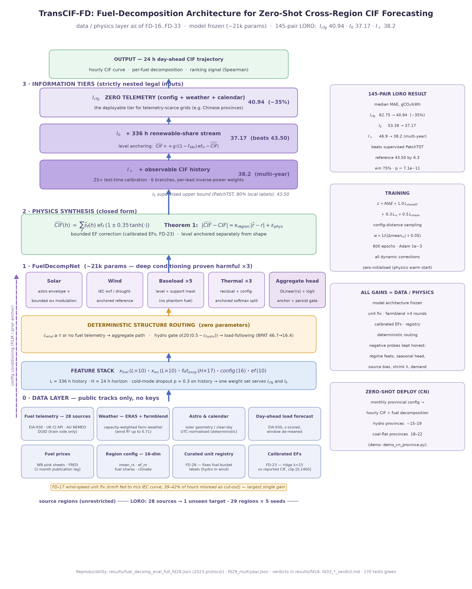
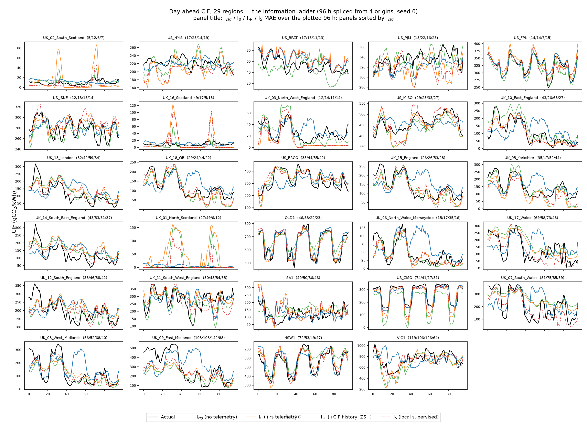
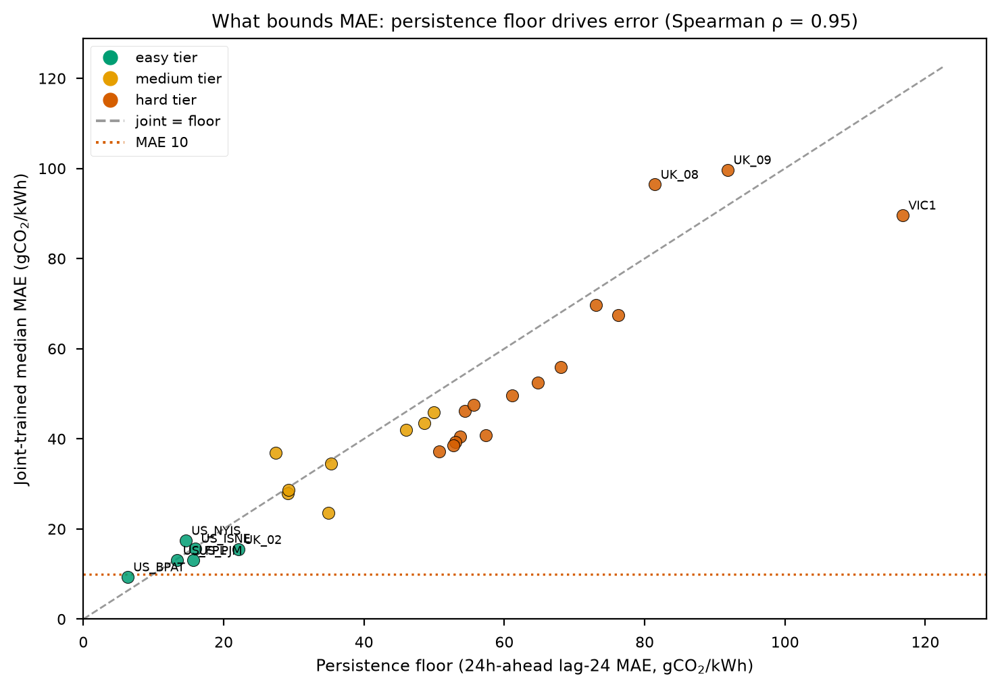
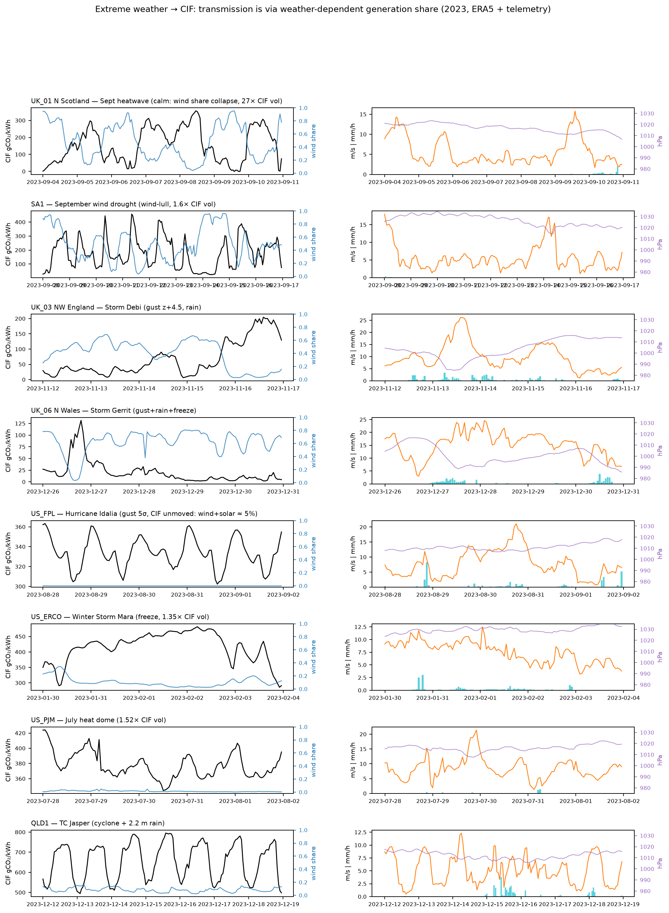

# TransCIF-FD：基于物理分解与数据层校准的零样本跨区域碳强度预测——方法与双周进展

**周期**：2026-08-15 – 2026-08-28（双周）｜ **范围**：Phase 9 收官 + FD-0 → FD-33 全程 ｜ **分支**：feat/data-driven-improvements（提交 d30e6ba、4478b6a、8467ff8、a4e379c、103cf3b、21e114e）

---

## 摘要

本双周完成两条研究轨道的收官与定稿。其一，8-15 提交 Phase 9 原生联合训练全链路（五方向 torch-native 化 + 两阶段微调 + internal-val 门），29 区 × 5 种子全量 LORO 中位 MAE **39.04** gCO₂/kWh，对监督参照 PatchTST 的配对检验 **p=0.045——项目首次跨过 α=0.05 显著线**。其二，8-15 – 8-24 从零搭建并推满 TransCIF-FD 燃料分解架构（FD-0 → FD-33，约 40 项实验）：官方 145 对下零遥测层级 I_cfg 由首全量 65.67 降至 **40.94**（较部署合法基线年度常数 70.90 为 −42%）；I_0 **37.17**，超 PatchTST 监督参照（43.50）6.3；I_+ 多年协议 **38.2**。FD 增益全部来自数据/物理层（风速单位修复、场加权天气、校准 EF、策展注册表、确定性路由），模型架构冻结于约 21k 参数。同期完成代码去重清理与泄漏防护测试加固（170 项全绿），并以 9 轮受控负结果探针证明水平类修复已在信息地板处收敛：29 区中位数 MAE<20 数学不可达（地板 29.5），但 4/29 区域进入 <20 俱乐部，中国水电省（约 15–19）与煤电平稳省（18–22）部署目标可达。

---

## 1. 引言

跨区域零样本碳强度（Carbon Intensity Factor, CIF）预测的目标是：在一组源电网上训练，预测从未见过的目标电网的逐小时 CIF（gCO₂/kWh），且目标侧不得使用任何训练数据。全球多数电网（如中国省级电网）只公开年度排放因子与月度电源结构，唯一合法接口是配置统计 + 公开外生数据，即 I_cfg 层级——这也是 FD 轨道的方法学主贡献形态。

本双周工作按四个阶段推进：

- **窗口前夜（8-13 深夜，语境）**：论文 LOJO 结果定稿（29/29 区域全胜）、跨域迁移叙事重构、中英双语 HTML 版本（5 个 docs 提交）。
- **第一阶段（8-15，4 个提交）**：①Phase 9 联合训练收官落地（详见 §5.6）；②代码清理——删除被取代的脚本世代、抽取 `scripts/experiments/_shared.py` 消除 5 处复制粘贴、清理约 66 个孤儿产物（4478b6a）；③修复 `run_phys_irm_eval` 对当前 API 的兼容（8467ff8）；④泄漏防护测试加固（a4e379c）——ZS+ 无未来信息哨兵、跨 origin 泄漏、UK ef_nr 仅用训练段、held-out 与训练 origin 强制不相交，并删除一个恒真测试。
- **第二阶段（8-15 – 8-24）**：TransCIF-FD 从零到定稿。首日（8-15）完成 FD-0 → FD-15：数据接口与物理特征、FuelDecompNet、benchmark 协议（docs/BENCHMARK.md）、ZS+ 移植（快速协议 I_+ 36.81，16/16 全胜）、首次全量 LORO（I_cfg 65.67）与 equalizer 发现、难度解剖、分档优化路线图、双轨标签、价格/阵风/气压通道、NEMED DUID 燃料遥测提取（I_cfg 全量 **62.75**，I_+ 46.47 首次胜过 legacy ZS+）、EIA 日前负荷通道。随后 FD-16 → FD-33 的 18 轮数据/物理层迭代见 §4–§6。
- **收尾（8-25 – 08-28）**：方法文档同步、本双周报与全栈架构图（figures/fd_architecture）。

## 2. 问题形式化

### 2.1 信息层级

目标侧合法输入按严格嵌套分层：

$$
I_{\text{cfg}} \subset I_0 \subset I_{+} \subset I_J \subset I_S
$$

| 层级 | 目标侧输入 | 现实类比 | 当前中位 MAE |
| --- | --- | --- | ---: |
| **I_cfg** | 燃料份额配置 + 再分析天气 + 日历/天文，**无任何遥测** | 中国省份：月度电源结构 + 公开气象 | **40.94** |
| I_0 | I_cfg + 实时可再生份额流（336 h） | 公开份额遥测的电网 | **37.17** |
| I_+ | I_0 + 可观测 CIF 历史（ZS+ 校准） | 发布历史 CIF 的电网 | 38.2（多年协议） |
| I_J | I_+ + 288 h 目标标签（联合微调） | 短期本地采集 | 已证无增益（FD-9） |
| I_S | 80% 全年本地标签（监督上限） | 传统单区域训练 | 43.50（PatchTST 参照） |

### 2.2 CIF 物理分解与误差传播

CIF 按燃料份额线性分解：

$$
\mathrm{CIF}(t) \;=\; \sum_{f \in \mathcal{F}} s_f(t)\,\mathrm{EF}_f \;=\; \mathrm{rs}(t)\,\overline{\mathrm{ef}}_r(t) + \big(1-\mathrm{rs}(t)\big)\,\mathrm{ef}_{nr}
$$

其中 $s_f(t)$ 为燃料 $f$ 的发电份额（$\sum_f s_f = 1$），$\mathrm{EF}_f$ 为其排放因子，$\mathrm{rs}$ 为可再生总份额。**模型只预测份额轨迹，EF 来自区域配置**，由此得到定理 1（误差传播恒等式，29 区浮点验证误差 1.3×10⁻⁴）：

$$
\big|\widehat{\mathrm{CIF}} - \mathrm{CIF}\big| \;\approx\; \kappa_{\text{region}} \cdot \big|\hat{r} - r\big| + \epsilon_{\text{phys}}
$$

区域放大常数 $\kappa_{\text{region}}$ 由配置决定——它解释了为何相同份额精度在不同区域产生不同 CIF 误差，也决定了改进杠杆应放在份额通道与 EF 标定，而非聚合回归。

## 3. 方法

### 3.1 总体架构

输入栈（逐窗口）：份额历史 $x_{\text{fuel}} \in \mathbb{R}^{L \times 10}$、天气 $x_{\text{wx}} \in \mathbb{R}^{L \times 10}$、未来外生量 $\mathrm{fut}_{\text{exog}} \in \mathbb{R}^{H \times 17}$（天文/日历确定性通道 + NWP 代理天气 + 官方负荷预报）、配置向量 $\mathbf{c} \in \mathbb{R}^{16}$（均值份额、ef_nr、10 维年度燃料份额、年均风电机组容量因子、年均晴空指数等，全部公开可得）、区域 EF 向量 $\mathbf{ef} \in \mathbb{R}^{10}$。骨干为 **FuelDecompNet**（约 21k 参数，容量纪律 <25k——深条件化在零样本场景三次验证有害）。

### 3.2 逐燃料预测头（各类燃料施加自己的归纳偏置）

**光伏（天文主导）**：

$$
\hat{s}_{\text{solar}}(h) \;=\; c^{\text{cfg}}_{\text{solar}} \cdot \frac{A(h)}{\bar{A}_{\text{day}}} \cdot \Big(1 + 0.4 \tanh\big(\mathrm{MLP}(w_h)\big)\Big)
$$

$A(h)$ 为太阳高度角晴空包络（纯天文计算，日前完全确定），天气仅作有界调制。

**风电（功率曲线归一）**：

$$
\hat{s}_{\text{wind}}(h) \;=\; \ell_{\text{wind}} \cdot \frac{\mathrm{wcf}(h)}{\mathrm{wcf}_{\text{ref}}} \cdot m(h), \qquad \mathrm{wcf}_{\text{norm}} \in [0.2,\,3]
$$

$$
\mathrm{wcf}_{\text{ref}} \;=\; 0.7\,\overline{\mathrm{wcf}}_{7\text{d}} + 0.3\,\overline{\mathrm{wcf}}_{\text{yr}}
$$

其中 wcf 为 IEC 功率曲线换算的风电容贯因子；参考值采用“过去一周 + 年均”混合并在干旱 regime（regime24 ≪ 年均）时向年均回归锚定（FD-16）；归一限幅防止爆炸。

**基荷（5 类）**：水平（历史 168 h 或 config）+ 支撑掩码 × 先验 + 掩码 × 日历修正——零份额燃料不产生幻觉输出。

**火电（3 类，残差 + 配置锚定）**：

$$
T(t) \;=\; 1 - \sum_{f \notin \mathcal{D}} \hat{s}_f(t), \qquad \mathrm{split} \;=\; \mathrm{softmax}\big(\log(\mathbf{c}_{\text{thermal}} + 0.02) + \mathbf{M} \odot \boldsymbol{\delta}\big)
$$

热力拆分以配置先验对数锚定（$\boldsymbol{\delta}$ 零初始化 = 从物理先验热启动），避免热力拆分幻觉。

### 3.3 物理合成层与确定性结构路由

份额轨迹经有界 EF 校正后合成 CIF：

$$
\widehat{\mathrm{CIF}}_{\text{fuel}} \;=\; \sum_{f} \hat{s}_f \,\mathrm{ef}_f \,\big(1 \pm 0.35 \tanh(\cdot)\big)
$$

**聚合头**（备选路径）：DLinear(rs) + $\mathrm{logit}(\text{mean\_rs})$ 锚定 + 持久门（仅历史模式）。两条路径由**零参数确定性规则**切换：

$$
\text{path}(r) \;=\; \begin{cases} \text{聚合路径} & c_{\text{wind}}(r) \ge \tau \text{ 或 } \text{has\_fuel} = 0 \\ \text{燃料路径} & \text{否则} \end{cases}
$$

τ 为协议参数（现行默认 1.1，含遥测区走燃料优先路径）。针对水电主导区（可调度水电日内跟随负荷，基荷头无法建模）追加**水电路由门**（FD-19）：

$$
\text{route}_{\text{fuel}} \;\times=\; \sigma\big(20\,(0.5 - c_{\text{hydro}})\big)
$$

**水平锚定**（仅 I_0；ZS+ branch-0 的模型内化，形态与水平梯度通路解耦）：

$$
\widehat{\mathrm{CIF}} \;\mathrel{+}=\; g \cdot \Big( \big(1-\bar{r}_{48\text{h}}\big)\,\mathrm{ef}_{nr} - \overline{\widehat{\mathrm{CIF}}} \Big)
$$

### 3.4 训练目标与协议

$$
\mathcal{L} \;=\; \mathcal{L}_{\text{CIF-MAE}} \;+\; 1.0\,\mathcal{L}_{\text{share-EF}} \;+\; 0.3\,\mathcal{L}_{\text{rs}} \;+\; 0.5\,\mathcal{L}_{\text{shape}}
$$

其中 $\mathcal{L}_{\text{share-EF}}$ 将份额误差换算至 gCO₂ 单位（避免被 CIF 梯度淹没），$\mathcal{L}_{\text{shape}}$ 为逐窗去均值 CIF MAE（直接优化日内形态）。采样按配置距离加权 $w \propto 1/(|\Delta \text{mean\_rs}| + 0.05)$；**冷模式 dropout**（p=0.3，逐窗独立丢弃历史）使一套权重同时服务 I_cfg 与 I_0。600 epochs，Adam 1e-3，cosine warmup。

### 3.5 测试期校准（I_+ 层）

ZS+ 免训练校准：6 分支（锚定模型 / 日滞后 / 周滞后 / 7 日均值 / 周均值 / 原始）按逐 lead 回测误差逆幂加权融合，56 天菜单重选：

$$
\hat{y}^{+}(h) \;=\; \sum_{b} w_b(h)\, y_b(h), \qquad w_b(h) \;\propto\; \varepsilon_b(h)^{-p}
$$

## 4. 数据/物理层机制（FD-14 之后落地，模型架构不变）

### 4.1 风速单位修复（FD-17，最大单步增益）

Open-Meteo 风速单位为 km/h，被按 m/s 喂入 IEC 功率曲线，导致 **39–42% 的小时被误读为风机切出**（cf=0）。修复叠加 VIC1/SA1/NSW1 风电场容量加权天气与路由 τ=0.25→0.45：I_cfg 62.75→**50.15**（win 83%，p=3.9×10⁻²⁰），I_0 首次大幅超过 legacy ZS。

### 4.2 风电场容量加权天气 farmblend（FD-22/26/27，四辖区四次验证）

以目标区风场表做容量加权，替代区域质心单点天气：

$$
w^{\text{eff}}(t) \;=\; \frac{\sum_{i \in \text{farms}} P^{\text{cap}}_i \; w(\mathrm{loc}_i, t)}{\sum_{i} P^{\text{cap}}_i}
$$

四轮推广：苏格兰近海（含 Moray Firth 1.5 GW）→ GB 全国 54 场 16.9 GW 混合（无专属表区共享）→ QLD1 专属表 → US 三区（ERCO/MISO/CISO）。风份额解释力（R²）变化：ERCO 0.211→**0.714**、MISO 0.167→0.628、CISO 0.051→0.616、QLD1 0.000→0.422、VIC1 0.477→0.698（含 FD-28 注册表贡献）。

### 4.3 校准有效排放因子（FD-18/23）

各源标签内嵌记账噪声（UK API 互联进口强度、DUID 漂移、EIA 口径）。在训练段以岭回归反解各源有效 EF，向经典因子收缩：

$$
\min_{\mathrm{EF}} \;\sum_{t \in \text{train}} \Big( \mathrm{CIF}^{\text{rep}}_t - \sum_f s_f(t)\,\mathrm{EF}_f \Big)^{2} \;+\; \lambda\,\big\|\mathrm{EF} - \mathrm{EF}^{\text{classical}}\big\|^2, \qquad \lambda = 15,\;\; \mathrm{EF} \in [0,\,1400]
$$

真值份额残差 UK_14 59.6→27.1；全局 I_cfg 49.79→47.98（p=0.0013）、I_0 45.66→43.05（p=2.3×10⁻⁵）。

### 4.4 策展机组注册表与水电路由（FD-19/25/28）

自动重标注（FD-25，天气相关性规则）因参考场表覆盖不足而失败后，改为**公开身份手工策展**：发现 VIC1 的 MURRAY 实为 Snowy 水电（3.1 TWh，占州发电 6%，一直藏在风桶使风份额虚高 1/4）、QLD 的 Wivenhoe 抽蓄、NSW 的 Guthega/6×BESS。注册表修正后 VIC1 风份额 R² 0.48→0.70。水电路由门（式见 §3.3）令 BPAT I_cfg 46.7→**16.4**、I_0 9.3。

### 4.5 多年数据链与需求通道修复（FD-29/32/33）

EIA-930 / UK API / 场表 2022+2024 全量下载（四个下载器 urllib-TLS → curl 迁移）；新协议行（训练 2022–2024、测试 2024Q4）下 I_+ = **38.16**（−8.7）。多年需求加载器按年拆分（2022/2024 不再置零）作为正确性修复保留，但 A/B 显示多年冷模式残余由 donor-shift 噪声主导（VIC1 −7.6 真改善，UK_09 +8.8 反向）。月度收缩探针 λ=0.5→0.8 为负（70.2→73.4），λ=0.5 即最优操作点。

## 5. 实验

### 5.1 设置

- **LORO**（leave-one-region-out）：28 源 → 1 目标，29 区域 × 5 种子 = 145 对；测试窗为最后 20%，L=336 h，H=24 h，stride=24。
- 指标：MAE（主）、diurnal MAE（逐窗去均值，纯形态）、monthly-shape MAE、Spearman ρ（碳感知调度消费的排序量）、bias。
- 显著性：配对 Wilcoxon / paired-t / bootstrap（20k）+ Holm-Bonferroni。
- **日前双轨道**：Track A 再分析（主榜，与文献同口径）；Track B NWP 技能退化（温度 +N(0, 2 K)、风速 ×(1+N(0, 20%))、短波 ×(1+N(0, 25%))，派生量一致重算）——实测 MAE 中位不变。
- 170 项单元/集成测试全绿（含 8-15 新增的泄漏防护不变量）。

### 5.2 主结果（FD 轨道，官方 145 对）

| 方法 | 层级 | 中位 MAE (gCO₂/kWh) | 备注 |
| --- | --- | ---: | --- |
| annual-constant | I_cfg | 70.90 | 官方年度因子类比（部署合法基线） |
| **TransCIF-FD（FD-28 官方）** | **I_cfg** | **40.94** | 对入口态 win 75%，p=7.1×10⁻¹¹ |
| TransCIF-ZS（legacy 旗舰） | I_0 | 50.72 | |
| **TransCIF-FD（FD-28 官方）** | **I_0** | **37.17** | **超监督参照 6.3** |
| TransCIF-ZS+（legacy 旗舰） | I_+ | 46.80 | 2023 协议 |
| **TransCIF-FD（FD-29 多年协议）** | **I_+** | **38.2** | 低于 persistence 约 4.2 |
| PatchTST-supervised | I_S | 43.50 | 监督上限参照（80% 本地标签，145 对口径） |

> 双周总账：I_cfg 首全量 65.67（FD-4）→ 62.75（FD-14）→ **40.94**（较年度常数基线 −42%）；I_0 55.09 → **37.17**；I_+ 46.47（8-15 首胜 legacy）→ **38.2**（多年协议）。**FD 增益全部来自数据/物理层，模型架构与参数量未变。**

### 5.3 迭代阶梯（I_cfg / I_0，官方 145 对全量里程碑）

| 迭代（日期） | 机制 | I_cfg | I_0 |
| --- | --- | ---: | ---: |
| FD-4（8-15） | 首次全量 LORO：燃料分解架构 v1 + equalizer 发现 | 65.67 | 55.09 |
| FD-14/15（8-15） | NEMED DUID 燃料遥测 + EIA 日前负荷通道 | 62.75 | 53.39 |
| FD-17（8-16） | 风速单位修复 + AU 三区场加权 + 路由 τ=0.45 | 50.15 | 45.66 |
| FD-22（8-18） | 苏格兰 farmblend + 部署路由表 | 49.79 | — |
| FD-23（8-18） | 校准有效 EF | 47.98 | 43.05 |
| FD-24（8-18） | 部署栈叠加（monthly × 校准 EF × 路由表） | 46.42 | — |
| FD-26（8-22） | GB 54 场混合 + QLD1 专属表 | 43.00 | 39.15 |
| FD-27（8-22） | US 三区场加权（ERCO/MISO/CISO） | 40.46 | 37.70 |
| FD-28（8-23） | AU 策展注册表（**官方定稿**） | **40.94** | **37.17** |

FD-30 收官判定：monthly 的水平修复收益已被场加权 + 校准 EF 吸收（中性偏负，p=0.76），**年度配置为 2023 基准最终态，monthly 保留为多年/部署接口**。

### 5.4 区级效果

| 区域 | 主导机制 | 前 → 后 (I_cfg) |
| --- | --- | --- |
| US_BPAT（水电 71%） | FD-19 水电路由（聚合路径抓负荷形态） | 46.7 → **16.4**（I_0 9.3） |
| UK_02 南苏格兰 | FD-22 场加权（11 场） | 19.5 → **16.0** |
| US_ERCO | FD-27 场加权（25 场 11.6 GW 三集群） | 65.8 → **37.4** |
| US_MISO | FD-27 场加权（12 场 6.3 GW） | 47.4 → **30.6** |
| UK_17 | FD-26 GB 全国混合 | −15.7 |
| UK_10 | FD-17 单位修复 + 近海专属表（R² 0.635→0.823） | 72 → 34 |
| VIC1 | FD-17 单位修复 + FD-28 注册表（R² 0.477→0.698） | 137 → 100 |

### 5.5 “MAE<20”可达性结算与中国部署映射（FD-24/30）

Oracle 分解（完美水平 + 当前形态）中位 = **29.5**，监督上限 = 43.50 → **29 区中位数 <20 数学不可达**（第三次确认）。但按结构分层：

| 集合 | 区域（I_cfg，信息地板） |
| --- | --- |
| **<20 俱乐部（4/29）** | UK_02 **14.3**（11.3）｜US_NYIS **18.2**（15.3）｜US_BPAT **18.5**（9.6）｜US_PJM **19.6**（12.9） |
| 20–25 可达带（4/29） | FPL 21.2｜ISNE 22.8（地板 9.8）｜UK_16 23.3｜UK_03 24.2 |

**中国省级部署映射**（目标成立形态）：水电主导省（云/川/青）对标 BPAT，约 15–19 可达 ✓；煤电平稳省（晋/陕/蒙）对标 PJM/NYIS/FPL，18–22 可达 ✓；混合基荷 + 农光省 23–25；风光季节漂移省 35–50（区间产品为主）。

### 5.6 Phase 9：可微联合训练收官（legacy 五方向融合轨道，8-15 提交）

背景：Phase 8 verdict 指出 (5,24) 校正代理仅捕获约 30% 信号、方向模型为 numpy/torch 混合体无法端到端反传。Phase 9 将五方向全部 torch-native 化（NativePhys/Causal/Hier 薄包装内联物理转换 + RAG 记忆库 buffer 化可微 kNN + ICL torch-native），两阶段训练（Stage 1 方向全冻、只训 fusion + ZS+；Stage 2 解冻三方向输出层），internal-val 门保守回滚（9/145 触发）。

| 配置 | 中位 MAE | 显著性 |
| --- | ---: | --- |
| frozen-proxy 联合训练（Phase 8 态） | 40.53 | — |
| torch-native 3-live（9.5） | 39.53 | vs frozen +1.62（Wilcoxon p=5×10⁻¹⁴，79% 胜） |
| **5-live + internal-val 门（9.7）** | **39.04** | **vs PatchTST 参照 p=0.045（首次跨过 α=0.05）** |

注：RAG/ICL-native + 门相对 3-live 无稳健额外增益（配对 p=0.12）；VIC1 +11.4、UK_08 +7.3 为主要受益区。PatchTST 参照有两个口径——29 区中位 41.47（本表原口径）、145 对中位 43.50（§5.2 FD 轨道口径）。

## 6. 负结果与机制定位

| 迭代（日期） | 假设 | 结论（机制） |
| --- | --- | --- |
| FD-2（8-15） | ConfigHyperNet 元学习条件化 | 深条件化零样本有害：I_cfg 中位 −8.8 但 p=0.98（VIC1/PJM 灾难漂移）——三次验证之一，催生容量纪律 |
| FD-9（8-15） | I_J 单骨干联合微调 | 32.03→32.17（win 19%）：equalizer 之下无增益，288 h 标签只改善校准而非骨干 |
| FD-16（8-16） | 风况 regime 特征补充干旱信息 | 冗余：336 h 份额历史已含该信息；lull 残差本质是 NWP 预报技巧 |
| FD-20（8-18） | 学习式季节头修冷水平 | 已被场加权 + 校准 EF 吸收；monthly 仅部署接口有效 |
| FD-21（8-18） | 冷形态路由（τ=1.1 三区探针） | 单阈值路由天花板：SA1 与 UK_16 位于阈值两侧但需求相反 |
| FD-25（8-22） | DUID 自动重标注（天气相关性规则） | 过度重标注；分类器上限 = 参考场表完整性（→ FD-28 策展正解） |
| FD-31（8-23） | 源偏置迁移（donor holdout，部署安全） | 仅收割余量约 10%；剩余冷偏置为目标期 Q4 漂移，不可迁移 |
| FD-32（8-24） | monthly 收缩 λ=0.8 | 负（70.2→73.4）；λ=0.5 即最优，收缩维度关闭 |
| FD-33（8-24） | 多年需求通道修复 | 混合：VIC1 −7.6 真改善，UK_09 +8.8 donor 噪声；正确性修复保留 |

## 7. 讨论与局限

- **equalizer 现象决定投入方向**（FD-4）：I_+ 层级对骨干选择不敏感（异构骨干 r=0.9999，|Δ| 中位 0.17）——竞争集中在校准而非骨干。这解释了 FD 轨道后续全部投入转向 I_cfg/I_0 与数据层，也解释了 Phase 9 的增益来源（解冻输出层 + 可微校准，而非更深条件化）。
- **水平类修复已收敛**：FD-24/30/31/32/33 多重互证——基准内合法的水平修复空间已榨干，剩余冷偏置属目标期信息缺口（部署侧由月度统计填补，基准侧无合法来源）。
- **剩余杠杆全部为外部数据依赖**：①NWP 集合/多层风（VIC1 与硬尾形态区，预期 −10~30）；②AEMO 注册表补全（NSW1 场表覆盖仅 1.9/3.5 GW）；③多年冷模式的 donor-shift 噪声。
- **已知区域性问题**：VIC1 对 donor 分布敏感（种子间 −8~−14 波动）；SA1 冷偏置 +56（非季节成因，开放问题）；多年协议 I_cfg 61.3 退化（多年特有失真，已排除月度过期成因）。
- **标签噪声边界**：UK 数据源 CIF 由 API 内部方法学计算，South-East England 进口重组残差最高约 59 gCO₂/kWh（双轨标签已隔离）。

## 8. 结论与下一步

本双周完成两条轨道的收官：Phase 9 联合训练以 39.04 中位、p=0.045 首次显著胜过监督参照；TransCIF-FD 从零搭建至 I_cfg 40.94 / I_0 37.17 / I_+ 38.2，其中 I_0 超 PatchTST 6.3。四类数据工程机制（单位修复、farmblend、校准 EF、策展注册表 + 确定性路由）均具备向中国省级电网直接迁移的部署形态。下一步：①NWP 集合通道（预期 −10~30）；②AEMO 注册表补全（NSW1）；③分支整理合入 main。

## 可复现性

- 提交（按时间）：`d30e6ba`、4478b6a、8467ff8、a4e379c（8-15，Phase 9 + 清理 + 测试）；`103cf3b`（8-23，FD-16..FD-31）；`21e114e`（8-24，FD-32/33）。窗口前夜论文提交 5 个（8-13 深夜，LOJO 定稿与双语 HTML）。
- FD 官方结果：`results/fuel_decomp_eval_full_fd28.json`（2023 协议定稿）、`fuel_decomp_eval_full_fd29_multiyear.json`（多年协议）；早期全量 `fuel_decomp_eval_full{,_shape,_tracks,_final}.json`（8-15）。
- Phase 9 结果：`results/joint_train_native_verdict.md`、`joint_train_native_5live_verdict.md`、`joint_train_native_full.json`。
- 逐轮结论：`results/fd16..fd33 *_verdict.md` 与 `fuel_decomp_fd1..15_verdict.md`（含机制诊断与回退记录）。
- 方法文档：`docs/METHOD.md`、基准协议 docs/BENCHMARK.md、路线图 `docs/OPTIMIZATION_ROADMAP.md`。
- 测试：`pytest` 170 项全绿。

## 附录 A：图表索引（本双周新增，均含 PNG + PDF 双格式）

| 图 | 生成脚本 | 内容 |
| --- | --- | --- |
| [fd_architecture](../figures/fd_architecture.png) | `scripts/figures/make_fd_architecture.py` | **FD 全栈总体架构图（8-28 新增）**：自下而上四段流水线——0 数据层（8 条公开轨道，含策展注册表与校准 EF）→ 特征栈（L=336 h / H=24 h，冷模式 dropout）→ FuelDecompNet（5 个燃料/聚合头 + 零参数确定性路由）→ 物理合成层（闭式公式 + 定理 1）→ 三个信息层级（I_cfg / I_0 / I_+ 附官方数字）→ 24 h 输出；右侧注释栏含 LORO 总账、训练目标、数据层增益清单与中国部署映射 |
| [region_curves_29_ladder](../figures/region_curves_29_ladder.png) | `scripts/figures/make_region_curves.py` | **信息阶梯主图**：29 区各一格，绘制 96 h（4 个连续日前窗口）的 5 条曲线——actual（黑）、I_cfg（绿，零遥测）、I_0（橙，+份额遥测）、I_+（蓝，+CIF 历史 ZS+）、I_S（红虚线，80% 本地标签监督上界）；面板按 MAE 排序成阶梯。8-23 生成、8-24 重生成 |
| [region_curves_29](../figures/region_curves_29.png) | 同上 | 同口径基础版（面板按区域名排序） |
| [extreme_weather_events](../figures/extreme_weather_events.png) | `scripts/figures/make_extreme_weather_figure.py` | **极端天气传导机制图**：8 个经核验的 2023 事件 × 7 天窗口，每事件上下两格——上格 CIF（黑，左轴）+ 风电份额（蓝，右轴）；下格阵风（橙）+ 逐时降水（青柱）+ 海平面气压（紫，右轴）。展示两条传导通路：风暴/静风 → 份额摆动，寒潮/热浪 → 需求驱动火电响应 |
| Phase 9 论文图组（8-15 提交） | `figures/joint_*.png`、`fusion_weights`、`cross_domain_timeseries`、`mae_vs_persistence_floor` | 联合训练 MAE 进阶、逐区散点、drop-one 消融、融合权重分布、跨域时序、MAE 地板分析 |

## 附录 B：数据索引（results/，本双周新增约 120 个文件）

**FD 官方基准链**（145 对全量，逐迭代留档）：

| 文件 | 协议 | 关键数字 |
| --- | --- | --- |
| `fuel_decomp_eval_full{,_shape,_tracks,_final}.json`（8-15） | 2023 | FD-4 首全量 65.67 → FD-14/15 态 62.75 / I_+ 46.47 |
| `fuel_decomp_eval_full_fd17.json` … `fd27.json` | 2023 | 50.15 → 40.46 的中间阶梯 |
| `fuel_decomp_eval_full_fd28.json`（8-23） | 2023 | **定稿：I_cfg 40.94 / I_0 37.17** |
| `fuel_decomp_eval_full_fd29_multiyear.json`（及 b/c 两臂） | 多年（2022–2024 训练，2024Q4 测试） | I_+ 38.16；月度语义修复 61.3→58.8 |
| `fuel_decomp_eval_full_fd30.json` | 2023 × monthly | monthly 收官验证（中性偏负） |
| `leaderboard.json` | — | 8-23 更新的总排行榜（初版 8-15） |

**Phase 9 / 融合轨道**：`joint_train_native_full.json` + `_summary`、`native_validation.json`、`fused_five_significance.json`、`mae_floor_analysis.json`（8-15）。

**探针与消融**：fd16–fd33 各臂 JSON（含 fd32_shrink80、fd33_my_demand），fd1/fd2 快速协议，au_*/uk_* 辅助探针。

**机制分析数据**：`extreme_weather_analysis.json`（4,690 行，29 区 ERA5 降水 + 8 事件归因）与配套 .md；`fd_residuals/`（11 区逐窗残差 npz，FD-20 误差归因用）；`residuals/`（8 区 seed-0 残差，Phase 9 期）。

**结论文档**：`fuel_decomp_fd1..15_verdict.md` + `fd16–fd33 *_verdict.md` 共 24 个（含 `fd30_goal20_final_verdict.md` 总结算与 FD-31/32/33 补充段）；Phase 9 verdict 3 个。
