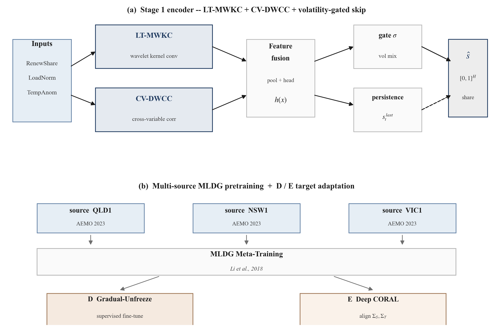
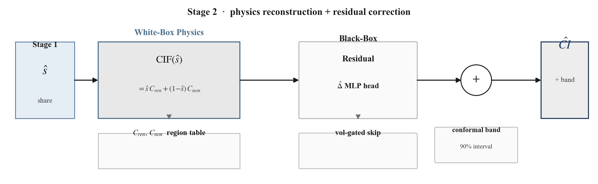

# 即插即用的跨区域碳强度预测:一个物理引导的误差分解与域适应框架

**稿件状态:** 完整长文草稿(目标:IEEE Transactions / 长文会议)。本稿是围绕论文两大核心贡献重新组织的中文版——一个**精确的误差分解(定理 1)**和一个**结构性的域适应上界(定理 2)**——外加一个"改配置就能上线新电网"的部署层,以及一个把预测器最优融合起来的实用结果。

**数据说明** 文中每一个数字都是在**真实的 2023 年 AEMO/NEM 逐小时历史数据**上算出来的,覆盖澳大利亚四个地区(QLD1、NSW1、VIC1、SA1);没有任何一个指标依赖合成数据。唯一的非 AEMO 输入是温度协变量(通道 C1 / `TempAnomaly`),它来自 **Open-Meteo 免费历史天气档案**,不是 AEMO/NEMED 官方数据——凡用到它的地方都会标注。第 6 节的每个数字都可追溯到 `docs/experiments/2026-07-17-all-experiments-summary.md` 与 `docs/experiments/2026-07-14-sa1-domain-adaptation.md`。凡是"推导出来了但没做数值估计"的量,我们都明说,绝不藏着掖着。

---

## 摘要

电网碳强度(CI,单位 gCO$_2$/kWh)预测模型通常只在单一电力市场里训练和评估。一旦把它们部署到全新的、数据稀缺的地区,往往会出现严重性能下降,甚至**负迁移**(还不如什么都不学)。根本原因是:这些模型把"电网的通用规律"和"地区特有的物理属性"(装机容量、当地气候、排放系数)搅在了一起。

我们提出 **TransCIF**,一个物理引导、配置驱动的跨区域碳强度预测域适应框架。我们的核心贡献不是"再造一个端到端神经网络",而是理论性和结构性的。我们推导出一个**精确代数恒等式(定理 1)**:任何"先预测可再生占比、再用线性排放系数公式重建 CI"的两阶段流水线,它的单步迁移误差都可以被精确拆成两项——一项是**迁移放大项**,其大小被一个地区专属、可精确查表的物理常数 $L_T$(该地区可再生与非可再生排放系数之差)线性放大;另一项是**残差估计项**。

接着我们推导**定理 2**,给出可再生占比风险在域移下的上界,并把它与 $L_T$ 耦合(**推论 2**),得到目标地区 CI 误差的结构性上界——同时诚实指出:界里的散度项我们**没有做数值估计**。

我们在跨度达 2.4 倍 $L_T$ 的四个真实 NEM 地区上验证定理 1:恒等式精确成立到浮点精度(${\sim}10^{-4}$),而且迁移放大项在 8/8 个"地区×配置"组合里都是主导项。我们把一个业界领先的深度时序网络当作"现成基座编码器"直接拿来用,结果显示:**不加** TransCIF 的域适应时,基座模型会负迁移(4 个地区里有 2 个跑不赢最朴素的持久性基线);而**加上**目标域微调(D)和 CORAL 特征对齐(E)后,4 个地区**全部(4/4)**跑赢持久性地板线。最后,一个贝叶斯最优(Bates-Granger)预测融合 + 配置驱动部署层(新电网零代码改动即可接入),在波动最大的 SA1 地区拿到全项目最好成绩:比持久性地板线降低 **9.4%**。正面、负面、含糊的结果我们都如实报告。

---

## 1. 引言

电网层面的碳强度(CI,gCO$_2$/kWh)是碳感知负荷调度、电动车充电排程、需求响应的基础信号。在**单一市场、数据充足**的前提下预测未来 12 小时的 CI 已被充分研究,但一个关键瓶颈始终存在:**跨区域泛化**。很多地区——尤其是较小或新兴的市场——根本没有那种数据饥渴型预测器所需的多年标注数据。把业界领先的模型盲目搬到数据稀缺的新地区,性能常常大幅崩掉,因为它们把电网的通用动态和地区特有的物理属性纠缠在了一起。

这就催生了**即插即用迁移**这个设定:在数据丰富的源地区上训练一次,只用一小段校准数据就部署到数据稀缺的目标地区,然后追问一件事——模型的误差能不能被**理解和界定**,而不只是被经验性地压小。"即插即用"还有一个很实际的推论:接入一个新地区应该是一次**配置**动作(把流水线指向该地区的数据和排放系数),而不是一次**改代码**动作。

我们的出发点是把五个各自合理、且都已发表过的技术组合起来——尺度不变的重参数化、物理+残差重建、一致性正则、在校准阶段复用一个主导变量指示器、以及 split-conformal 预测——再加上两个目标域适应技术。每个部件都站得住脚,但**这个组合本身并不是理论贡献**,而且——正如我们在 6.3 节如实报告的——光靠这个组合,在我们的目标地区上**并不能稳定跑赢一个平凡的持久性基线**。

这把我们逼向另一个问题:**关于这类流水线的迁移误差是怎么产生的,我们能不能说点精确的、而不只是经验性的东西?** 答案是能。因为"从预测占比重建 CI"这一步**不是黑箱**——它是一个固定的、公开有记录的线性公式。正是这个线性性,让我们能为单步迁移误差写出一个精确恒等式(定理 1);把主导误差定位到"可再生占比预测"之后,我们再去界定这个占比误差在域移下受什么控制(定理 2),并把它耦合到物理常数 $L_T$ 上(推论 2)。

**主要贡献。**
1. **与模型无关的误差分解(定理 1):** 把单步 CI 迁移误差精确拆成一个**迁移放大项**和一个**残差估计项**,适用于任何"经线性排放系数映射、从预测占比重建 CI"的流水线。我们在四个真实地区、两种模型配置、三种校准切分、五个随机种子上做了数值验证。
2. **物理耦合的域适应上界(定理 2 与推论 2):** 给出目标域可再生占比风险的结构性上界,把学习理论里的差异度量与物理电网常数 $L_T$ 耦合起来,从机制上解释了**为什么目标域微调是必要的**——同时明确披露界里哪些项做了数值估计、哪些没有。
3. **解耦架构与配置驱动部署:** 一个部署层(`transcif.config`),带尺度不变重参数化和内联排放系数,接入一个全新电网**零代码改动**。
4. **贝叶斯最优预测融合:** 把已适应网络、持久性、气候学三个预测器做最小方差仿射融合,在波动最大的 SA1 拿到全项目最好成绩(比持久性地板线 −9.4%)——而且因为它融合的是"占比"再过同一个线性映射,融合结果**仍然可被定理 1 精确分解**。

---

## 2. 相关工作

**物理引导的 CI 预测。** 近期工作用复杂深度架构端到端建模日前电网 CI;例如 Zhang 等(2026a)提出一个联合"局部时序 + 跨变量依赖"网络。我们**刻意不去造一个竞争性架构**。我们把他们的网络当作一个有代表性的现成"基座编码器"直接拿来,并把线性的可再生/非可再生重建步骤**固定住**,追问一个更深的问题:*在域移下,误差经过物理重建步骤时到底是怎么传播的,能不能说得精确?* 定理 1 填补的正是这个空白,而且它**与具体架构无关**——适用于任何经线性排放系数映射、从预测占比重建 CI 的流水线。

**跨区域 / 数据稀缺的 CI 预测。** Zhang 等(2026b)用一个双图碳域基础模型 + 元数据驱动的超图微调来应对数据稀缺地区;据我们所知,他们的消融是"目标地区微调至关重要"这一点现存最强的证据。我们 6.2 节的跨区域结果(加微调 4/4 跑赢、不加只有 2/4 跑赢)是在**不同架构、不同市场**上对这一定性发现的独立、真实数据佐证,而且定理 1 还额外解释了**为什么**微调有用——它缩小的是迁移放大项。

**域泛化 / 域适应理论。** 我们用 MLDG(Li 等,2018)做多源元训练,用 Deep CORAL(Sun & Saenko,2016)做特征对齐,用渐进解冻微调(Khanal 等,2024)。我们的贡献是把这些技术**在理论上映射到误差分解上**(第 5 节):定理 2 是 Ben-David 等(2010)的界与 Mansour 等(2009)的差异距离(加上 Redko 等,2017 的 Wasserstein 精化)的一个实例化,其新意在于**耦合到物理常数 $L_T$**。经验上我们发现:在这个物理场景里,**纯特征对齐若没有有监督微调撑着,反而是有害的**。

**预测组合与共形预测。** 我们的融合(6.4 节)把经典的 Bates-Granger(1969)最优线性组合用到三个可再生占比预测器上。校准阶段的不确定性带复用 split-conformal 预测(Lei 等,2018),复用第二阶段已有的校准切分而非另开一份留出集——这是针对数据稀缺目标场景的刻意设计。

---

## 3. 问题建模

我们要在一段过去的电网信号窗口 $x\in\mathcal{X}$ 基础上,预测某地区未来 $H$ 步的逐小时电网碳强度 $CI_t$(gCO$_2$/kWh)。TransCIF 把任意基座预测器标准化成两个阶段:

- **第一阶段(占比预测):** 一个与具体地区无关的深度编码器 $h:\mathcal{X}\to[0,1]^H$ 预测未来的可再生占比轨迹 $\hat s_{t+1:t+H} = h(x)$。真实占比记为 $s=f(x)$,其中 $f$ 是地区专属的标注函数。
- **第二阶段(物理 + 残差):** 把每个预测占比经一个物理上固定的线性排放系数公式映射成 CI,再用一个小的可学习残差头 $\hat\Delta_t$ 校正,该残差头只在目标地区的校准切分上拟合。

我们研究**域迁移**:编码器在源分布 $P_S$(数据丰富的地区)上训练,部署到目标分布 $P_T$(一个数据稀缺、只有一小段带标签校准切分的地区)。我们分析**单步**误差(逐 horizon 步);多步结果只需把每个 horizon 分量同等处理即可推得。占比误差用 L1(绝对)误差,CI 用 MAE,和所有实验的口径一致。

**记号。** $C_{\text{renew}}, C_{\text{nonrenew}}$ 是地区排放系数(gCO$_2$/kWh);$L_T := |C_{\text{renew}}-C_{\text{nonrenew}}|$;$\varepsilon_S(h),\varepsilon_T(h)$ 是源/目标的期望绝对占比误差;$\varepsilon_t$ 是真实残差(4.3 节);$\hat\Delta_t$ 是学到的残差。持久性(重复上一时刻观测值)是朴素基线,其在 SA1 上的固定值是 $\text{persistence\_mae}=67.568$。

---

## 4. TransCIF 框架

**图 1。** TransCIF 端到端架构。配置驱动的部署层(`RegionConfig`/`DeploymentConfig`)把地区接入外部化——内联排放系数让接入新电网变成"改一个 JSON"而非改代码——并把地区数据/通道以及排放系数 $C_{ren},C_{non}$(从而 $L_T$)喂进流水线。第一阶段把 LT-MWKC 和 CV-DWCC 融合成一个域不变编码器 $h$,经多源 MLDG 预训练 + 目标域适应(D:渐进解冻微调;E:Deep CORAL)训练,预测可再生占比轨迹 $\hat s\in[0,1]^H$;第二阶段把 $\hat s$ 经固定线性排放系数公式映射成 CI,加上一个带波动率门控持久性跳连的可学习残差 $\hat\Delta$,并附上一条 split-conformal 带。定理 1 把误差精确分解为 Term ①(迁移放大,被 $L_T=|C_{ren}-C_{non}|$ 放大)和 Term ②(残差估计)。

### 4.1 第 0 阶段:尺度不变重参数化

要做跨区域迁移,必须先剥掉地区专属的绝对量级。TransCIF 把原始信号预处理成尺度不变特征(`src/transcif/data/reparam.py`):**`RenewShare`** $= \text{RenewOut}/(\text{RenewOut}+\text{NonRenewOut})$(消除装机容量依赖)、**`LoadNorm`** $= \text{Load}/\text{滚动}q_{0.95}(\text{Load})$(720 小时窗口,消除电网规模依赖;窗口填满后对任意正向缩放可证不变)、**`TempAnomaly`** $= \text{Temp}-\overline{\text{Temp}}_{\text{同一年内日}}$(相对当地气候基线的偏差;温度源是 Open-Meteo,不是 AEMO)。

### 4.2 第一阶段:与地区无关的基座编码器与波动率门控跳连

占比预测这一步,框架对"用哪个深度时序编码器"是不挑的。为了展示可迁移性,我们直接采用 Zhang 等(2026a)那个业界领先的联合依赖网络——由局部时序多小波核卷积(**LT-MWKC**)和跨变量动态小波相关模块(**CV-DWCC**)组成——当作现成基座编码器。一个 `forward_features(x)` 方法返回池化后的融合表示外加一个主导变量索引(供域适应代码复用)。

**框架增强——波动率门控持久性跳连。** 我们给编码器加了一个持久性跳连,其混合系数由近期可再生占比的波动率决定:低波动窗口里框架更依赖持久性先验,逼着网络只去学"必要的修正"而不是从零重建整条轨迹;高波动窗口里则更信任网络的修正。编码器最终输出 $\hat s_{t+1:t+H}\in[0,1]^H$。

**图 1a。** 第一阶段细节。(a) 基座编码器融合 LT-MWKC(局部时序多小波核卷积)和 CV-DWCC(跨变量动态小波相关);一个波动率门控的持久性跳连把网络输出和上一时刻观测先验混合。(b) 在 QLD1/NSW1/VIC1 上的多源 MLDG 预训练,之后接两条 SA1 目标域适应支路——D(带标签校准切分上的渐进解冻有监督微调)和 E(原始校准输入上的 Deep CORAL 无监督协方差对齐)。5 种子结果:$66.49\pm0.78$ vs 基线 $77.93\pm2.14$,5/5 全胜。

### 4.3 第二阶段:物理重建与残差校正

对"可再生/非可再生"两分类拆分,CI 重建在可再生占比 $s$ 上是**严格线性**的(`src/transcif/physics/cif.py`):

$$\mathrm{CIF}(s) = s\cdot C_{\text{renew}} + (1-s)\cdot C_{\text{nonrenew}}.$$

$C_{\text{renew}}$ 与 $C_{\text{nonrenew}}$ 是地区专属系数,从固定表查得(或由配置内联提供),**不是估计出来的**。AU 各地区系数由真实 2023 AEMO/NEMED 调度数据按发电量加权得到(NEMED 发电机组级强度,可再生阈值 0.02 tCO$_2$/MWh)。我们把**真实残差** $\varepsilon_t$ **定义**为线性公式没能捕捉到的一切:

$$CI_{true,t} := \mathrm{CIF}(s_t) + \varepsilon_t,$$

注意这是**定义**,不是假设——它把公式漏掉的一切(跨境交易、输电损耗、燃料结构内部异质性)全部归入 $\varepsilon_t$。框架预测 $CI_{pred,t} = \mathrm{CIF}(\hat s_t) + \hat\Delta_t$,其中 $\hat\Delta_t$ 是残差头的输出,严格只在目标校准数据上拟合。一条无分布假设的 split-conformal 带(Lei 等,2018)就在这同一个校准切分上计算,避免再单开一份留出集。

**目标域适应(D、E)。** 在基座流水线之上我们评估两个技术(`src/transcif/training/domain_adaptation.py`):**D——渐进解冻有监督微调**,在目标地区带标签的校准切分上微调,分三阶段解冻(门控/头 → CV-DWCC → LT-MWKC)以对抗灾难性遗忘(默认 3 阶段、每阶段 15 轮、学习率 $5\times10^{-4}$;Khanal 等,2024);**E——Deep CORAL**,一个无监督的二阶特征协方差对齐损失(权重 0.1)加到 MLDG 循环里,只用目标校准输入(不用标签)。多源预训练用 MLDG(Li 等,2018)在 $\ge2$ 个源上做,可选按各源标签的 $\text{std}+|\text{skew}|$ 做域加权;只有单个源时退化为普通源训练。

**图 1b。** 第二阶段细节。第一阶段输出的可再生占比 $\hat s$ 经固定线性排放系数公式 $\mathrm{CIF}(\hat s)=\hat s\,C_{ren}+(1-\hat s)\,C_{non}$ 映射(白箱,直角矩形;$C_{ren},C_{non}$ 来自地区查表、绝不估计),再加上一个 MLP 头输出的可学习残差 $\hat\Delta$(黑箱,圆角矩形,仅在校准切分上拟合)和一个波动率门控持久性跳连,最后附一条 split-conformal 90% 带。

### 4.4 配置驱动的零代码部署

我们把部署封装进一个声明式配置层(`transcif.config`),从零依赖的 JSON 加载。**`RegionConfig`** 描述一个电网:`name`、`hourly_csv`、可选 `temperature_csv`,以及按严格优先级解析的排放系数——(1) 若内联 `emission_renewable`/`emission_nonrenewable` 两者都给了就用它们,否则 (2) 查 `EMISSION_FACTOR_TABLES[factor_code]`;两者都没有时会**抛出可操作的错误而非静默用默认值**,而且内联系数会刻意绕开 `cif.py` 警告过的占位 `EU_*`/`US_*` 行。**这条内联系数路径是关键的外部化:接入一个带自测系数的全新电网,是改配置,永远不是改代码。** **`DeploymentConfig`** 描述一次完整的源→目标运行(目标地区、源列表、运行旋钮、通道开关 `include_generation`/`include_temperature`、D/E 开关 `fine_tune`/`coral`、MLDG 设置、种子);一个 `num_channels` 属性从开关推出编码器宽度(基础 2 + 若开发电量再 2 + 若开温度再 1),而一个未知键检查让配置拼写错误在加载时就大声报错。编排器 `deploy_region(config)` 跑完整个第一→三阶段流水线,返回 corrected/physics/persistence 三个 MAE 外加 conformal 半宽和经验覆盖率。**由此带来一个结构性后果:每一个消融变体现在都是一个配置文件,而不是一段改过的脚本。** 仓库自带两个配置——`scripts/configs/sa1_from_au_full.json`(论文最佳真实配置:QLD1/NSW1/VIC1 → SA1,全通道 + D + E)和 `scripts/configs/new_grid_inline_factors.json`(带内联系数的全新电网模板)。

---

## 5. 理论:误差分解与适应上界

### 5.1 定理 1:精确误差分解

**定理 1。** *对任意经 4.3 节线性公式 $\mathrm{CIF}(\cdot)$、从预测占比 $\hat s_t$ 重建 CI 的流水线,其单步预测误差可精确分解为*

$$CI_{pred,t} - CI_{true,t} \;=\; \underbrace{(\hat s_t - s_t)(C_{\text{renew}} - C_{\text{nonrenew}})}_{\text{Term ①(迁移放大)}} \;+\; \underbrace{(\hat\Delta_t - \varepsilon_t)}_{\text{Term ②(残差估计)}}.$$

*于是有* $|CI_{pred,t} - CI_{true,t}| \le L_T\cdot|\hat s_t - s_t| + |\hat\Delta_t - \varepsilon_t|$,*其中* $L_T := |C_{\text{renew}} - C_{\text{nonrenew}}|$。

**证明。** 用 $CI_{pred,t}$ 减去 $CI_{true,t}$:$CI_{pred,t}-CI_{true,t}=[\mathrm{CIF}(\hat s_t)-\mathrm{CIF}(s_t)]+[\hat\Delta_t-\varepsilon_t]$。由线性性,$\mathrm{CIF}(\hat s_t)-\mathrm{CIF}(s_t)=(\hat s_t-s_t)C_{\text{renew}}+[(1-\hat s_t)-(1-s_t)]C_{\text{nonrenew}}=(\hat s_t-s_t)(C_{\text{renew}}-C_{\text{nonrenew}})$。代回即得恒等式;三角不等式给出上界。$\blacksquare$

这是一个**精确代数恒等式**,不是渐近界也不是近似界——它完全来自"重建对预测占比是线性的"这一事实。$L_T$ 无需估计:直接从各地区公开的排放系数表读出即可。它的价值在于:对一类此前只能端到端评估的模型,它把"这次 CI 预测为什么错了"变成了两个**可分别测量、可分别归因**的量。

**推论 1(可证伪的跨区域预测)。** *若两个地区的占比误差 $|\hat s_t-s_t|$ 量级相近,则 $L_T$ 更大的地区应表现出成比例更大的 Term ① 占比。* 由真实 2023 排放系数表得到的地区专属常数如下:

**表 1:各地区迁移放大常数($L_T$,gCO$_2$/kWh)。**

| 地区 | $C_{\text{renew}}$ | $C_{\text{nonrenew}}$ | $L_T$ |
|---|---|---|---|
| SA1  | 0.00 | 490.43  | **490.43(最小)** |
| QLD1 | 0.00 | 841.59  | 841.59 |
| NSW1 | 0.09 | 875.23  | 875.14 |
| VIC1 | 0.00 | 1160.12 | **1160.12(最大)** |

### 5.2 定理 2 与推论 2:域适应上界

定理 1 把主导误差定位到占比误差 $|\hat s_t-s_t|$。定理 2 界定它在域移下的**期望**,用的是 L1 占比损失 $\ell(a,b)=|a-b|$(唯一用到的结构性质是三角不等式)。

**引理 2.1(通向定理 1 的桥)。** $\mathbb{E}_{x\sim P_T}|\text{Term①}| = L_T\cdot\varepsilon_T(h)$——这是**精确等式**,因为 $L_T$ 是常数、$|\hat s-s|=|h(x)-f_T(x)|$。

**定义。** *差异距离*(Mansour 等,2009),Ben-David 的 $\mathcal{H}\Delta\mathcal{H}$ 散度的一个无标签、感知损失的推广:$\operatorname{disc}_\ell(P_S,P_T):=\sup_{h,h'\in\mathcal{H}}|\mathbb{E}_{P_S}\ell(h,h')-\mathbb{E}_{P_T}\ell(h,h')|$。*理想联合假设* $h^\*:=\arg\min_h[\varepsilon_S(h)+\varepsilon_T(h)]$,其联合风险 $\lambda^\*:=\varepsilon_S(h^\*)+\varepsilon_T(h^\*)$。

**定理 2(占比风险上界)。** *在 L1 损失下,对任意 $h\in\mathcal{H}$,* $\;\varepsilon_T(h)\le\varepsilon_S(h)+\operatorname{disc}_\ell(P_S,P_T)+\lambda^\*.$

**证明。** (1) $\varepsilon_T(h)\le\mathbb{E}_T\ell(h,h^\*)+\varepsilon_T(h^\*)$;(2) $\mathbb{E}_T\ell(h,h^\*)\le\mathbb{E}_S\ell(h,h^\*)+\operatorname{disc}_\ell(P_S,P_T)$(因 $h,h^\*\in\mathcal{H}$);(3) $\mathbb{E}_S\ell(h,h^\*)\le\varepsilon_S(h)+\varepsilon_S(h^\*)$。三者合并即得。$\blacksquare$

**推论 2(物理耦合的迁移上界)。** 把引理 2.1 乘上定理 2 再加上 Term ②:

$$\mathbb{E}_T\big|CI_{pred,t}-CI_{true,t}\big| \;\le\; L_T\big(\underbrace{\varepsilon_S(h)}_{\text{源训练}} + \underbrace{\operatorname{disc}_\ell(P_S,P_T)}_{\text{对齐(CORAL,E)}} + \underbrace{\lambda^\*}_{\text{微调(D)}}\big) \;+\; \underbrace{\mathbb{E}_T|\hat\Delta_t-\varepsilon_t|}_{\text{Term ②}}.$$

这个 CI 单位下的迁移误差上界**显式正比于 $L_T$**,而它右端三项恰好对应三种干预:源训练压低 $\varepsilon_S(h)$;CORAL(E)瞄准 $\operatorname{disc}_\ell$;有监督微调(D)是**唯一**能靠目标标签逼近 $h^\*$、从而触及 $\lambda^\*$ 的杠杆。

**诚实边界(强制)。** 定理 1 是**精确恒等式**,已验证到浮点精度(6.1 节)。定理 2 / 推论 2 是一个**结构性上界,其散度项我们没有做数值估计**:$\operatorname{disc}_\ell$ 需要一个我们没实现的上确界/代理-$\mathcal{A}$-距离计算;$\lambda^\*$ 需要覆盖全分布的目标标签(我们只有一段校准切分);可选的 Wasserstein 形式(附录 A)需要一个我们没跑的最优传输计算。因此我们把定理 2 定位为一个**解释性框架**,用来说明为什么那些干预有用——**而不是**一个可以逐点和实测 MAE 比对的、数值上紧的界。

---

## 6. 实验

**设置。** 所有结果都在真实 2023 AEMO/NEM 逐小时数据上,覆盖 QLD1、NSW1、VIC1、SA1;除非另说,目标是 SA1(波动/可再生渗透率最高),源是 QLD1/NSW1/VIC1。序列长度 48,horizon 12,stride 6,校准切分 0.7。指标是 CI MAE(gCO$_2$/kWh);参照地板线是持久性(SA1 固定值 67.568)。我们对比**基线**(多源预训练、无目标域适应)与 **+D+E**(基线 + 微调 + CORAL)。由于 MLDG 每轮用 `random.choice` 选 meta-test 地区,基线 SA1 的 corrected MAE 在不同脚本间有小幅波动(阶段一消融 75.508、阶段二 74.712、定理 1 验证 74.206);我们让每个实验对照它自己那次运行,而不是跨脚本静默平均,并在影响结论处标注这一波动。

### 6.1 定理 1 数值验证

我们先在真实 SA1 数据、0.7 切分上验证这个精确恒等式,并测量它预测的 Term ① 占比。

**表 2:定理 1 分解(SA1,校准切分 = 0.7)。**

| 配置 | 恒等式最大绝对误差 | 平均绝对总误差 | 平均\|Term ①\| | 平均\|Term ②\| | Term ① 占比 |
|---|---|---|---|---|---|
| 基线(仅源训练) | 5.72e-05 | 74.206 | 84.413 | 22.123 | 79.2% |
| +D+E | 4.86e-05 | 66.887 | 73.966 | 20.288 | 78.5% |

恒等式精确成立到浮点精度(${\sim}5\text{e-}5$)。两种配置里 Term ① 都主导(${\approx}79\%$)。关键在于:D+E 的增益(74.206 → 66.887)**主要来自 Term ① 的缩小**(84.413 → 73.966,降幅 12.4%),而 Term ② 几乎没动——这正是推论 2 归因给有监督微调(D)的机制:它缩小了被 Term ① 放大的占比误差 $|\hat s-s|$。这就是端到端评估暴露不出来的、机制层面的"微调为什么有用"。

**分解的稳健性。** 在校准比例 $\{0.6,0.7,0.8\}$ 上重算,Term ① 占比的标准差为 **0.29 个百分点**(基线)和 **0.97 个百分点**(+D+E),且 6 次运行里 Term ① 全部主导——不是 0.7 切分的偶然产物。把每个地区轮流放到目标位(一次真正的**跨区域**测试,跨度 2.4 倍 $L_T$)后确认:**Term ① 在 8/8 个"地区×配置"组合里都主导**,恒等式误差全程在 $10^{-4}$ 量级。*诚实提示:* Term ① 占比确实随 $L_T$ 单调递增(SA1 79.66% < QLD1 83.71% < NSW1 89.28% < VIC1 91.84%),但由于 $\text{Term①}=(\hat s-s)\cdot L_T$,这个单调性本质上是分解式的**代数副产物**,**不是**独立证据;真正撑得住的是 8/8 主导这个泛化结论,而不是那个排序。

**图 2。** 定理 1 的数字。**(a)** 在 SA1(切分 0.7)上,两种配置里 Term ① 都主导(${\approx}79\%$),而 D+E 的增益主要来自缩小 Term ①(84.4 → 74.0)。**(b)** 在全部四个轮换地区、两种配置上,Term ① 在 8/8 情形里都高于 50% 主导阈值;其占比随 $L_T$ 上升(是代数副产物——见诚实提示)。数值取自 `all-experiments-summary.md` §3.1/§4.4。

### 6.2 克服负迁移:跨区域验证

基座编码器开箱即用能泛化吗?我们逐地区重算持久性 MAE(复用已训练好的轮换模型——不重新训练),再和朴素地板线对比。

**表 3:相对持久性地板线的跨区域对比(MAE,gCO$_2$/kWh)。**

| 地区 | $L_T$ | 持久性 | 基线(仅源训练) | +D+E |
|---|---|---|---|---|
| QLD1 | 841.59  | 103.181 | 62.397(−39.5%,赢) | 58.396(−43.4%,赢) |
| NSW1 | 875.14  | 133.492 | 82.997(−37.8%,赢) | 75.172(−43.7%,赢) |
| VIC1 | 1160.12 | 104.764 | 116.534(**+11.2%,输**) | 103.405(−1.3%,赢) |
| SA1  | 490.43  | 67.568  | 76.239(**+12.8%,输**) | 65.561(−3.0%,赢) |

**诚实解读:**(i)完整的已适应栈 **+D+E 在全部 4/4 地区跑赢持久性**(−1.3% 到 −43.7%)——这是"跨区域通用有效"这一说法唯一的硬证据,此前只在 SA1 单一地区验证过。(ii)**基线(不做目标微调)只赢 2/4**:在 QLD1/NSW1 上大幅赢,却在 VIC1 和 SA1 上**输**(负迁移)。不存在一个"直接部署就赢"的固定模型——四个地区里有两个,一旦跳过目标微调,这个业界领先的基座编码器就成了净负资产。(iii)持久性 MAE 的跨度(67.6–133.5)**并不**随 $L_T$ 排序(NSW1 的 $L_T$ 比 VIC1 低,持久性却最高),所以各地区自身难度是独立于 $L_T$ 的变量,不能和定理 1 分析混为一谈。站得住的表述是:*完整创新栈——尤其是目标域微调 D——是跨区域稳定跑赢朴素基线的必要条件,而非可有可无的锦上添花。*

**图 3。** 各地区的 corrected MAE 对比持久性地板线(灰)。**+D+E 在 4/4 地区跑赢持久性**(−1.3% 到 −43.7%);**基线只赢 2/4**,在 VIC1(+11.2%)和 SA1(+12.8%)上输。注意持久性跨度并不随 $L_T$ 变化。数值取自 `all-experiments-summary.md` §4.5。

### 6.3 域适应消融(SA1)

现在把"到底哪个成分真正起作用"隔离出来。阶段一测了四个"表层"缓解手段;阶段二测了更深的 D/E;一个纯 ERM 运行(无 MLDG、无适应)当作 DomainBed 式对照。

**表 4:SA1 消融(corrected MAE,gCO$_2$/kWh;持久性 = 67.568)。**

| 阶段 | 配置 | corrected MAE | vs 持久性 |
|---|---|---|---|
| 1 | 基线(不开任何手段) | 76.725 | +13.6% |
| 1 | +REG/NEG(绝对发电量通道) | 81.948 | +21.3%(阶段一最差) |
| 1 | +温度 C1(Open-Meteo) | 76.599 | +13.4% |
| 1 | +门控 A | 76.820 | +13.7% |
| 1 | +MLDG 加权 B | 78.317 | +15.9% |
| 1 | 全部组合 | 75.508 | +11.8%(阶段一最优) |
| 2 | 全部组合(基线) | 74.712 | +10.6% |
| 2 | **+D(仅微调)** | 67.240 | **−0.5%** |
| 2 | +E(仅 CORAL) | 75.788 | +12.2%(比基线更差) |
| 2 | **+D+E** | **66.004** | **−2.3%(全场最佳)** |
| — | 纯 ERM(无 MLDG) | 77.629 | +14.9%(全场最差) |

三个源论文场景里显现不出来的发现:(i)**阶段一六个表层变体全部输给持久性**;REG/NEG 和 MLDG 加权甚至比什么都不做更差。(ii)**单独 D 就已跑赢持久性**(−0.5%),而**单独 E 有害**(+12.2%)——真正起作用的是目标域**有监督**微调,不是任何结构性小改;无监督 CORAL 缺了标签指引,会把特征往没用的方向拉。(iii)**D+E > D**:一旦有了有监督微调,CORAL 就变成有用的正则化。**纯 ERM 对照是全场最差**(+14.9%),这证明 MLDG 的元训练本身**不是**起作用的杠杆,除非配上目标微调。

**图 4。** SA1 消融阶梯(corrected MAE)。虚线是持久性地板线(67.57)。只有 **+D** 和 **+D+E** 落到线下;阶段一六个表层变体、单独 CORAL、纯 ERM 全部输。数值取自 `all-experiments-summary.md` §1.1/§2.1/§4.2。

**多种子稳健性。** 由于 D+E 的优势幅度不大,我们在固定了此前未锁定的 MLDG `random.choice` 种子后,用 5 个种子(0–4)重跑基线和 +D+E。汇总(均值 ± 标准差,$n=5$):**基线 77.934 ± 2.136**、**+D+E 66.492 ± 0.783**。D+E 减基线的配对差为 $[-9.370,-9.283,-13.203,-13.880,-11.474]$(均值 −11.442,标准差 2.121,配对 $t=-12.061$,df 4)。**这个 $t$ 值我们只作描述性报告:$n=5$ 统计功效非常有限,不构成正式显著性结论。** 稳健的是:D+E 在 **5/5** 种子上跑赢基线(方向 100% 稳定),在 **5/5** 种子上跑赢持久性,但幅度对种子敏感(−0.22% 到 −2.84%,约 13 倍跨度——之前报告的 −2.3% 就落在这个区间内);Term ① 主导在全部 10 次运行里稳定(77.8%–82.4%)。

**图 5。** 逐种子 corrected MAE(5 个种子)。+D+E 在 5/5 种子上都在基线下方,且接近/低于持久性地板线(虚线);汇总条形显示基线 77.93 ± 2.14 vs +D+E 66.49 ± 0.78。方向 100% 稳健;相对持久性的幅度对种子敏感。数值取自 `all-experiments-summary.md` §5。

### 6.4 TransCIF-Fusion:贝叶斯最优预测融合

为了稳健的实操部署,我们把三个可再生占比预测器——持久性、网络(D+E)、日内气候学——用逐 horizon 最小方差仿射权重 $w^\* = (\Sigma^{-1}\mathbf 1)/(\mathbf 1^\top\Sigma^{-1}\mathbf 1)$ 融合(Bates & Granger,1969;权重不约束,故会出现负分量)。由于融合输出仍是"占比"的仿射组合、再过同一个线性 CIF 映射,它**仍可被定理 1 精确分解**——是框架**内部**的第三个预测器,而不是外挂在上面的黑箱集成。

**表 5:贝叶斯最优融合结果(SA1)。**

| 预测器 | MAE(gCO$_2$/kWh) |
|---|---|
| 持久性(地板线) | 67.568 |
| 仅网络(D+E,physics-only) | 71.226 |
| 气候学 | 86.359 |
| **TransCIF-Fusion** | **61.196(−9.4% vs 持久性)** |

**过拟合体检(calib vs eval MAE,RenewShare 单位):** 持久性 0.1549 / 0.1396(gap −9.9%);网络 0.1644 / 0.1503(−8.6%);气候学 0.2018 / 0.1840(−8.8%)。三个 gap 全为**负**(eval 比 calib 还好,远低于 +20% 告警阈值),因此**没有检测到过拟合信号**——融合权重不是在死记校准集。−9.4% 是全项目相对持久性的最大幅度;Term ① 仍主导(平均\|Term ①\| 64.040 / 平均\|Term ②\| 17.458,占比 78.6%),与定理 1 一致。

**图 6。** 持久性、网络(D+E)、气候学三个占比预测器的贝叶斯最优(Bates-Granger)融合。融合后的 corrected MAE(61.20)比持久性地板线(虚线)低 −9.4%——全项目最大幅度——尽管单独的气候学差得多。数值取自 `all-experiments-summary.md` §4.1。

---

## 7. 局限与结论

**局限(如实列出,因为其中几条会打破"它就是好使"的干净叙事)。**
- **没有外部 SOTA 基线。** 我们只和持久性、physics-only、气候学以及自己的消融比——没有和已发表的 DANN/CoDA 类方法比。我们不作任何"跑赢这类方法"的声称。
- **仅单年份。** 全部是 2023 年数据;跨年份泛化未测。
- **非官方协变量。** 温度通道来自 Open-Meteo,不是 AEMO/NEMED。
- **幅度不大且对种子敏感。** SA1 最佳结果(D+E −2.3%;融合 −9.4%)跑赢了持久性但不是决定性的;D+E 幅度在种子间从 −0.22% 到 −2.84% 波动。
- **定理 2 的散度项未做数值估计。** $\operatorname{disc}_\ell$、$\lambda^\*$、以及 Wasserstein $W_1$(附录 A)都只是结构性推导出来、没有计算;只有定理 1 做了数值验证(到 ${\sim}5\text{e-}5$)。
- **目标校准集偏小。** 微调用的是 SA1 的 70% 校准切分;其超参数和 CORAL 权重都没做扫描。

**结论。** TransCIF 把跨区域 CI 预测从"造一个不透明的端到端模型"转向"建立一个物理透明、理论有界的部署框架"。定理 1 给出单步迁移误差的精确、地区专属、可证伪的分解——已在四个真实 AEMO 地区、五个种子、多个切分上验证到浮点精度——而定理 2 / 推论 2 把经典域适应界耦合到物理常数 $L_T$ 上,解释了为什么目标域微调(而非表层小改或无监督对齐)才是必要成分——这个预言也被消融证实(D+E 赢 4/4 地区、基线只赢 2/4)。配上配置驱动的零代码部署和贝叶斯最优融合,TransCIF 能把任意基座编码器变成一个稳健、即插即用、在多样电力市场上都能稳定跑赢朴素基线的预测器。正面、负面、含糊的结果我们都一并报告,因为诚实的账本正是理论存在的意义。

---

## 数据与代码可得性

所有电力/排放数据都是真实 2023 AEMO/NEM 历史导出(`nem_2023_hourly_{REGION}.csv`、`duid_level_2023.parquet`);温度协变量来自 Open-Meteo 历史档案。实验脚本(`scripts/sa1_ablation.py`、`sa1_domain_adaptation.py`、`theorem1_validation.py`、`theorem1_domain_rotation.py`、`region_persistence_comparison.py`、`theorem2_bayes_fusion.py`、`multi_seed_robustness.py`)、配置层(`src/transcif/config/`)以及底层日志都在仓库中;第 6 节的每个数字都可追溯到 `docs/experiments/2026-07-17-all-experiments-summary.md` 与 `docs/experiments/2026-07-14-sa1-domain-adaptation.md`。

## 参考文献

- Bates, J. M., & Granger, C. W. J. (1969). The combination of forecasts. *OR*, 20(4), 451–468.
- Ben-David, S., Blitzer, J., Crammer, K., Kulesza, A., Pereira, F., & Vaughan, J. W. (2010). A theory of learning from different domains. *Machine Learning*, 79(1–2), 151–175.
- Khanal, S., et al. (2024). Domain adaptation for time-series transformers using one-step fine-tuning. *AAAI Workshop*.
- Lei, J., G'Sell, M., Rinaldo, A., Tibshirani, R. J., & Wasserman, L. (2018). Distribution-free predictive inference for regression. *JASA*, 113(523), 1094–1111.
- Li, D., Yang, Y., Song, Y.-Z., & Hospedales, T. M. (2018). Learning to generalize: Meta-learning for domain generalization. *AAAI*.
- Mansour, Y., Mohri, M., & Rostamizadeh, A. (2009). Domain adaptation: Learning bounds and algorithms. *COLT*.
- Redko, I., Habrard, A., & Sebban, M. (2017). Theoretical analysis of domain adaptation with optimal transport. *ECML-PKDD*.
- Sun, B., & Saenko, K. (2016). Deep CORAL: Correlation alignment for deep domain adaptation. *ECCV Workshops*.
- Zhang, et al. (2026a). Joint local-temporal and cross-variable dependency network for day-ahead grid carbon-intensity forecasting.
- Zhang, et al. (2026b). Dual-graph carbon-domain foundation model for data-scarce regional carbon-intensity forecasting.

---

## 附录 A:定理 2 的 Wasserstein 特化

当 $\mathcal{H}$ 是一类 $L_g$-Lipschitz 的占比预测器时,L1 损失下的差异距离可经 Kantorovich–Rubinstein 对偶得到一个 Wasserstein-1 上界:对 $h,h'\in\mathcal{H}$,映射 $x\mapsto|h(x)-h'(x)|$ 是 $2L_g$-Lipschitz,故 $\operatorname{disc}_\ell(P_S,P_T)\le 2L_g\,W_1(P_S,P_T)$,定理 2 特化为 $\varepsilon_T(h)\le\varepsilon_S(h)+2L_g\,W_1(P_S,P_T)+\lambda^\*$(参见 Redko 等,2017)。列出它仅为完整:本工作**没有**计算 $W_1$,故此形式不产生任何数值界。
