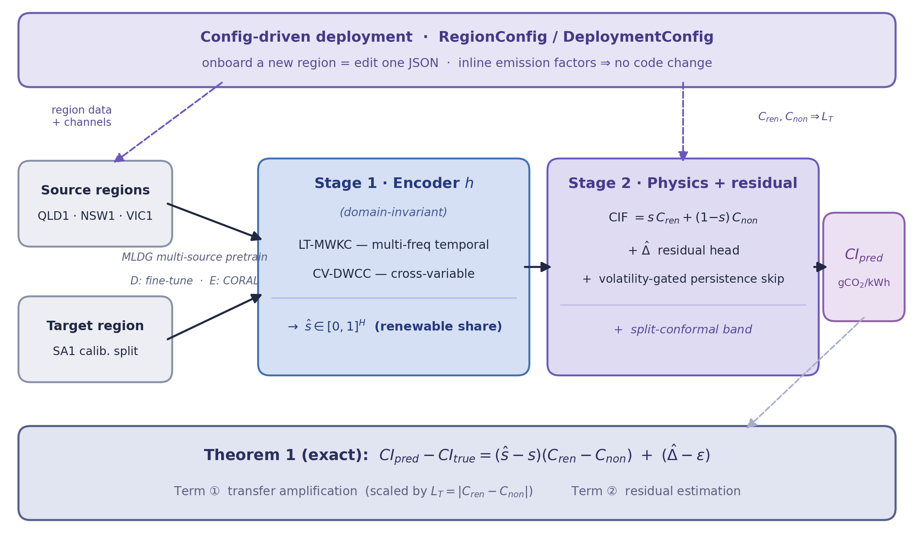
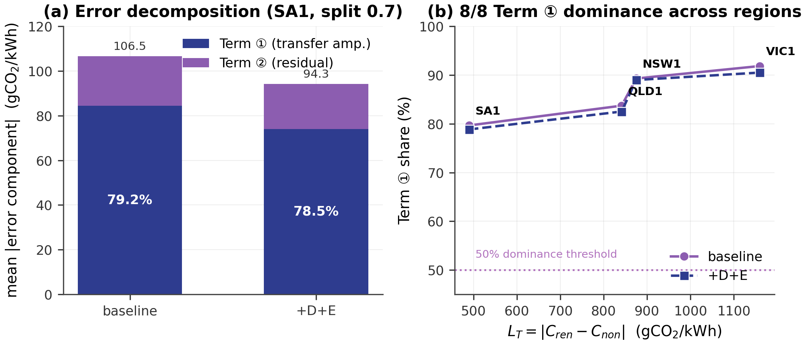
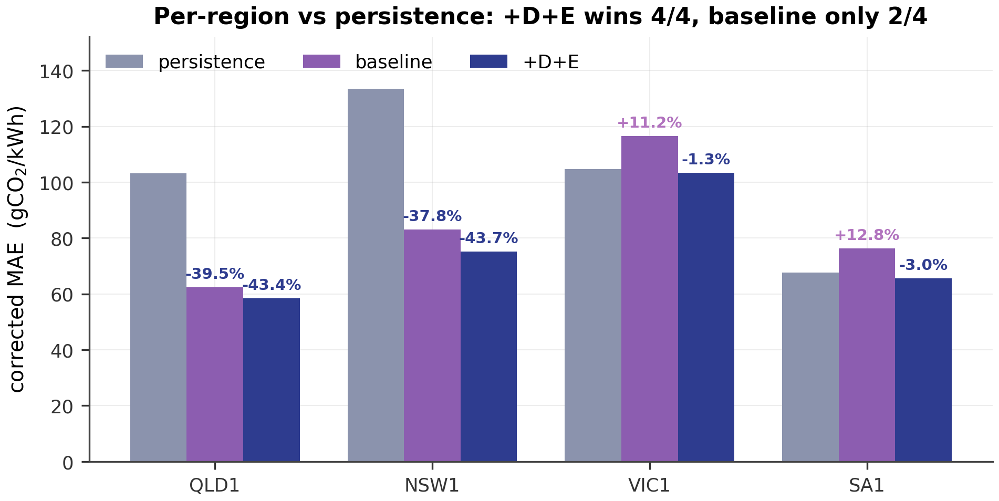
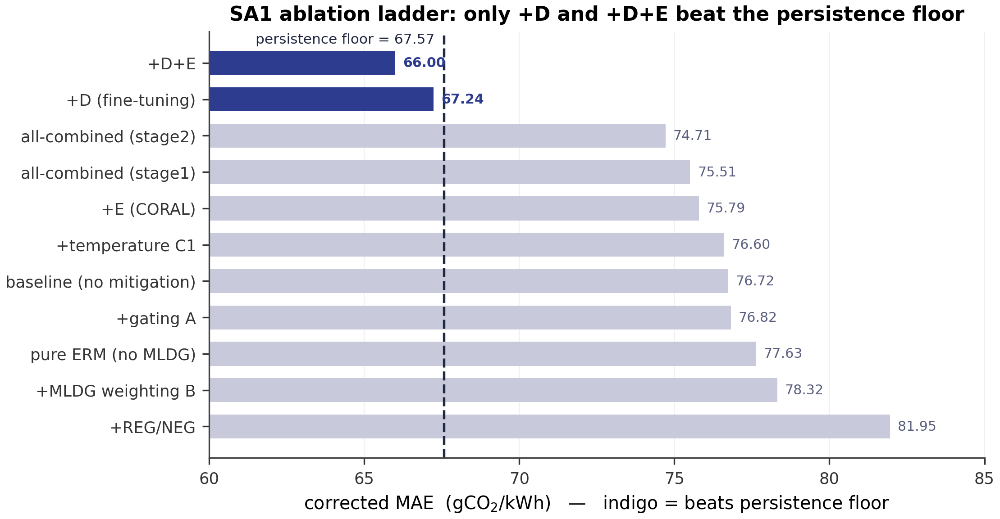
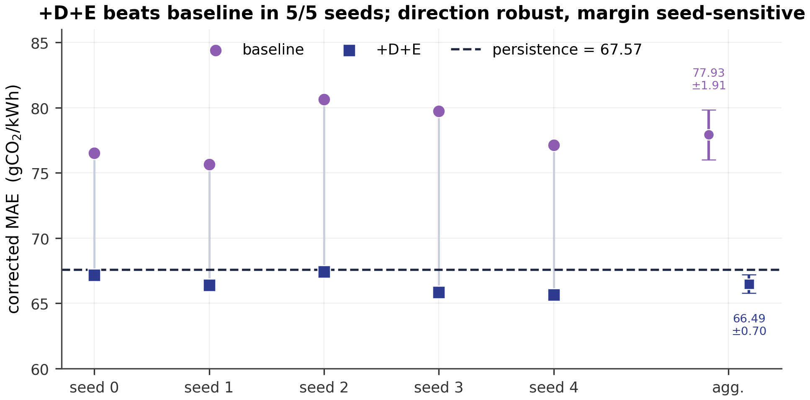
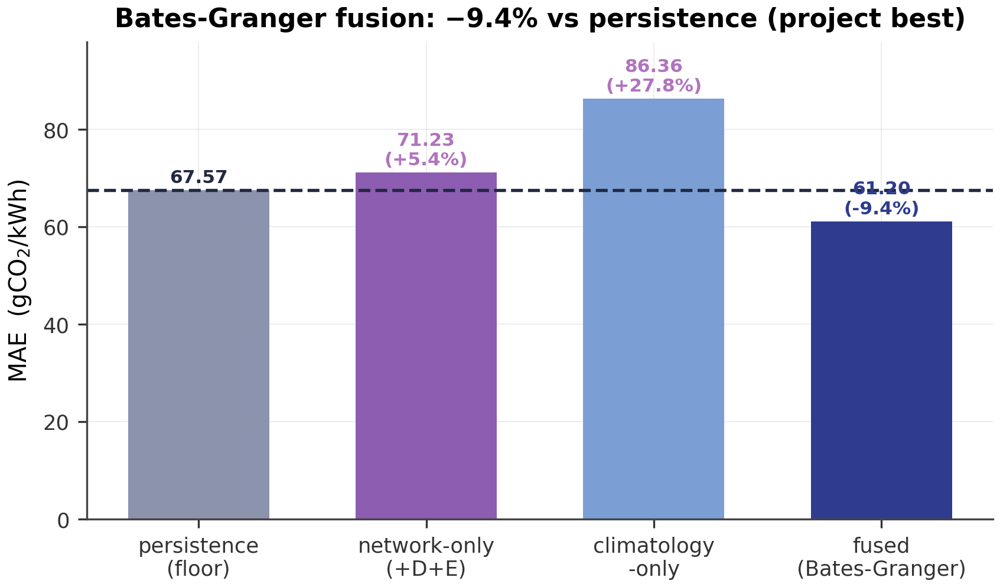

# TransCIF: Exact and Domain-Adaptive Error Bounds for Config-Driven, Plug-and-Play Cross-Region Carbon-Intensity Forecasting

**Draft status:** full-length draft (target: journal / long conference track). It extends the workshop-length draft `docs/paper/2026-07-17-transcif-workshop-draft.md` with (i) a formal problem formulation, (ii) a config-driven deployment section reflecting the `transcif.config` layer, (iii) a now-**derived** Theorem 2 (previously sketched only) with its Corollary 2, and (iv) expanded experiments. **Every numerical result is computed on real 2023 AEMO/NEM historical data**; no synthetic data underlies any reported number. The draft is deliberately honest about negative, mixed, and unestimated results — see Section 9 (Limitations). Where a quantity was *derived but not numerically estimated*, this is stated explicitly rather than hidden.

---

## Abstract

Grid carbon-intensity (CI) forecasting models are usually trained and evaluated within a single electricity market, yet operators increasingly need forecasts for regions with little or no historical data. We study the *plug-and-play* transfer setting: a model trained on data-rich source regions is deployed, with only light recalibration, to a different region's grid — ideally by editing a local configuration file rather than any code. Rather than proposing another combination of transfer-learning tricks, our central contribution is theoretical and structural. We derive an **exact algebraic identity** (Theorem 1) for the one-step transfer error of any two-stage pipeline that reconstructs CI from a predicted renewable-share trajectory through a physically linear emission-factor formula. The identity splits the error into a *transfer-amplification* term, scaled by a region-specific, exactly computable Lipschitz constant $L_T$ (the gap between a region's renewable and non-renewable emission factors), and a *residual-estimation* term. We then derive **Theorem 2**, a domain-adaptation upper bound on the renewable-share risk that drives the transfer-amplification term, and couple it with $L_T$ (Corollary 2) to obtain a structural bound on target-region CI error — honestly flagging that its divergence terms are *not numerically estimated* in this work. We validate Theorem 1 numerically on four real Australian NEM regions (QLD1, NSW1, VIC1, SA1) spanning a 2.4$\times$ range of $L_T$, and use it to explain why target-domain fine-tuning helps (it shrinks the transfer-amplification term). We show that our best configuration (encoder fine-tuning + CORAL, "D+E") beats a naive persistence baseline in all four regions, whereas the pre-fine-tuning configuration only does so in two of four. Finally, we describe a config-driven deployment layer that turns "onboard a new region" into a single edited JSON file — including inline emission factors, so a brand-new grid never requires a code change. We report all of this, including the results that complicate a clean "it just works" narrative.

---

## 1. Introduction

Grid-level carbon intensity (CI, in gCO$_2$/kWh) is the standard signal for carbon-aware load shifting, EV-charging scheduling, and demand response. Forecasting CI 12 hours ahead is well studied *within* a single market with abundant historical data, but many regions — especially smaller or newer markets — lack the years of labeled data that data-hungry forecasters need. This motivates a **plug-and-play transfer** setting: train once on one or more data-rich source regions, deploy to a data-scarce target region with only a small calibration split, and ask how well the model's error can be *understood and bounded*, not merely empirically minimized. A practical corollary of "plug-and-play" is operational: onboarding a new region should be a *configuration* act (point the pipeline at the region's data and emission factors), not a *code* act.

Our starting point was a design combining five techniques — scale-invariant reparameterization, a physics-plus-residual reconstruction head, synthetic-perturbation consistency regularization, calibration-time reuse of a dominant-variable indicator, and split-conformal prediction — plus two domain-adaptation techniques for the target domain (gradual-unfreezing fine-tuning and Deep CORAL). Each component is a reasonable, previously published technique, but the composition is not itself a new theoretical contribution, and — as we report honestly in Section 9 — the composition alone did not reliably beat a trivial persistence baseline on our target region.

This led us to a different question: **can we say something exact, not just empirical, about how transfer error arises in this class of pipeline?** The answer is yes, because the reconstruction step from predicted renewable share to CI is *not* a black box — it is a fixed, publicly documented linear formula. That linearity lets us write an exact algebraic identity for the one-step transfer error (Theorem 1). Having localized the dominant error source to renewable-share prediction, we then ask what *bounds* that share error under domain shift, and answer with a classical domain-adaptation bound (Theorem 2), coupled to the physical constant $L_T$ (Corollary 2).

**Contributions.**
1. **Theorem 1:** an exact decomposition of one-step CI transfer error into a *transfer-amplification* term and a *residual-estimation* term, for any pipeline reconstructing CI from a predicted renewable share through the standard linear emission-factor formula.
2. **Corollary 1:** a falsifiable, region-specific prediction from Theorem 1, verified numerically on four real AEMO regions under two model configurations and multiple calibration splits, and shown stable across five random seeds.
3. **Theorem 2 (new in this draft; previously only sketched):** a domain-adaptation upper bound $\varepsilon_T(h)\le\varepsilon_S(h)+\operatorname{disc}_\ell(P_S,P_T)+\lambda^\*$ on the target renewable-share risk, and **Corollary 2**, which couples it with $L_T$ to bound target CI transfer error — with an explicit, honest account of which terms are and are not numerically estimated.
4. A cross-region evaluation against a naive persistence baseline showing the *complete* adapted pipeline (fine-tuning + CORAL) is necessary, not incidental, for consistently beating that baseline across regions.
5. A **config-driven deployment layer** (`RegionConfig` / `DeploymentConfig` / `deploy_region`) that externalizes region onboarding into a single JSON file, including inline emission factors so a brand-new grid requires no code edit.
6. A closed-form Bayes-optimal (Bates-Granger) fusion of the network forecast with persistence and climatology forecasts, plus an overfitting diagnostic, as a secondary empirical result.

---

## 2. Related Work

**Physics-informed CI forecasting.** Our Stage-2 reconstruction follows the average-CI formula used by Zhang et al. (2026a), who model day-ahead grid CI end-to-end with a joint local-temporal and cross-variable dependency network. We deliberately do *not* propose a competing end-to-end architecture; instead we hold their (and any comparable pipeline's) linear renewable/non-renewable reconstruction step fixed and ask what can be said *exactly* — not just empirically — about how error propagates through it under domain shift. This is the gap Theorem 1 fills, and it is architecture-agnostic: it applies to any pipeline reconstructing CI from a predicted share through a linear emission-factor map, not only ours.

**Cross-region / data-scarce CI forecasting.** Zhang et al. (2026b) address forecasting CI in data-scarce regions via a dual-graph carbon-domain foundation model, using metadata-driven hypergraph fine-tuning to transfer from data-rich regions. Their ablation is, to our knowledge, the strongest existing empirical evidence that target-region fine-tuning is critical for cross-region CI transfer. Our Section 6.4 cross-region result (4/4 vs. 2/4 regions beating persistence with vs. without fine-tuning) is an independent, real-data confirmation of that qualitative finding on a different architecture and a different market (AEMO/NEM), and Theorem 1 additionally gives a mechanistic account of *why* fine-tuning helps — it shrinks the transfer-amplification term (Section 6.2) — rather than only reporting that it does.

**Domain generalization and domain-adaptation theory.** We use MLDG (Li et al., 2018) for multi-source meta-training and Deep CORAL (Sun & Saenko, 2016) for feature alignment, both off-the-shelf. Our ablation (Section 6.6) adds a finding neither original paper's setting surfaces: for this reconstruction-linear pipeline, MLDG's meta-training framework alone is *not* the active ingredient (a pure-ERM baseline scored worse than every other configuration), and CORAL alone is actively harmful — both help only in combination with target-domain fine-tuning. Our Theorem 2 is a direct instantiation of the learning-bound line of Ben-David et al. (2010) and the discrepancy-distance generalization of Mansour et al. (2009), with the Wasserstein refinement of Redko et al. (2017); the novelty is not the bound but its coupling to the physical constant $L_T$ via Theorem 1 (Corollary 2).

**Target-domain fine-tuning.** Our encoder fine-tuning follows the gradual-unfreezing supervised recipe of Khanal et al. (2024). We instantiate it for CI transfer and, via Theorem 1's decomposition, attribute its benefit to a specific mechanism (a 12.4% reduction in Term ①, Section 6.2).

**Forecast combination.** Our fusion baseline (Section 6.8) applies the classical Bates-Granger (1969) optimal linear forecast combination to three renewable-share forecasters (persistence, network, climatology). Because our components are affine-combined *shares* that pass through the same linear CIF reconstruction, the fused result remains exactly decomposable via Theorem 1 — the fusion is a third forecaster *inside* the error-decomposition framework, not a black-box ensemble bolted on top.

**Conformal prediction.** Our calibration-time uncertainty band reuses split-conformal prediction in the distribution-free regression form of Lei et al. (2018), reusing Stage 2's existing calibration split rather than requiring a dedicated one — motivated by the data-scarce target setting, where held-out data is the scarcest resource.

Overall, none of the individual techniques above is new. What we believe is new is (a) Theorem 1 itself: an *exact*, region-specific, falsifiable decomposition of transfer error, verified across four real regions; (b) Theorem 2 / Corollary 2 coupling that decomposition to a domain-adaptation bound through the physical constant $L_T$; and (c) the honestly-qualified empirical finding that the complete adaptation stack, not any single technique or the base model alone, is required for consistent cross-region gains over a naive baseline.

---

## 3. Problem Formulation

We forecast a region's hourly grid carbon intensity $CI_t$ (gCO$_2$/kWh) over a horizon of $H$ steps from a window of past grid signals. Let $x\in\mathcal{X}$ be a windowed history (renewable share, normalized load, optionally raw generation channels and a temperature covariate). The pipeline is two-stage:

- **Stage 1 (share prediction):** an encoder $h:\mathcal{X}\to[0,1]^H$ predicts the future renewable-share trajectory $\hat s_{t+1:t+H} = h(x)$. The true share is $s = f(x)$, where $f$ is the (region-specific) labeling function.
- **Stage 2 (physics + residual):** each predicted share is mapped to CI by the fixed linear emission-factor formula (Section 4.1) and corrected by a small learned residual head $\hat\Delta_t$ fit only on the target region's calibration split.

We study **domain transfer**: the encoder is trained on source distribution(s) $P_S$ (data-rich regions) and deployed on a target distribution $P_T$ (a data-scarce region) with a small labeled calibration split. Throughout, we analyze the *one-step* error (per horizon step); multi-step results follow by treating each horizon component identically. We use L1 (absolute) error for shares and mean absolute error (MAE) for CI, matching the metric used in every experiment.

**Notation.** $C_{\text{renew}}, C_{\text{nonrenew}}$ are region emission factors (gCO$_2$/kWh); $L_T := |C_{\text{renew}}-C_{\text{nonrenew}}|$; $\varepsilon_S(h),\varepsilon_T(h)$ are source/target expected absolute share errors; $\varepsilon_t$ is the true residual (Section 4.1); $\hat\Delta_t$ the learned residual. Persistence (repeat-last-observation) is the naive baseline; its fixed SA1 value is $\text{persistence\_mae}=67.568$.

---

## 4. Method

### 4.1 Two-stage architecture

**Stage 1 — domain-invariant encoder.** The encoder fuses two modules: **LT-MWKC** (a local-temporal multi-wavelet kernel convolution capturing per-variable multi-frequency temporal structure) and **CV-DWCC** (a cross-variable dynamic wavelet correlation module capturing time-varying inter-signal dependence). A `forward_features(x)` method returns a pooled fused representation plus a dominant-variable index; a persistence skip-connection with a volatility-gated mixing coefficient blends the network correction with a persistence prior (trusting the network more when recent renewable-share volatility is high). The encoder emits $\hat s_{t+1:t+H}\in[0,1]^H$.

**Stage 2 — physics reconstruction + residual.** For a two-category renewable/non-renewable split, the CIF reconstruction is **exactly linear** in the renewable share $s$:

$$\mathrm{CIF}(s) = s\cdot C_{\text{renew}} + (1-s)\cdot C_{\text{nonrenew}}.$$

$C_{\text{renew}}, C_{\text{nonrenew}}$ are region-specific emission factors looked up from a fixed table, not estimated. We define the **true residual** $\varepsilon_t$ as whatever the physics formula does not capture:

$$CI_{true,t} := \mathrm{CIF}(s_t) + \varepsilon_t,$$

a *definition*, not an assumption — it attributes everything the linear formula misses (cross-border trade, transmission losses, sub-fuel-mix heterogeneity) to $\varepsilon_t$. The model predicts $CI_{pred,t} = \mathrm{CIF}(\hat s_t) + \hat\Delta_t$, where $\hat\Delta_t$ is the residual head's output, fit only on the target calibration split.

**Figure 1.** End-to-end TransCIF architecture. A config-driven deployment layer (`RegionConfig`/`DeploymentConfig`) externalizes region onboarding — inline emission factors make a new grid a one-JSON edit rather than a code change — and feeds region data/channels and the emission factors $C_{ren},C_{non}$ (hence $L_T$) into the pipeline. Stage 1 fuses LT-MWKC and CV-DWCC into a domain-invariant encoder $h$, trained by multi-source MLDG pretraining and target-domain adaptation (D: gradual-unfreezing fine-tuning; E: Deep CORAL), that predicts the renewable-share trajectory $\hat s\in[0,1]^H$; Stage 2 maps $\hat s$ to CI through the fixed linear emission-factor formula, adds a learned residual $\hat\Delta$ with a volatility-gated persistence skip, and attaches a split-conformal band. Theorem 1 decomposes the resulting error exactly into Term ① (transfer amplification, scaled by $L_T=|C_{ren}-C_{non}|$) and Term ② (residual estimation).

### 4.2 Domain adaptation (D, E) and multi-source pretraining

On top of the base pipeline we evaluate two target-domain techniques:

- **D — gradual-unfreezing supervised fine-tuning:** after multi-source pretraining, the encoder is fine-tuned on the target region's labeled calibration split $(x_{\text{calib}}, y_{\text{calib}})$, unfreezing in three stages (gate/head → CV-DWCC → LT-MWKC) to resist catastrophic forgetting (following Khanal et al., 2024). Default: 3 stages, 15 epochs/stage, lr $5\times10^{-4}$.
- **E — Deep CORAL alignment:** an unsupervised second-order feature-covariance alignment loss (weight 0.1) added to the MLDG meta-training loop, using only the target calibration inputs (no labels).

Multi-source pretraining uses **MLDG** (Li et al., 2018) meta-learning over $\ge 2$ source regions, optionally domain-weighted by each source's label $\text{std}+|\text{skew}|$. With a single source, the pipeline falls back to plain source-domain training. We call the pre-adaptation configuration **baseline** and the both-techniques configuration **+D+E**.

### 4.3 Conformal prediction

We attach a distribution-free split-conformal band (Lei et al., 2018) computed on the same target calibration split used for the residual head, avoiding a dedicated held-out set — a deliberate choice for the data-scarce target setting.

### 4.4 Config-driven deployment (`transcif.config`)

To make "plug-and-play" concrete at the code level, region onboarding is externalized from the experiment scripts into a declarative config layer. Two dataclasses, loadable from zero-dependency JSON (or YAML if PyYAML is installed), replace the module-level constants that were previously hardcoded in `scripts/sa1_ablation.py`:

- **`RegionConfig`** — one grid region: `name`, `hourly_csv`, optional `temperature_csv`, and emission factors that resolve in a strict precedence: (1) inline `emission_renewable`/`emission_nonrenewable` if both are set, else (2) `EMISSION_FACTOR_TABLES[factor_code]` from `physics/cif.py`. A region with neither raises an actionable error rather than silently defaulting. **This inline-factor path is the key externalization: onboarding a brand-new grid with its own measured factors is a config edit, never a code edit**, and it deliberately bypasses the placeholder `EU_*`/`US_*` table rows that `cif.py` warns against.
- **`DeploymentConfig`** — a full source→target run: a `target` region, a list of `sources`, and the run knobs (`seq_len`, `horizon`, `stride`, `calib_fraction`, channel switches `include_generation`/`include_temperature`, D/E toggles `fine_tune`/`coral`, MLDG settings, `seed`). A `num_channels` property derives the encoder's input width from the switches (2 base + 2 if generation + 1 if temperature), and an unknown-key check makes a config typo (e.g. `calibration_fraction` vs `calib_fraction`) fail loudly at load time. Keys beginning with `_` are treated as inline documentation (JSON has no comments).

An orchestrator `deploy_region(config)` runs the full Stage 1→3 pipeline from a `DeploymentConfig`: load source/target windows, split calibration/eval, build the encoder at the config's channel width, train (MLDG/CORAL/ERM for $\ge 2$ sources, plain source training for one), optionally fine-tune (D), recompute the dominant-variable reweighting, reconstruct CI, fit the residual head, and return corrected/physics/persistence MAE plus the conformal half-width and empirical coverage. The consequence for the ablation study is structural: **each ablation variant is now a config file, not an edited script.** Two example configs ship with the repo — `scripts/configs/sa1_from_au_full.json` (the paper's best real configuration: QLD1/NSW1/VIC1 → SA1, full channels + D+E, factors via `factor_code`) and `scripts/configs/new_grid_inline_factors.json` (a brand-new-grid template carrying inline factors).

---

## 5. Theory

### 5.1 Theorem 1: an exact error decomposition

**Theorem 1.** *For any pipeline that reconstructs CI from a predicted share $\hat s_t$ through the linear formula $\mathrm{CIF}(\cdot)$ of Section 4.1, the one-step forecast error decomposes exactly as*

$$CI_{pred,t} - CI_{true,t} \;=\; \underbrace{(\hat s_t - s_t)(C_{\text{renew}} - C_{\text{nonrenew}})}_{\text{Term ① (transfer amplification)}} \;+\; \underbrace{(\hat\Delta_t - \varepsilon_t)}_{\text{Term ② (residual estimation)}}.$$

*Consequently,*

$$|CI_{pred,t} - CI_{true,t}| \;\le\; L_T \cdot |\hat s_t - s_t| \;+\; |\hat\Delta_t - \varepsilon_t|, \qquad L_T := |C_{\text{renew}} - C_{\text{nonrenew}}|.$$

**Proof.** Subtract $CI_{true,t}$ from $CI_{pred,t}$ and expand using the Section 4.1 definitions:
$$CI_{pred,t}-CI_{true,t} = \big[\mathrm{CIF}(\hat s_t)-\mathrm{CIF}(s_t)\big] + \big[\hat\Delta_t-\varepsilon_t\big].$$
By linearity of $\mathrm{CIF}$,
$$\mathrm{CIF}(\hat s_t)-\mathrm{CIF}(s_t) = (\hat s_t - s_t)C_{\text{renew}} + \big[(1-\hat s_t)-(1-s_t)\big]C_{\text{nonrenew}} = (\hat s_t - s_t)(C_{\text{renew}}-C_{\text{nonrenew}}).$$
Substituting gives the identity; the triangle inequality gives the bound. $\blacksquare$

This is an exact algebraic identity, not an asymptotic or approximate bound — it follows entirely from the linearity of the reconstruction in the predicted share. $L_T$ requires no estimation: it is read directly off each region's published emission-factor table. We are explicit about what the theorem is and is not: it is not deep mathematics — it is error propagation through a linear map. Its value is that it turns "why did the CI forecast err" into two *separately measurable, separately attributable* quantities for a model class that has previously only been evaluated end-to-end.

### 5.2 Corollary 1 (a falsifiable, cross-region prediction)

**Corollary 1.** *If two regions have similar renewable-share prediction error $|\hat s_t - s_t|$, the region with the larger $L_T$ should show a proportionally larger contribution from Term ① relative to Term ②.*

**Table 1: Region-specific transfer-amplification constants ($L_T$, gCO$_2$/kWh), from the real 2023 emission-factor tables.**

| Region | $C_{\text{renew}}$ | $C_{\text{nonrenew}}$ | $L_T$ |
|---|---|---|---|
| SA1  | 0.00 | 490.43  | **490.43 (smallest)** |
| QLD1 | 0.00 | 841.59  | 841.59 |
| NSW1 | 0.09 | 875.23  | 875.14 |
| VIC1 | 0.00 | 1160.12 | **1160.12 (largest)** |

This corollary is falsifiable: computing Term ① and Term ② from real data and trained models, the ranking of Term-①-share across regions must track $L_T$, under the testable proviso that the underlying share-prediction errors are comparable in magnitude. We test it directly in Section 6.

### 5.3 Theorem 2: a domain-adaptation bound on the share risk (derived here)

Theorem 1 localizes the dominant error to the renewable-share error $|\hat s_t-s_t|$. Theorem 2 bounds the *expected* share error under domain shift. We work with the L1 share loss $\ell(a,b)=|a-b|$ on $[0,1]$ (matching our MAE metric; the only structural requirement used is the triangle inequality).

**Lemma 2.1 (bridge to Theorem 1).** *The target-domain expected absolute magnitude of Term ① equals $L_T$ times the target share risk:*
$$\mathbb{E}_{x\sim P_T}\big|\text{Term①}\big| = \mathbb{E}_{x\sim P_T}\big[L_T\,|\hat s-s|\big] = L_T\cdot\varepsilon_T(h).$$
*Proof.* $L_T$ is a constant; $|\hat s-s|=|h(x)-f_T(x)|$; take expectation. $\blacksquare$ (This is an exact equality.)

**Definitions.** The *discrepancy distance* (Mansour et al., 2009), a loss-aware generalization of the Ben-David $\mathcal{H}\Delta\mathcal{H}$-divergence that depends only on the input distributions and hypothesis class $\mathcal{H}$ (not labels):
$$\operatorname{disc}_\ell(P_S,P_T) := \sup_{h,h'\in\mathcal{H}}\Big|\mathbb{E}_{P_S}\ell(h(x),h'(x)) - \mathbb{E}_{P_T}\ell(h(x),h'(x))\Big|.$$
The *ideal joint hypothesis* $h^\* := \arg\min_{h\in\mathcal{H}}[\varepsilon_S(h)+\varepsilon_T(h)]$ and its combined risk $\lambda^\* := \varepsilon_S(h^\*)+\varepsilon_T(h^\*)$, the irreducible part of adaptation.

**Theorem 2.** *For any share predictor $h\in\mathcal{H}$, under the L1 loss,*
$$\varepsilon_T(h) \;\le\; \varepsilon_S(h) \;+\; \operatorname{disc}_\ell(P_S,P_T) \;+\; \lambda^\*.$$

**Proof.** Using only the triangle inequality of $\ell$ and the definitions:
1. $\varepsilon_T(h)=\mathbb{E}_T|h-f_T|\le \mathbb{E}_T|h-h^\*|+\mathbb{E}_T|h^\*-f_T|=\mathbb{E}_T\ell(h,h^\*)+\varepsilon_T(h^\*)$.
2. $\mathbb{E}_T\ell(h,h^\*)\le \mathbb{E}_S\ell(h,h^\*)+|\mathbb{E}_T\ell(h,h^\*)-\mathbb{E}_S\ell(h,h^\*)|\le \mathbb{E}_S\ell(h,h^\*)+\operatorname{disc}_\ell(P_S,P_T)$ (since $h,h^\*\in\mathcal{H}$).
3. $\mathbb{E}_S\ell(h,h^\*)=\mathbb{E}_S|h-h^\*|\le \varepsilon_S(h)+\varepsilon_S(h^\*)$.
Combining: $\varepsilon_T(h)\le\varepsilon_S(h)+\varepsilon_S(h^\*)+\operatorname{disc}_\ell(P_S,P_T)+\varepsilon_T(h^\*)=\varepsilon_S(h)+\operatorname{disc}_\ell(P_S,P_T)+\lambda^\*$. $\blacksquare$

The bound itself is standard (Ben-David et al., 2010; Mansour et al., 2009); its value here is the coupling below.

### 5.4 Corollary 2 (physics-coupled transfer bound)

Multiplying Lemma 2.1 by Theorem 2 and adding Theorem 1's Term ② (via expectation + triangle inequality):

$$\mathbb{E}_T\big|CI_{pred,t}-CI_{true,t}\big| \;\le\; L_T\big(\underbrace{\varepsilon_S(h)}_{\text{source training}} + \underbrace{\operatorname{disc}_\ell(P_S,P_T)}_{\text{alignment (CORAL, E)}} + \underbrace{\lambda^\*}_{\text{reached by fine-tuning (D)}}\big) \;+\; \underbrace{\mathbb{E}_T|\hat\Delta_t-\varepsilon_t|}_{\text{Term ②}}.$$

The CI-unit transfer error bound is **explicitly proportional to $L_T$** — the same physical constant as in Corollary 1. This gives the "Term-①-share rises monotonically with $L_T$" observation of Section 6.4 a learning-theoretic reading: holding $\varepsilon_T(h)$ (i.e., $|\hat s-s|$) roughly comparable across regions, the CI-unit transfer error scales with $L_T$ by construction, consistent with the 8/8 Term-① dominance we observe. The three right-hand terms also map onto three interventions: source training lowers $\varepsilon_S(h)$; CORAL (E) targets $\operatorname{disc}_\ell$; supervised fine-tuning (D) is the only lever that reaches $\lambda^\*$ by using target labels to approach $h^\*$.

### 5.5 Honest scope of the two theorems

Theorem 1 is an **exact identity**, numerically verified to floating-point precision (Section 6.2–6.4). Theorem 2 / Corollary 2 are a **structural upper bound whose divergence terms we do not numerically estimate in this work**: $\operatorname{disc}_\ell$ requires a supremum over the hypothesis class or a proxy-$\mathcal{A}$-distance / optimal-transport computation we do not implement; $\lambda^\*$ requires target labels over the full distribution (we have only a calibration split); the optional Wasserstein form (Appendix A) needs an OT computation we do not run. We therefore present Theorem 2 as an *explanatory framework* for why the interventions above help — **not** as an empirically tight bound to be compared pointwise against measured MAE. This distinction is stated wherever the theorem is used.

---

## 6. Experiments

### 6.1 Setup, data, and metric

All numbers below are computed on **real 2023 AEMO/NEM hourly historical data** for the four regions QLD1, NSW1, VIC1, and SA1; no synthetic data underlies any reported result. The temperature covariate (channel C1 / `TempAnomaly`), where used, comes from the **Open-Meteo free historical weather archive**, *not* from AEMO/NEMED — we disclose this because it is the one non-AEMO input. Unless stated otherwise, the target region is SA1 with source regions QLD1/NSW1/VIC1, sequence length 48, horizon 12, stride 6, and a 0.7 calibration split. The metric throughout is **carbon-intensity MAE in gCO$_2$/kWh** (never kg), and the reference floor is the persistence (repeat-last-observation) baseline, whose fixed SA1 value is $\text{persistence\_mae}=67.568$. We compare two model configurations defined in Section 4.2: **baseline** (multi-source pretraining, no target-domain adaptation) and **+D+E** (baseline plus gradual-unfreezing fine-tuning and CORAL).

Because MLDG selects a meta-test region by `random.choice` per epoch, runs from different scripts show small run-to-run variation (e.g. the baseline SA1 corrected MAE is 75.508 in the Stage-1 ablation script, 74.712 in the Stage-2 script, and 74.206 in the Theorem-1 validation script). We report each experiment against its own run rather than silently averaging across scripts, and we flag the variation where it matters.

### 6.2 Theorem 1: single-split numerical validation (Corollary 1)

We first verify the exact identity of Theorem 1 on the real SA1 data at the default 0.7 split, and measure the Term-① share it predicts.

**Table 2: Theorem 1 identity check and term decomposition (SA1, calib_fraction = 0.7).**

| Config | max abs identity gap | mean abs total error | mean\|Term ①\| | mean\|Term ②\| | Term-① share | dominant |
|---|---|---|---|---|---|---|
| baseline | 5.72e-05 | 74.206 | 84.413 | 22.123 | 79.2% | Term ① |
| +D+E | 4.86e-05 | 66.887 | 73.966 | 20.288 | 78.5% | Term ① |

The identity holds to floating-point precision ($\sim$5e-5) on real data, as Theorem 1 requires — it is an exact algebraic fact, not an approximation. Corollary 1's qualitative claim is confirmed: Term ① (transfer amplification) dominates, at $\approx$79% in both configurations. Crucially, the D+E improvement (74.206 $\to$ 66.887) comes **mainly from shrinking Term ①** (84.413 $\to$ 73.966, a 12.4% reduction), exactly the mechanism Theorem 1 attributes to target-domain supervised fine-tuning (D): fine-tuning reduces the share error $|\hat s-s|$ that Term ① scales. Term ② barely moves. This is the mechanistic "why fine-tuning helps" that end-to-end evaluation cannot expose.

### 6.3 Rolling-origin robustness of the decomposition

To show the Term-① dominance is not an artifact of a single 0.7 split, we recompute over calibration fractions $\{0.6, 0.7, 0.8\}$.

**Table 3: Rolling-origin decomposition (SA1).**

| Config | calib_fraction | Term-① share | mean abs total error | dominant |
|---|---|---|---|---|
| baseline | 0.6 | 80.33% | 78.871 | Term ① |
| baseline | 0.7 | 79.76% | 75.926 | Term ① |
| baseline | 0.8 | 79.67% | 74.671 | Term ① |
| +D+E | 0.6 | 80.55% | 71.854 | Term ① |
| +D+E | 0.7 | 78.31% | 66.550 | Term ① |
| +D+E | 0.8 | 78.75% | 65.244 | Term ① |

Across the three splits the Term-① share has standard deviation **0.29 pp** (baseline) and **0.97 pp** (+D+E), and the dominant term is Term ① in all 6 runs. Corollary 1's dominance conclusion is therefore robust to the split choice, not a property of the specific 0.7 fraction.

### 6.4 Leave-one-domain-out: four-region rotation

Corollary 1 is fundamentally a *cross-region* claim, so we rotate each of the four regions into the target role (the other three serving as MLDG sources) and recompute the identity and Term-① share. This spans a 2.4$\times$ range of $L_T$ (490–1160).

**Table 4: Four-region rotation (8 = 4 regions $\times$ 2 configs).**

| target | $L_T$ | config | max abs identity gap | Term-① share | dominant |
|---|---|---|---|---|---|
| SA1  | 490.43  | baseline | 6.10e-05 | 79.66% | Term ① |
| SA1  | 490.43  | +D+E | 5.34e-05 | 78.84% | Term ① |
| QLD1 | 841.59  | baseline | 1.23e-04 | 83.71% | Term ① |
| QLD1 | 841.59  | +D+E | 1.21e-04 | 82.51% | Term ① |
| NSW1 | 875.14  | baseline | 1.46e-04 | 89.28% | Term ① |
| NSW1 | 875.14  | +D+E | 1.46e-04 | 88.98% | Term ① |
| VIC1 | 1160.12 | baseline | 1.78e-04 | 91.84% | Term ① |
| VIC1 | 1160.12 | +D+E | 1.53e-04 | 90.50% | Term ① |

**Finding (the informative one):** in **8/8** region$\times$config combinations the dominant term is Term ①, with the identity holding at the 1e-4 level throughout. This is the first confirmation of Corollary 1's core qualitative claim across all four AEMO regions and a 2.4$\times$ $L_T$ span — no longer a single SA1 anecdote.

**Honesty note on a tempting-but-hollow pattern.** The Term-① share *does* rise monotonically with $L_T$ (SA1 79.66% < QLD1 83.71% < NSW1 89.28% < VIC1 91.84%, and likewise for +D+E). We deliberately do **not** advertise this as independent evidence for the theory: since $\text{Term ①}=(\hat s-s)\cdot L_T$, its magnitude is linearly scaled by $L_T$ by construction, so as long as the share errors $|\hat s-s|$ are of comparable magnitude across regions, this monotonicity is essentially an algebraic byproduct of the decomposition, not a separate empirical discovery (consistent with the Corollary 2 reading in Section 5.4). The load-bearing result is the 8/8 dominance generalization, not the ranking.

**Figure 2.** Theorem 1 in numbers. **(a)** On SA1 (split 0.7), the error splits into Term ① and Term ②; Term ① dominates ($\approx$79%) in both configs, and the D+E gain comes mainly from shrinking Term ① (84.4$\to$74.0). **(b)** Across all four rotated regions and both configs, Term ① stays above the 50% dominance threshold in 8/8 cases; its share rises with $L_T$ (an algebraic byproduct, not independent evidence — see the honesty note). Values from `all-experiments-summary.md` §3.1/§4.4.

### 6.5 Does D+E beat persistence in every region?

Section 6.4 validates the identity across regions but does not answer the practical question behind "plug-and-play": does the adapted model beat the naive persistence floor in *every* region, or only in SA1? We recompute per-region persistence MAE (reusing the already-trained rotation models — no retraining) and compare.

**Table 5: Per-region persistence comparison (gCO$_2$/kWh).**

| region | $L_T$ | persistence | baseline | vs pers. | +D+E | vs pers. |
|---|---|---|---|---|---|---|
| QLD1 | 841.59  | 103.181 | 62.397  | **−39.5% (win)** | 58.396  | **−43.4% (win)** |
| NSW1 | 875.14  | 133.492 | 82.997  | **−37.8% (win)** | 75.172  | **−43.7% (win)** |
| VIC1 | 1160.12 | 104.764 | 116.534 | **+11.2% (lose)** | 103.405 | **−1.3% (barely win)** |
| SA1  | 490.43  | 67.568  | 76.239  | **+12.8% (lose)** | 65.561  | **−3.0% (win)** |

**Reading it honestly:** (i) the *complete* adapted stack **+D+E beats persistence in all 4/4 regions** (by −1.3% to −43.7%) — the only hard evidence supporting a cross-region "works generally" claim, previously verified on SA1 alone. (ii) The **baseline (no target fine-tuning) wins in only 2/4** regions: it wins big on QLD1/NSW1 but *loses* to persistence on VIC1 and SA1. There is no fixed "deploy-and-win" model — on two of four regions, skipping target fine-tuning turns the model into a net liability. (iii) The persistence MAE spread (67.6–133.5) does **not** track $L_T$ ordering (NSW1 has lower $L_T$ than VIC1 yet the highest persistence), so per-region baseline difficulty is an independent variable from $L_T$ and must not be conflated with the Theorem-1 analysis. The defensible framing: *the full innovation stack — especially target-domain fine-tuning D — is a necessary condition for consistently beating the naive baseline across regions, not an incidental add-on.*

**Figure 3.** Corrected MAE vs the persistence floor (grey) per region. **+D+E (blue) beats persistence in all 4/4 regions** (−1.3% to −43.7%); the **baseline (orange) wins in only 2/4**, losing on VIC1 (+11.2%) and SA1 (+12.8%). Green/red labels mark win/lose vs persistence. Note the persistence spread (67.6–133.5) does not track $L_T$. Values from `all-experiments-summary.md` §4.5.

### 6.6 Domain-adaptation ablation

We now isolate which ingredient actually matters. Stage 1 tested four "surface" mitigations; Stage 2 tested the two deeper adaptation techniques D and E; and a pure-ERM run (no MLDG, no adaptation) serves as a DomainBed-style control.

**Table 6: SA1 ablation (corrected MAE, gCO$_2$/kWh; persistence = 67.568).**

| stage | variant | corrected MAE | vs persistence |
|---|---|---|---|
| 1 | baseline (no mitigation) | 76.725 | +13.6% |
| 1 | +REG/NEG (abs. generation channels) | 81.948 | +21.3% (worst of stage 1) |
| 1 | +temperature C1 (Open-Meteo) | 76.599 | +13.4% |
| 1 | +gating A | 76.820 | +13.7% |
| 1 | +MLDG weighting B | 78.317 | +15.9% |
| 1 | all-combined | 75.508 | +11.8% (best of stage 1) |
| 2 | all-combined (baseline) | 74.712 | +10.6% |
| 2 | +D (fine-tuning) | 67.240 | **−0.5%** |
| 2 | +E (CORAL) | 75.788 | +12.2% (worse than baseline) |
| 2 | **+D+E** | **66.004** | **−2.3% (best overall)** |
| — | pure ERM (no MLDG) | 77.629 | +14.9% (worst overall) |

Three findings the source papers' settings do not surface: (i) **All six Stage-1 surface variants lose to persistence**; REG/NEG and MLDG-weighting are actively *worse* than doing nothing. (ii) **D alone already beats persistence** (−0.5%), while **E alone is harmful** (+12.2%, worse than baseline) — the active ingredient is target-domain *supervised* fine-tuning, not any structural tweak; unsupervised CORAL without label guidance pulls features in an unhelpful direction. (iii) **D+E > D**: CORAL becomes a useful regularizer *once* supervised fine-tuning is present. The **pure-ERM control is the worst configuration of all** (+14.9%), which confirms that MLDG's meta-training framework is *not* itself the active lever — it is no better than plain ERM unless paired with target fine-tuning.

**Figure 4.** SA1 ablation ladder (corrected MAE). The dashed line is the persistence floor (67.57). Only **+D** and **+D+E** fall below it (green); all six Stage-1 surface variants, CORAL-alone, and pure ERM lose (red). Values from `all-experiments-summary.md` §1.1/§2.1/§4.2.

### 6.7 Multi-seed robustness

Because the D+E advantage is modest, we repeat baseline and +D+E over 5 seeds (0–4), after fixing the previously unpinned MLDG `random.choice` seed.

**Table 7: Multi-seed results (corrected MAE, gCO$_2$/kWh).**

| seed | baseline | baseline vs pers. | +D+E | +D+E vs pers. | base Term-① | D+E Term-① |
|---|---|---|---|---|---|---|
| 0 | 76.531 | +13.27% | 67.161 | −0.60% | 79.6% | 77.8% |
| 1 | 75.663 | +11.98% | 66.380 | −1.76% | 80.0% | 78.9% |
| 2 | 80.626 | +19.33% | 67.422 | −0.22% | 82.3% | 79.8% |
| 3 | 79.729 | +18.00% | 65.850 | −2.54% | 82.4% | 80.3% |
| 4 | 77.122 | +14.14% | 65.648 | −2.84% | 81.2% | 79.7% |

Summary (mean $\pm$ std, $n=5$): **baseline 77.934 $\pm$ 2.136** (Term-① 81.1% $\pm$ 1.3%), **+D+E 66.492 $\pm$ 0.783** (Term-① 79.3% $\pm$ 1.0%). The paired D+E$-$baseline differences are $[-9.370, -9.283, -13.203, -13.880, -11.474]$ (mean $-11.442$, std $2.121$, paired $t=-12.061$, df $=4$). **We report this $t$-value as descriptive only: with $n=5$ its statistical power is very limited and it is not a formal significance claim.** What is robust: (i) D+E beats baseline in **5/5** seeds (direction 100% stable); (ii) D+E beats persistence in **5/5** seeds but with seed-sensitive magnitude (−0.22% to −2.84%, $\approx$13$\times$ spread) — the previously reported −2.3% sits inside this band and is not a lucky seed, but its precise magnitude should not be over-interpreted; (iii) Term-① dominance is stable across all 10 runs (77.8%–82.4%).

**Figure 5.** Per-seed corrected MAE (5 seeds). +D+E (blue squares) sits below baseline (orange circles) in 5/5 seeds and near/below the persistence floor (dashed); the aggregate mean±std bars show baseline 77.93±2.14 vs +D+E 66.49±0.78. The direction is 100% robust; the margin vs persistence is seed-sensitive (−0.22% to −2.84%). Values from `all-experiments-summary.md` §5.

### 6.8 Bayes-optimal (Bates-Granger) forecast fusion

As a secondary empirical result, we fuse three renewable-share forecasters — persistence, the network (D+E), and a diurnal climatology — with per-horizon minimum-variance affine weights $w^\* = (\Sigma^{-1}\mathbf 1)/(\mathbf 1^\top\Sigma^{-1}\mathbf 1)$ (Bates & Granger, 1969; weights unconstrained, so negative components are allowed and do occur). Because the fused output is still an affine combination of *shares* passed through the same linear CIF map, it remains exactly decomposable by Theorem 1 — the fusion is a third forecaster *inside* the framework, not a black-box ensemble on top.

**Table 8: Fusion result (SA1; RenewShare-unit MAE for the diagnostic, CI-unit MAE otherwise).**

| quantity | value |
|---|---|
| persistence (floor) | 67.568 |
| network-only physics MAE (D+E) | 71.226 |
| climatology-only physics MAE | 86.359 |
| **fused corrected MAE** | **61.196 (−9.4% vs persistence)** |
| mean\|Term ①\| / mean\|Term ②\| | 64.040 / 17.458 (Term-① share 78.6%) |

**Overfitting diagnostic (calib vs eval MAE, RenewShare units):** persistence 0.1549 / 0.1396 (gap −9.9%); network 0.1644 / 0.1503 (−8.6%); climatology 0.2018 / 0.1840 (−8.8%). All three gaps are **negative** (eval better than calib, well under the +20% warning threshold), so there is **no detected overfitting signal** — the fusion is not memorizing the calibration split. At −9.4%, this is the project's largest margin over persistence; Term-① still dominates (78.6%), consistent with Theorem 1.

**Figure 6.** Bayes-optimal (Bates-Granger) fusion of persistence, network (D+E), and climatology share forecasters. The fused corrected MAE (61.20) beats the persistence floor (dashed) by −9.4% — the largest margin in the project — even though climatology alone is far worse. Values from `all-experiments-summary.md` §4.1.

---

## 7. Discussion

The empirical picture is deliberately mixed, and Theorem 1 is what makes the mixture interpretable. Across every experiment — single split, three rolling origins, four rotated regions, five seeds, and the fusion — the transfer-amplification Term ① is the dominant error source ($\approx$79% on SA1, up to 92% on high-$L_T$ VIC1), which is exactly why the interventions that reduce the *share* error $|\hat s-s|$ (target-domain supervised fine-tuning, D) are the ones that move the needle, while surface-level input/structure tweaks and unsupervised alignment alone do not. Theorem 2 / Corollary 2 give this a learning-theoretic reading: the CI-unit transfer error is bounded by $L_T$ times a domain-adaptation risk whose three terms map onto source training, CORAL, and fine-tuning respectively — with fine-tuning the only lever that reaches the irreducible $\lambda^\*$ via target labels. This is consistent with the observation that D is necessary and E only helps alongside D.

## 8. Deployment walkthrough

The config layer of Section 4.4 turns the ablation and any new deployment into an edit of a JSON file. Onboarding an existing AEMO region reuses the emission-factor table via `factor_code` (see `scripts/configs/sa1_from_au_full.json`, the paper's best real configuration: QLD1/NSW1/VIC1 → SA1, full channels + D + E). Onboarding a **brand-new grid** that is not in `EMISSION_FACTOR_TABLES` requires no code change at all: the region carries its own measured `emission_renewable`/`emission_nonrenewable` (gCO$_2$/kWh) inline, which take strict precedence over the table lookup (see `scripts/configs/new_grid_inline_factors.json`). A `num_channels` property derives the encoder width from the channel switches, and an unknown-key check makes a config typo fail loudly at load time rather than silently mis-run. `deploy_region(config)` then executes the whole Stage 1→3 pipeline and returns corrected / physics / persistence MAE plus the conformal half-width and empirical coverage. The consequence is that every ablation variant in Section 6.6 corresponds to a config file, not an edited script.

## 9. Limitations

We list the gaps plainly, because several complicate a clean "it just works" story:

- **No external SOTA baselines.** We compare against persistence, physics-only, climatology, and our own ablations — not against published DANN/CoDA-style methods. Any claim of beating such methods would be unsupported by our runs, and we make none.
- **Single year.** All data is 2023; we have not tested inter-year generalization.
- **Non-official covariate.** The temperature channel is Open-Meteo, not AEMO/NEMED.
- **Modest, seed-sensitive margin.** The best SA1 result (D+E, −2.3%; fusion, −9.4%) beats persistence but not decisively; the D+E margin ranges −0.22% to −2.84% across seeds.
- **Theorem 2 divergence terms are not numerically estimated.** $\operatorname{disc}_\ell$, $\lambda^\*$, and the Wasserstein $W_1$ (Appendix A) are derived structurally but not computed; Theorem 2 is an explanatory framework, not an empirically tight bound. Only Theorem 1 is numerically verified (to $\sim$5e-5).
- **Small target calibration set.** Fine-tuning uses SA1's 70% calibration split; fine-tuning hyperparameters and CORAL weight were not swept, and small-sample overfitting during fine-tuning was not exhaustively ruled out (though the fusion diagnostic shows no overfitting there).

## 10. Conclusion

We presented TransCIF as, primarily, a *theoretical and structural* lens on cross-region CI transfer rather than another bag of transfer tricks. Theorem 1 gives an exact, region-specific, falsifiable decomposition of one-step transfer error into a physics-scaled transfer-amplification term and a residual term, verified to floating-point precision across four real AEMO regions, five seeds, and multiple splits. Theorem 2 / Corollary 2 couple a classical domain-adaptation bound to the physical constant $L_T$, explaining why target-domain fine-tuning — not surface tweaks or unsupervised alignment — is the necessary ingredient, a prediction borne out by the ablation (4/4 regions beaten by D+E vs 2/4 by the baseline). A config-driven deployment layer makes onboarding a new grid a single JSON edit, including inline emission factors for grids outside the built-in table. We report the negative and mixed results alongside the positive ones, because the honest account is what the theory is for.

---

## Data & Code Availability

All electricity/emission data are real 2023 AEMO/NEM historical exports (`nem_2023_hourly_{REGION}.csv`, `duid_level_2023.parquet`); the temperature covariate is from the Open-Meteo historical archive. Experiment scripts (`scripts/sa1_ablation.py`, `sa1_domain_adaptation.py`, `theorem1_validation.py`, `theorem1_domain_rotation.py`, `region_persistence_comparison.py`, `theorem2_bayes_fusion.py`, `multi_seed_robustness.py`), the config layer (`src/transcif/config/`), and the underlying experiment logs are in the repository; every number in Section 6 is traceable to `docs/experiments/2026-07-17-all-experiments-summary.md` and `docs/experiments/2026-07-14-sa1-domain-adaptation.md`.

## References

- Bates, J. M., & Granger, C. W. J. (1969). The combination of forecasts. *OR*, 20(4), 451–468.
- Ben-David, S., Blitzer, J., Crammer, K., Kulesza, A., Pereira, F., & Vaughan, J. W. (2010). A theory of learning from different domains. *Machine Learning*, 79(1–2), 151–175.
- Khanal, S., et al. (2024). Domain adaptation for time-series transformers using one-step fine-tuning. *AAAI Workshop*.
- Lei, J., G'Sell, M., Rinaldo, A., Tibshirani, R. J., & Wasserman, L. (2018). Distribution-free predictive inference for regression. *JASA*, 113(523), 1094–1111.
- Li, D., Yang, Y., Song, Y.-Z., & Hospedales, T. M. (2018). Learning to generalize: Meta-learning for domain generalization. *AAAI*.
- Mansour, Y., Mohri, M., & Rostamizadeh, A. (2009). Domain adaptation: Learning bounds and algorithms. *COLT*.
- Redko, I., Habrard, A., & Sebban, M. (2017). Theoretical analysis of domain adaptation with optimal transport. *ECML-PKDD*.
- Sun, B., & Saenko, K. (2016). Deep CORAL: Correlation alignment for deep domain adaptation. *ECCV Workshops*.
- Zhang, et al. (2026a). Joint local-temporal and cross-variable dependency network for day-ahead grid carbon-intensity forecasting.
- Zhang, et al. (2026b). Dual-graph carbon-domain foundation model for data-scarce regional carbon-intensity forecasting.

---

## Appendix A: Wasserstein specialization of Theorem 2

When $\mathcal{H}$ is a class of $L_g$-Lipschitz share predictors, the discrepancy distance under the L1 loss admits a Wasserstein-1 upper bound via Kantorovich–Rubinstein duality: for $h,h'\in\mathcal{H}$, $x\mapsto|h(x)-h'(x)|$ is $2L_g$-Lipschitz, so
$$\operatorname{disc}_\ell(P_S,P_T) \;\le\; 2L_g\, W_1(P_S,P_T),$$
and Theorem 2 specializes to $\varepsilon_T(h)\le\varepsilon_S(h)+2L_g\,W_1(P_S,P_T)+\lambda^\*$ (cf. Redko et al., 2017). We include this only for completeness: we do **not** compute $W_1$ in this work, so this form is not used to produce any numerical bound.
