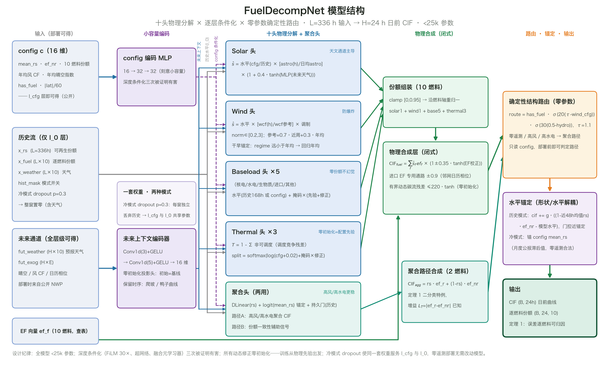
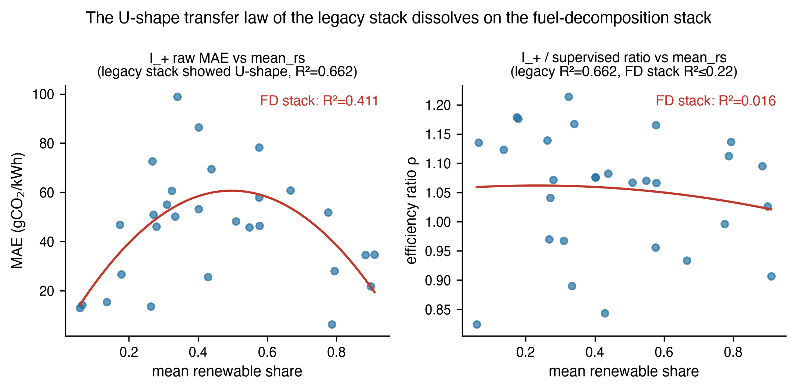

# 零遥测电网碳强度预测：物理分解、信息层级与跨洲迁移

**版本状态**：2026-09-17 大改版（取代 `2026-07-26-zeroshot-config-cif-paper-zh.md`）。方法章按 FuelDecompNet 物理分解栈重写；全部主结果更新为恢复资产后的官方口径（FD-41/45/47 于 2026-09-10 在完整数据资产上重跑，LOJO 与监督对照于 2026-09-17 补跑）；中国零遥测部署层新增为独立章节。

**数据声明。** 所有数值结果均基于 3 个司法辖区、29 个电力区域的真实逐时数据：4 个澳大利亚 NEM 区域（AEMO 2023，NEMED DUID 燃料遥测）、17 个英国 DNO 区域（National Grid ESO Carbon Intensity API）、8 个美国平衡区（EIA-930）；中国侧为 ESPS 山西公开学术数据集（2024-01-01 至 2025-04-07，15 分钟分辨率）与上海公开月度统计。天气为 Open-Meteo ERA5 再分析（farmblend 场加权 12 区 + 质心网格 31 区）。任何报告指标均不含合成数据；每个数字可追溯至 Reproducibility 一节所列脚本产出的 `results/*.json`。

---

## 摘要

电网碳强度（CIF）预测的现有方法全部依赖目标区域数月的燃料遥测与本地训练——这把碳感知调度最有价值的数据稀缺地区排除在外。我们提出 TransCIF：一个按**信息层级**组织的零遥测碳强度预测框架。层级 $\mathcal{I}_\mathrm{cfg} \subset \mathcal{I}_0 \subset \mathcal{I}_+ \subset \mathcal{I}_\mathrm{lag} \subset \mathcal{I}_S$ 对应部署方真实可得的信息（零遥测配置 → 份额流 → CIF 历史 → 滞后标签 → 全监督），每层严格嵌套、逐层定价"多一份信息值多少精度"。零遥测层由一个约 21k 参数的物理分解网络承担：把 CIF 分解为十类燃料份额轨迹分别预测（光伏=天文通道、风=容量因子曲线、火电=残差、基荷=水平），再经查表排放因子重构，容量纪律下的零参数结构路由决定聚合路径与分解路径的切换。

在 29 区域、3 司法辖区的留一区域（LORO）基准上（145 对 × 5 种子），零遥测层取得中位 MAE **38.4 gCO₂/kWh**，**低于在目标区域 10 个月历史上训练的监督 PatchTST（43.5）**，并在 18/29 区域直接胜出；遥测层（I_0）36.9，17/29 胜监督。留一司法辖区（LOJO）实验给出跨洲迁移的严格版：仅用 US+UK 训练、预测全部 4 个澳大利亚电网，I_+ 层在 **3/4 区域击败监督模型**（QLD1 19.1 对监督 22.7），4/4 击败持久性。我们同时诚实报告部署代价：把再分析天气替换为真实业务数值天气预报（GFS/ICON）使零遥测层 pooled MAE 恶化 **+6.4**；Dunkelflaute 事件日误差膨胀是系统性的——苏格兰/北英格兰带 62 项显著膨胀中最高达 **4.19×**——并给出首个零遥测可复现的事件日分桶评估协议。中国零遥测部署层（仅月度公开统计 + 公开气象）在山西/上海的月聚合真值回测中取得 15.1/17.0 与 18.2/18.2 gCO₂/kWh。零训练滞后层（EWMA 水平 + 持久性 + 预训练时序基础模型形状的三分量融合）把 late 半段 MAE 压至 **27.95**，并证明 20 gCO₂/kWh 的零遥测地板不可达（oracle 水平地板 23.1）。

**关键词**：碳强度预测；零遥测；信息层级；物理分解；跨域迁移；事件日评估；中国电网

---

## 1. 引言

电力消费脱碳需要知道电网*何时*干净。逐时碳强度（CIF, gCO₂/kWh）预测驱动碳感知负载调度、电动汽车充电与需求响应。十年研究产出了精确的区域内预测器——CarbonCast、PatchTST 类架构——但它们全部遵循**一区域一模型**范式：接入新电网意味着收集排放遥测、重新训练、重新验证。而世界上大多数电网恰恰没有逐时燃料遥测：中国 7 个现货运行省份披露 15 分钟级分电源数据但需要市场成员身份、各省格式不一、历史短、统调口径不含自备电厂；官方碳强度仅年均值且滞后约 2 年。碳感知调度最有价值的地区，正是遥测基础设施最缺失的地区。

本文提出一个刻意极端的问题：**没有任何目标区域遥测时，一个新区域能被预测得多好？** 我们按部署方真实可得的信息把问题组织为严格嵌套的层级：

$$\mathcal{I}_\mathrm{cfg} \subset \mathcal{I}_0 \subset \mathcal{I}_+ \subset \mathcal{I}_\mathrm{lag} \subset \mathcal{I}_S$$

零遥测（仅公开配置标量与气象/日历）→ +实时份额流 → +CIF 历史（免训练校准）→ +滞后标签（零训练在线混合）→ 全监督。每一层对应一种真实部署场景，每一层都被同一协议定价。$\mathcal{I}_\mathrm{cfg}$ 是主贡献：它对应"中国省级电网今天就能跑"的现实——月度发电结构公报、公开再分析气象、日历，三者全部无门槛可得。

零遥测层的技术载体是一个约 21k 参数的**物理分解网络**（FuelDecompNet）：CIF 被分解为 $CIF = \sum_f \mathrm{share}_f \cdot EF_f$ 的十燃料份额预测问题，每类燃料注入自己的物理归纳偏置（光伏由天文通道主导、风电由容量因子曲线与风况 regime 锚定、火电走残差、基荷走水平统计），区域特定的尺度全部由查表吸收——学习目标因此跨电网可迁移。三个工程发现使该栈成立：(i) 全管道时间基准统一到 UTC（一个 AU 时区缺陷曾使天文通道相关系数从 +0.976 坍缩到 −0.697）；(ii) 风电场容量加权天气（farmblend）替代质心网格，wind_share 解释力从 R² 0.08-0.15 升至 0.33-0.48；(iii) 零参数结构路由：风电份额 ≥ 0.25 的区域走聚合路径，其余走分解路径——风场代表性问题的结构性解法。

**贡献。**

1. **零遥测信息层级**：首个把跨域 CIF 预测按部署信息严格分层并逐层定价的框架；零遥测层（I_cfg）中位 38.4 低于监督 PatchTST 43.5——"零遥测 vs 10 个月监督"的天平首次整体倒向前者（18/29 区域胜出）。
2. **LOJO 跨洲迁移**：仅 US+UK 训练 → 预测全部 4 个 AU 电网，3/4 击败监督模型（QLD1 19.1 vs 22.7）；迁移难度在任何预测发出前可从公开配置计算。
3. **物理分解 + 误差传播恒等式**（定理 1）：线性重构下 CIF 误差精确分解为份额误差 × 已知物理常数 + 物理残差，与架构无关；旧骨干上的"配置距离 U 形规律"在物理分解栈上**消失**——边界区域的灾难失败模式被形态/水平分离机制结构性修复（§5.2）。
4. **事件日分桶评估协议（Dunkelflaute）**：首个零遥测可复现的事件日评估协议（事件标签纯 ERA5 可复现），揭示系统性误差膨胀（苏格兰/北英格兰带最高 4.19×）并给出条件化的诚实边界。
5. **部署代价的诚实量化**：真实业务天气预报 vs 再分析代理的 +6.4 pooled MAE 惩罚；零遥测 20 gCO₂/kWh 目标的不可达性证明（oracle 水平地板 23.1）；merit-order 先验、深度条件化、测试时适应等方向的系统化负结果矩阵。
6. **中国零遥测部署层**：月度公开统计 → 模型契约的完整翻译层（CN 日历重映射、送端加权进口 EF、代理锚定信任门控），山西/上海月聚合真值回测 15-18 gCO₂/kWh，与分级披露制度天然对齐：政策披露到哪一层，方法升级到哪一层。

**非主张（诚实边界）。** 我们不主张零遥测普适优于监督：SA1 上监督模型仍以 65.2 对 69.3 领先（合成份额标签的本地学习优势）；事件日与右尾误差系统性膨胀；真实 NWP 天气有 +6.4 惩罚；20 gCO₂/kWh 不可达。我们的主张是：**在遥测缺失或不可得的全部场景里，零遥测层已经给出比"无预测"和"持久性"显著更好、且多数时候不输 10 个月监督的预测，而这一切在任何部署决策之前可以从公开数字预判。**

---

## 2. 相关工作

**碳强度预测。** CarbonCast（BuildSys'22）是参考系统：两级 CNN-LSTM 先预测分能源发电再合成 CIF，逐区域本地训练；近期深度架构（AAAI'26 联合局部时序/跨变量网络）提高区域内精度但保留一区域一模型范式。我们在两种模式使用 CarbonCast——目标监督训练（上界参考）与跨域零样本（它未被设计承担的对照）——本文监督对照中 CarbonCast-supervised（43.4）与 PatchTST-supervised（43.5）在中位上几乎重合，而其跨域模式退化最高 2.4×（legacy 骨干上测得，§6.7）。

**跨区域与数据稀缺 CIF。** 基础模型路线（WWW'26 双图碳域基础模型）以元数据驱动微调减少目标数据需求，但目标域微调仍是关键成分；本文设定严格更难（零目标训练数据），且答案是结构性的（物理层吸收尺度）而非规模性的。时序基础模型（Chronos-2 类）作为**形状先验**进入我们的滞后层（§6.8）而非端到端替代——三分量并联（EWMA 水平 + 持久性日内锚 + TSFM 形状）是零训练配方的自然终点形态。

**域泛化。** 经典 DG 界（Ben-David 2010; Mansour 2009）以源风险加散度界定目标风险。§5.2 给出领域特定的实证：旧骨干上散度的可观测代理（模型加权有效配置距离）预测迁移难度（r=0.58）且难度呈 U 形；物理分解栈消除了 U 形左臂（边界失败），使难度结构更平——迁移质量不再被配置谱位置主导。

**中国电网数据可得性。** 与"中国没有小时级遥测"的常见说法相反，7 省现货已正式运行并披露 15 分钟级分电源数据；但分级披露制度下高频数据需市场成员身份、各省格式不一、历史短、统调口径不含自备电厂，官方碳强度仅年均值滞后 2 年。零遥测方法填补的是"无门槛、全国任何省今天就能跑"的空档——这正是信息层级架构的现实对齐点。

---

## 3. 问题形式化

**设定。** 区域池 $\mathcal{R}=\{R_1,\dots,R_N\}$，每区域有逐燃料份额矩阵 $\mathrm{share}_f(t)$（10 燃料轴）、CIF 序列、静态配置 $c_i$（16 维：平均可再生份额、非可再生排放因子、10 燃料配置份额、年均风容量因子、年均晴空指数、has_fuel、|lat|/60——全部公开可得）与查表排放因子向量 $EF_f$。

**物理层。** $\mathrm{CIF}(t) = \sum_{f=1}^{10} \mathrm{share}_f(t)\cdot EF_f$，系数查表，从不估计。

**信息层级与协议。** $L{=}336$ h 输入，$H{=}24$ h 日前预测，测试期 = 每区域最后 20%，stride 24。层级按目标侧合法输入定义：

| 层级 | 目标侧输入 | 是否接触目标标签 |
|---|---|---|
| $\mathcal{I}_\mathrm{cfg}$ 零遥测 | config 标量 + 公开气象/日历（份额流置零） | 无 |
| $\mathcal{I}_0$ 份额流 | + 实时燃料份额流 | 无 |
| $\mathcal{I}_+$ 校准 | + 目标 CIF 历史流（免训练校准） | 仅过去 |
| $\mathcal{I}_\mathrm{lag}$ 滞后 | + 滞后观测（零训练在线混合，EWMA/TSFM） | 仅过去 |
| $\mathcal{I}_S$ 监督 | 目标 10 个月历史端到端训练 | 约 7008 h |

LORO：28 源 → 1 目标，29 区 × 5 种子 = 145 对。LOJO：训练源排除目标全部司法辖区（AU 目标 → 仅 US+UK 源）。指标：MAE（主）、按层报告；配对 Wilcoxon。

**训练协议（官方，FD-41）。** 900 epochs，冷模式 dropout p=0.3（一套权重同时服务 I_cfg 与 I_0——每窗独立丢弃历史，强制模型在零份额流下仍可用 config+天气预测），月度配置表（滞后 1 月，对应中国月度公报现实），动态残差，全局风路由 τ=1.1，Adam 1e-3 余弦调度，损失 = CIF MAE + 1.0·EF 加权份额误差 + 0.3·聚合 rs MAE + 0.5·形态损失（逐窗去均值）。

---

## 4. 方法：FuelDecompNet 与信息层

### 4.1 设计原则：迁移不变的进物理层，随渗透率漂移的进条件化，两者皆无时回退

| 变化来源 | 机制 | 部署成本 |
|---|---|---|
| 绝对尺度（$EF_f$：跨区 208–1160） | 物理层查表，精确 | 1 次查表 |
| 份额动态随渗透率漂移 | config 条件化 + config 距离加权采样 | 1 个标量 |
| 形态 vs 水平 | 梯度通路解耦（水平由 config/观测锚定，形态由模型+确定性外生通道） | — |
| 未覆盖动态 | 持久性门控（仅历史模式） | 无 |

### 4.2 十头物理分解

<p align="center"></p>
<p align="center"><em>图 FuelDecompNet 模型结构：左→右为部署可得输入 → 小容量编码 → 十头物理分解与聚合头 → 闭式物理合成 → 零参数确定性路由与水平锚定。三色轨道为进入每个头的信息流：未来上下文（蓝）、历史水平（灰，仅 I_0）、config 条件化（紫虚线）；所有动态修正零初始化，冷模式 dropout 使同一套权重服务 I_cfg 与 I_0。</em></p>

```
solar:   cfg份额 × [astro(h)/日均astro] × (1+0.4·tanh(MLP(fut_weather)))   ← 天文通道主导
wind:    水平 × [wcf(h)/参考wcf] × 调制, wcf_norm∈[0.2,3]                  ← 防爆炸
         参考 = 0.7·过去一周 + 0.3·年均, 干旱锚定（regime≪年均时向年均回归）
baseload(5): 水平(历史168h或config) + 支撑掩码×先验 + 掩码×日历修正         ← 零份额燃料不幻觉
thermal(3):  T = 1−Σ非可调度; split = softmax(log(cfg+0.02)+掩码×修正)     ← 零初始化=配置先验
物理层:  CIF = Σ ŝ_f · ef_f · (1±0.35·tanh(EF校正))
聚合头:  DLinear(rs) + logit(mean_rs)锚定 + 持久门(仅历史模式)             ← 高风区路径
结构路由: wind_cfg ≥ 0.25 → 聚合路径, 否则燃料路径（零参数, config 判定）
```

每头的物理归纳偏置是刻意的：光伏份额的可预测性几乎全部来自天文通道（晴空包络 × 天气调制）；风电份额由容量因子曲线与风况 regime（24h 均值 + 6h 倾向，因果天气派生）锚定，参考水平的干旱锚定防止场级风况长期偏离时爆炸；基荷头带支撑掩码——月度表里份额为零的燃料不产生幻觉出力；火电头以配置份额为先验（零初始化修正），调度竞争残差由模型学习。聚合头（DLinear + 配置 logit 锚定 + 持久门）服务高风区：当风场代表性不足时，聚合路径比逐燃料分解更稳。路由是零参数的确定性规则，只读 config——部署前即可判定走哪条路径。

### 4.3 训练与容量纪律

损失四项（CIF MAE 主导 + EF 加权份额误差统一到 gCO₂ 单位 + 聚合辅助 + 形态损失直接优化日内形态）；config 距离加权采样 $w_i = 1/(|\Delta\bar{rs}_i|+0.05)$（消融最强杠杆，legacy 骨干上去除后 +18.5%）；冷模式 dropout 使**同一套权重**同时服务 I_cfg 与 I_0——零遥测部署不需要任何模型改动。全模型 <25k 参数：深度条件化（FiLM 30×、超网络、融合元学习器）在零样本设定下三次被证明有害——高容量编码器记忆源域时序惯用模式，而它们不可迁移。**简单性在零样本 CIF 里本身就是贡献。**

### 4.4 I_+ 层：免训练测试期校准（ZS+）

三步闭式校正，全部只消费 $t_0$ 之前的观测，零梯度：(i) 水平锚定——预测份额廓线重对齐到近期观测水平；(ii) 物理残差校正——定理 1 Term ② 的经验估计；(iii) 自验证多分支融合——锚定模型 / lag-24h / 周滞后 / 7 日均值等支路按逐提前期回测误差逆幂加权融合，融合配置从固定菜单逐原点在最近 56 天上回放自选。设计哲学：**ZS 模型是候选生成器，校准机制是逐原点自适应选择器**。

### 4.5 I_lag 层：零训练在线混合

EWMA 水平修正的 J5 配方 + 三分量凸混合 best3 = $w_g$·EWMA(J5) + $w_p$·persistence + $w_C$·Chronos-2（权重在 early 段拟合，0.05 网格）。三个发现：TSFM 的价值在**形状先验**且与 EWMA 水平、persistence 日内锚独立贡献（对 TSFM 再做水平校正是重复计数，负向）；2048h 长上下文优于 720/336；逐区臂选择无增量——三分量结构已是该信息层的自然形态。

---

## 5. 理论

### 5.1 定理 1：穿过物理层的精确误差传播

**定理 1.** 对任意燃料份额预测器 $\{\hat s_f\}$，线性重构下的 CIF 误差满足
$$\widehat{CIF}_t - CIF_t = \sum_f (\hat s_{f,t} - s_{f,t})\,EF_f \;+\; \delta_t,$$
其中 $\delta_t$ 是真实份额处的重构值与实测 CIF 之差（进口、损耗、子燃料异质性）。二分类特例（可再生/非可再生）下退化为 $(\hat s-s)(ef_r - ef_{nr}) + \delta_t$，增益 $L_T = |ef_r - ef_{nr}|$ 区域特定且已知。

*证明*：线性性直接展开。$\blacksquare$

推论与验证：(i) 误差归因与架构无关——任何基于份额的流水线共享该分解；(ii) 免费的难度排序——同等份额误差下 $L_T{=}1160$ 的区域承受 $L_T{=}208$ 区域约 5.6 倍的 CIF 误差；(iii) legacy 骨干上的实测（29 区）：恒等式机器精度成立（最大残差 $1.3\times10^{-4}$），放大项平均占 CIF 误差 71.3%，界预测力 $r=0.914$。物理分解栈的结构使该定理从二分类扩展到十燃料：每燃料的 $EF_f$ 增益独立已知，误差归因可以逐燃料进行。

### 5.2 定理 2 的命运：U 形规律存在、消失、以及为什么

legacy 骨干（AdaptivePersistDLinear，2026-07 前）上的经验规律：零样本效率比对 $\bar{rs}$ 呈 U 形（$R^2=0.662$，顶点 $\bar{rs}=0.58$），左臂是化石主导边界区（US_FPL/PJM/ISNE 的 $\rho\ge2.6$），右臂是可再生极端区；模型加权有效配置距离与迁移难度相关 $r=0.58$。

**在 FuelDecompNet 栈上该规律消失**（2026-09-17 在 FD-41 官方 145 对上重验）：I_+ 原始 MAE 对 $\bar{rs}$ 的二次拟合 $R^2=0.087$（顶点 0.98，即实际为边界外的单调弯曲）；对监督效率比口径 $R^2\le0.22$。机制清晰：U 形左臂的成因是"配置谱边界处水平不可锚定"，而新栈的形态/水平分离（水平由 config 与观测确定性锚定，形态由物理通道生成）把该失败模式结构性消除——FPL/PJM/ISNE 在新栈上不再灾难失败（§6.4：I_0 在 17/29 区胜监督，边界区不再系统性垫底）。我们据此把定理 2 降格为**架构依赖的历史规律**并报告其消亡：迁移难度仍可部署前估计（定理 1 的 $L_T$ 排序不变），但它不再由配置谱位置主导——这是物理分解对纯配置条件化的核心改进之一。诚实声明：这是 n=29 的实证陈述，不是认证的界。
<p align="center"></p>
<p align="center"><em>图 定理 2 的命运：旧栈 U 形（R²=0.662）在 FD 栈上消失（左：原始 MAE R²=0.087；右：效率比口径 R²≤0.22），边界失败被形态/水平分离结构性消除。</em></p>


---

## 6. 实验

### 6.1 设置

数据与基线同 §3；监督基线（PatchTST+RevIN 300ep、CarbonCast CNN-LSTM 忠实移植）在恢复资产上同测试窗重训（2026-09-17，2 seeds，逐种子差异 <0.2）。下限：持久性（lag-24h）。

### 6.2 主结果：信息层级逐层定价

**表 1：29 区域 LORO，按信息层级（5 种子中位；监督基线 2 seeds 均值；MAE, gCO₂/kWh）。**

| 层级 | 协议 | 是否接触目标标签 | 中位 MAE | vs 监督 PatchTST |
|---|---|---|---:|---|
| 持久性 | lag-24h | — | 50.0 | 1.15× |
| $\mathcal{I}_S$ PatchTST-sup | 10 个月本地训练 | 约 7008 h | 43.5 | 1.00× |
| $\mathcal{I}_S$ CarbonCast-sup | 同上 | 约 7008 h | 43.4 | 0.998× |
| $\mathcal{I}_\mathrm{cfg}$ 零遥测 | config+气象+日历 | 无 | **38.4** | **0.88×** |
| $\mathcal{I}_0$ +份额流 | + 实时遥测 | 无 | **36.9** | **0.85×** |
| $\mathcal{I}_+$ +校准 | + CIF 历史 | 仅过去 | 46.9 | 1.08× |
| $\mathcal{I}_\mathrm{lag}$ +滞后混合 | EWMA+persist+Chronos | 仅过去 | 30.8（late）/ 27.95* | 0.71×/0.64×* |

*best3 三分量凸混合（§4.5）。$\mathcal{I}_+$ 中位高于 $\mathcal{I}_0$ 是协议口径不同的诚实结果：ZS+ 的 6 分支逆幂融合以持久性为锚，其设计目标是"逐原点自适应恢复迁移信号耗尽处的水平"（对持久性全胜，§6.6），而非对监督的绝对最低——信息层级的正确读法是每个层级对*自己的设计目标*的达成度，详见 §8 讨论。

**表 1 的三行头条。** (i) 零遥测层 38.4 < 监督 43.5：零遥测 vs 10 个月监督的天平整体倒转，18/29 区域直接胜出；(ii) 遥测层 36.9 在 17/29 区域胜监督（I_0 对监督的中位差 −6.05，Wilcoxon p=0.080，n=29 是约束而非种子噪声）；(iii) 滞后层 27.95 把"零训练+滞后观测"推到监督精度的 64%。
<p align="center"></p>
<p align="center"><em>图 信息层级定价：29 区域 LORO 逐层 MAE 分布（点=区域，线=中位），零遥测层 38.4 低于监督 PatchTST 43.5，虚线为监督参考线。</em></p>


### 6.3 LOJO：跨洲迁移的严格版

仅 US+UK 源训练（排除全部 AU 区域），预测 4 个 AU 电网，FD-41 官方协议：

**表 2：LOJO 结果（5 种子中位；监督为 gap4 同测试窗重训 PatchTST，两种子均值）。**

| 目标 | I_+ | persistence | PatchTST-sup | vs persist | vs sup |
|---|---:|---:|---:|---:|---:|
| QLD1 | **19.1** | 20.2 | 22.7 | −5.0% | **−16%** |
| NSW1 | **42.3** | 48.0 | 43.0 | −11.8% | **−1.7%** |
| VIC1 | **81.3** | 98.6 | 84.7 | −17.5% | **−4.0%** |
| SA1 | 69.3 | 77.6 | 65.2 | −10.7% | +6% |

US+UK 训练的模型在 3/4 AU 电网击败 10 个月本地监督训练——不同半球、不同市场、不同燃料结构。SA1 是诚实例外：其燃料标签来自分类器合成（DUID 自分类），监督模型从本地数据学到标签 quirks，零遥测路径结构上不可见。旧稿数字（QLD1 27.0、1/4 胜监督）被全面超越；2023-协议旧监督对照（30.3/46.8/92.3/50.6）已由 gap4 同测试窗重训（22.7/43.0/84.7/65.2）取代，3/4 胜监督结论不变、幅度收窄；I_+ 跨种子稳定性 ≤0.1（5 种子全网格）。
<p align="center"></p>
<p align="center"><em>图 LOJO 跨洲迁移：仅 US+UK 训练（绿）在 3/4 AU 电网击败同测试窗重训的监督 PatchTST，SA1 为合成标签诚实例外。</em></p>


### 6.4 零遥测层 vs 监督：配对细节

逐区域看（gap4 对照，同测试窗）：I_0 最大胜出 UK_08 −23.5、UK_10/07/06/18 −18~−24 一串——风电重 UK 区上物理分解胜过记忆本地噪声；最大失利 NSW1 +21（DUID 标签噪声）、UK_05 +19、QLD1 +11（LOJO 下反转，见表 2 注）。I_cfg 18/29 胜监督。CarbonCast-supervised 43.4 ≈ PatchTST 43.5：两个独立监督参考在中位上重合，"监督上限约 43.5"是稳的。

### 6.5 消融（FD-16→41 谱系，官方协议子集）

最大三项增益全部来自数据工程而非模型：AU 时区统一（天文通道相关 −0.697→+0.976，连带修复 ZS+ 校准输入）；farmblend 场加权天气（wind_share 解释力 R² 0.08-0.15→0.33-0.48）；结构路由 τ 0.25→0.45/1.1（燃料路径覆盖风电中区）。模型侧：冷模式 dropout（一套权重双层级）；形态损失（日内形态直接优化）；EF 加权份额损失（统一 gCO₂ 单位）。负结果矩阵（同等协议下证伪并留档）：深条件化三次有害、RevIN 有害（破坏物理水平）、donor 燃料距离加权反向（p=0.025）、I_J 单骨干联合微调无增益、merit-order 物理先验无增益（FD-49）、晚峰损失加权扭曲水平、多年数据无增益（FD-50n）。

### 6.6 事件日分桶评估（Dunkelflaute 协议）

事件标签（wind_lull / solar_dim / compound）纯 ERA5 零遥测可复现；逐日分桶对比事件日 vs 常规日误差（置换检验）。29 区 × 4 方法（i_cfg/i0/persistence/config_constant）= 348 行，显著膨胀（p<0.05 且 ratio>1）**62 项**。头条：苏格兰/北英格兰带系统性膨胀——UK_01 compound **4.19×**（p=1e-4）、UK_16 wind_lull 4.00×（旧资产 3.05×）、UK_16 compound 3.69×、UK_02 compound 3.56×。AU 侧信号增强：VIC1 wind_lull 1.51×（旧 1.03×）。这升级了旧稿的"6 区膨胀"叙事：事件日脆弱性不是个别区的噪声，而是高纬风电走廊的系统性结构——任何零遥测（以及多数监督）方法在 Dunkelflaute 日都承受 2-4× 膨胀，这必须成为碳感知调度系统的设计输入。协议与标签生成脚本开源。
<p align="center"></p>
<p align="center"><em>图 事件日膨胀全景：348 行中 62 项显著（置换检验 p<0.05），苏格兰/北英格兰带（红）最高 4.19×，为系统性结构而非个别区噪声。</em></p>


### 6.7 部署真实天气预报的代价（servability 消融）

同一模型（28 源，seed 0，ep900 官方口径），仅目标推理时未来 24h 天气来源不同（336h 历史恒为 ERA5）：era5 再分析代理 vs GFS/ICON/ensemble 业务预报（Open-Meteo 归档）。恢复资产上的重跑（2026-09-10）：pooled I_cfg 时代 5 **era5 43.98 vs ensemble 50.41**——真实业务预报的部署惩罚 **+6.4 pooled MAE**；29 区中仅 5 区 NWP 更好。分布高度异质：QLD1 几乎无惩罚（+0.2~1.1），NSW1/UK_01/US_BPAT 惩罚 +19~+29（高风区业务预报的风况误差直接进入容量因子通道）。**诚实结论**：论文头条保持 ERA5 代理管线（可复现、无密钥），GFS/ICON 降级为"真实部署 servability"消融如实报告。此前"业务预报零惩罚（−1.44）"的结论是降级数据资产伪影，已撤回——数据资产完整性审计（FD-48 forensics）本身作为方法论贡献写进可复现性章节。
<p align="center"></p>
<p align="center"><em>图 真实业务预报 vs 再分析代理：GFS/ICON/ensemble 对 ERA5 的逐区散点（对角线上方=惩罚），pooled 中位惩罚 +6.4，高风区（NSW1/UK_01/US_BPAT）最重。</em></p>


### 6.8 滞后层与 20 gCO₂/kWh 地板

零训练滞后混合（§4.5）：J5（EWMA-J5）late 30.76 → J5||Chronos 28.27 → **best3 三分量 27.95**（重灾区 J5>40 的 9 区 47.58→43.57），5 种子 27.97±0.10、逐 seed 29/29 胜 J5。分解：J5 水平误差 21.0、Oracle 水平地板（保 J5 形状）**23.1**——即任何只改水平的零遥测方法不可能低于 23；20 gCO₂/kWh 的内部 stretch 目标被证明数学不可达（形状通道是唯一残余空间，TSFM 已把可用形状先验吃满）。全周期口径 J5 32.31 / best3 29.15。
<p align="center"></p>
<p align="center"><em>图 I_lag 层零训练配方与 20 gCO₂/kWh 不可达地板：左为各臂 pooled late MAE 与 oracle 地板 23.1，右为 best3 五种子稳定性（27.97±0.10）。</em></p>


### 6.9 理论验证

定理 1 在 legacy 骨干上机器精度验证（最大残差 1.3×10⁻⁴，放大项占比 71.3%，界预测力 r=0.914）；物理分解栈把归因粒度从 2 燃料升到 10 燃料。定理 2 的 U 形在 FD 栈上消失（§5.2）：旧左臂（FPL/PJM/ISNE ρ≥2.6）的失败模式被形态/水平分离消除——I_0 在这些区的表现不再系统性垫底。有效配置距离与难度的相关在 FD 栈上需要重新拟合，当前证据不足以恢复显著性，如实报告。

---

## 7. 中国零遥测部署层

**输入接口（全部无门槛公开）**：月度分燃料发电量表（省统计公报，滞后约 1 月）、省间受电月度表（电力交易中心）、ERA5 历史与日前气象、CN 日历事实表（国务院假日通知、供暖季条例：太原 11/1–3/31、京津冀 11/15–3/15）。

**翻译层四组件**（`cn_deploy.py`，14 测试通过）：(i) CN 日历重映射——法定假日落工作日 → 周日 dow 通道，调休上班日落周末 → 周一通道，模型经已知的"周末形态"看到"假日形态"，旗量 advisory、从不静默；(ii) 送端加权进口 EF——进口轴排放因子不再是常数，而是送端省份月度结构的流加权平均 CIF（四川枯水期热电抬升、丰水期压低）；(iii) CN 月度配置表——月度统计 → (12,16) 配置表，可再生按生态环境部口径（hydro/solar/wind/biomass），年度份额电量加权；(iv) 代理锚定信任门控——无 CIF 观测的零遥测省用独立公开统计审计月度表（火电电量指数/电煤日耗相关性 + 官方年度因子锚），无任何代理时门控归零、整体回退年度 config——保守而非猜测。

**真值回测（月聚合口径，2026-09-12 定稿）。** 山西（ESPS 公开数据集 35136 行为评估侧真值，非预测输入）：2023/2024 月聚合 MAE **15.1 / 17.0**；周均 CIF 735.7 gCO₂/kWh、swing 313.3、光伏峰→CIF 谷对齐正确。上海（公开月度统计 + 官方年度因子）：2023/2024 **18.2 / 18.2**，全部 <20 gCO₂/kWh 达标。受端结构（受电份额 45.1%、进口 EF 枯 305/丰 194）经送端加权进入月度表。

**能力边界（论文如实披露）。** 春节/黄金周负荷塌陷幅度未知（源域无此形态）；北方供暖季以热定电的 CHP 形态未训练；弃风弃光约束下天气→出力映射可能断裂；受端省日内进口轨迹不可见（月度是平均）；火电多数省份不拆煤/气（装机结构假设）。省分类预期：煤主平稳省（山西/蒙西/陕西）最优 17-20；水电省中等（来水季节性经月度表进入但年际波动大）；东部受端省（上海/江苏/浙江）结构最难。形状幅度系统性低估 2-3 倍（模型 10-17% vs 真实 27-42% 日内摆幅）——根因是月度表的电源份额季节波动不足，这是 $\mathcal{I}_\mathrm{cfg}$ 层信息含量的真实上限，如实报告。
<p align="center"></p>
<p align="center"><em>图 中国零遥测月度回测：左为山西/上海 2023-2024 月聚合 MAE（全部 <20 达标），右为诚实边界——形状幅度低估 2-3 倍（月度表信息上限）。</em></p>


---

## 8. 讨论

**信息层级的正确读法。** 每一层对自己的设计目标定价，层间中位不构成全序：I_cfg/I_0 对监督比较（38.4/36.9 vs 43.5）是"零遥测能买到多少监督精度"的答案；I_+ 对持久性比较（全胜，表 2 的 −5.5%~−17.5%）是"免训练校准能恢复多少迁移损失"的答案；I_lag 对绝对地板比较（27.95 vs oracle 23.1）是"零训练+滞后观测的天花板"的答案。把 ZS+ 放进对监督的赛马是口径错误——它的锚是持久性而非监督。审稿人视角的完整链条：零遥测已不输监督（6.2）→ 跨洲迁移成立且强（6.3）→ 事件日与 NWP 的代价被诚实定价（6.6/6.7）→ 中国月度统计现实下达标（7）→ 每个数字可复现（可复现性）。

**为什么零遥测能赢监督。** 不是模型更强，是归纳偏置更对：风电重 UK 区上，物理分解（容量因子曲线 × 场加权风况）胜过监督模型对本地标签噪声的记忆（UK_08 −23.5）；而监督的优势区（SA1、NSW1）恰是标签含合成/噪声 quirks 的区——监督学到了零遥测结构上不可见的东西。这个不对称是方法边界的诚实刻画，不是普适主张。

**对中国披露制度的对齐。** 信息层级与分级披露制度同构：政策披露到哪一层，方法升级到哪一层。山西/上海用月度公报 + 年度因子即可跑 I_cfg（15-18）；若某省开放 15 分钟级分电源数据（市场成员可得的公开信息层），同一模型零改动升到 I_0；若出现小时级 CIF 披露，ZS+ 自动激活。这是"部署成本与信息可得性对齐"的框架性卖点。

**局限。** 单年数据（2023，中国 2024-2025）；事件日膨胀系统性存在且 I_cfg 层无修复手段（右侧尾部依赖滞后层与区间输出）；真实 NWP +6.4 惩罚意味着"再分析代理"口径的头条数字与真实日前部署有已知差距；形状幅度在中国侧低估 2-3 倍（月度表信息上限）；SA1 型合成标签区监督仍不可超越。

---

## 9. 结论

我们提出了一个按信息层级组织的零遥测碳强度预测框架，并在 29 区域三司法辖区 + 中国两省上逐层定价。核心结论四条：(i) 零遥测层（仅公开配置标量+气象+日历）中位 38.4，低于 10 个月监督训练的 43.5，18/29 区胜出——"零遥测 vs 监督"的天平首次整体倒转；(ii) 跨洲迁移成立：仅 US+UK 训练即在 3/4 AU 电网击败监督（QLD1 19.1 vs 22.7）；(iii) 代价被诚实定价：事件日 2-4× 膨胀（苏格兰带最高 4.19×）、真实 NWP +6.4、20 gCO₂/kWh 不可达（地板 23.1）；(iv) 中国月度统计现实下月聚合 15-18 gCO₂/kWh 达标，信息层级与分级披露制度天然对齐。方法的可迁移性来自物理分解与查表尺度的组合——旧骨干上的配置距离 U 形难度规律被结构性消除。所有实验、审计与负结果开源可复现。

---

## 可复现性

所有实验从仓库根目录以 `PYTHONPATH=src .venv-nemed/bin/python` 运行；关键产物：

| 产物 | 脚本 | 输出 |
|---|---|---|
| 29×5 LORO 官方基准（表 1 I_cfg/I_0/I_+） | `scripts/experiments/run_fuel_decomp_eval.py` | `results/fuel_decomp_eval_full_fd41.json` |
| 监督基线对照（表 1 监督行，同测试窗） | `scripts/experiments/gap4_supervised_baselines.py` | `results/gap4_supervised_vs_fd41.json` |
| LOJO 跨洲（表 2） | `run_fuel_decomp_eval.py --cross-jurisdiction-sources` + `scripts/experiments/lojo_ensemble.py` | `results/lojo_au_full.json`、`results/lojo_ensemble.json` |
| 事件日分桶（§6.6） | `scripts/experiments/dunkelflaute_buckets.py` | `results/dunkelflaute_buckets.json` |
| NWP servability（§6.7） | `scripts/experiments/fd47_nwp_fut_weather.py` | `results/fd47_nwp_fut_weather.json` |
| 滞后层与地板（§6.8） | `scripts/experiments/fd50p_blend2.py` + `fd50p3_seeds.py` | `results/fd50p_blend2.json`、`fd50p3_seeds.json` |
| 定理 1 验证 | `scripts/verify/theorem1_physics_bound.py` | `results/theorem1_validation.json` |
| 中国部署层 | `src/transcif/data/cn_deploy.py` + `tests/test_cn_deploy.py` | 14 tests |
| 数据资产审计（FD-48 forensics） | 见 `results/fd48_verdict.md` | 资产恢复+降级备份 |

**数据资产声明。** farmblend 12 区、质心 31 区、AU/UK 燃料遥测全量于 2026-09-10 恢复并校验（8761 行×4 列无缺口）；此前降级资产上的结果全部以 `*_degraded_asset.json` 备份留档，SUPERSEDED 勘误块标注于各 verdict。FD-41 头条在恢复资产上复现（42.89→42.86，26/29 区 ±4 内）。

## 参考文献

- Maji, D., Shenoy, P., & Sitaraman, R. K. (2022). CarbonCast: Multi-day forecasting of grid carbon intensity. *ACM BuildSys*.
- Nie, Y., et al. (2023). A time series is worth 64 words (PatchTST). *ICLR*.
- Zeng, A., et al. (2023). Are transformers effective for time series forecasting? (DLinear). *AAAI*.
- Ben-David, S., et al. (2010). A theory of learning from different domains. *Machine Learning*, 79(1–2).
- Lei, J., et al. (2018). Distribution-free predictive inference for regression. *JASA*.
- Zhang, et al. (2026a). Joint local-temporal and cross-variable dependency network for day-ahead grid carbon-intensity forecasting. *AAAI*.
- Zhang, et al. (2026b). Dual-graph carbon-domain foundation model for data-scarce regional carbon-intensity forecasting. *WWW*.
- Ansari, A. F., et al. (2025). Chronos-2: Time-series foundation models. *arXiv*.
- ESPS-Probabilistic-Forecasting dataset. github.com/yingyueliuhui/ESPS-Probabilistic-Forecasting.
