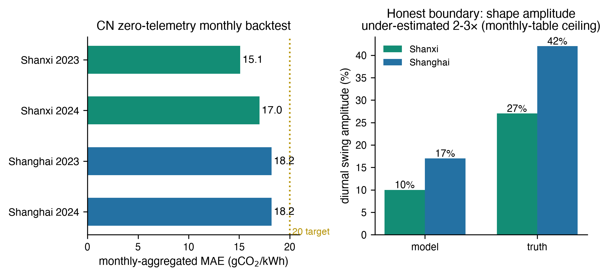
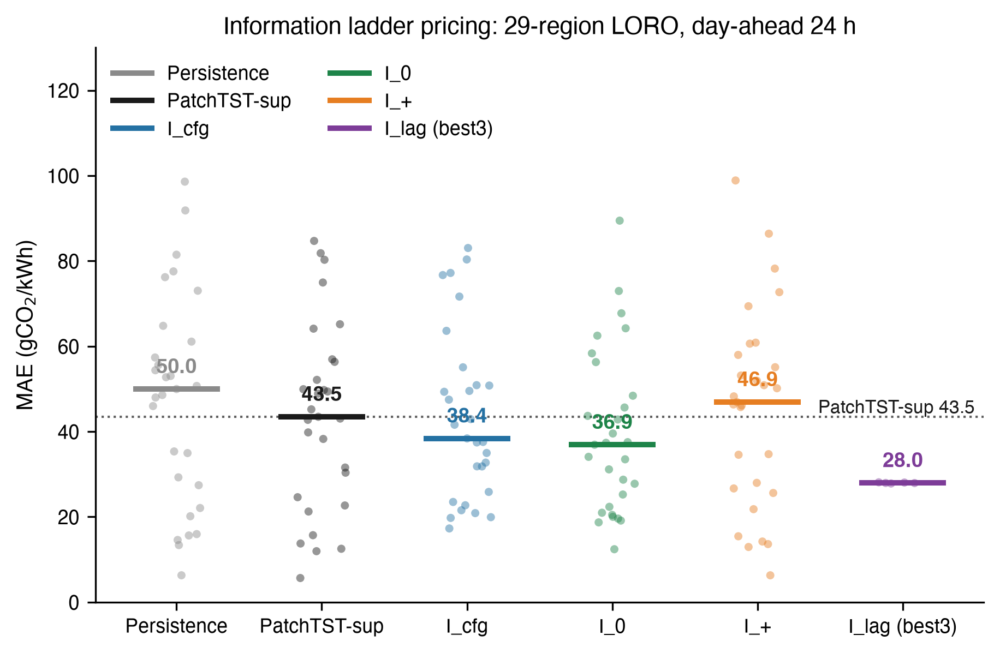
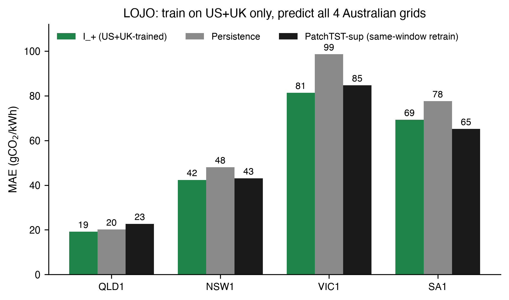
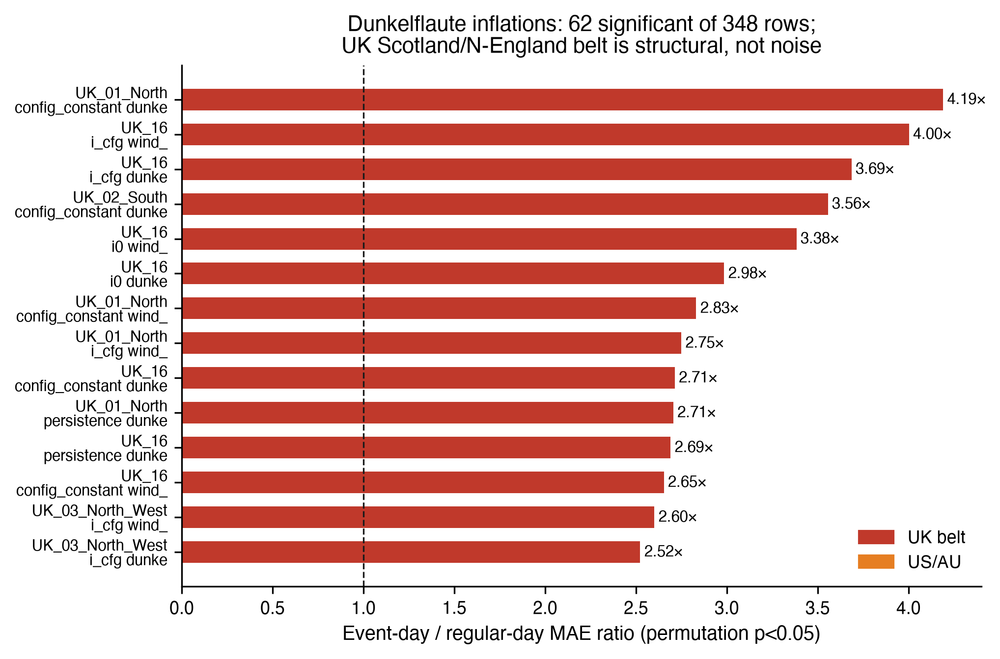
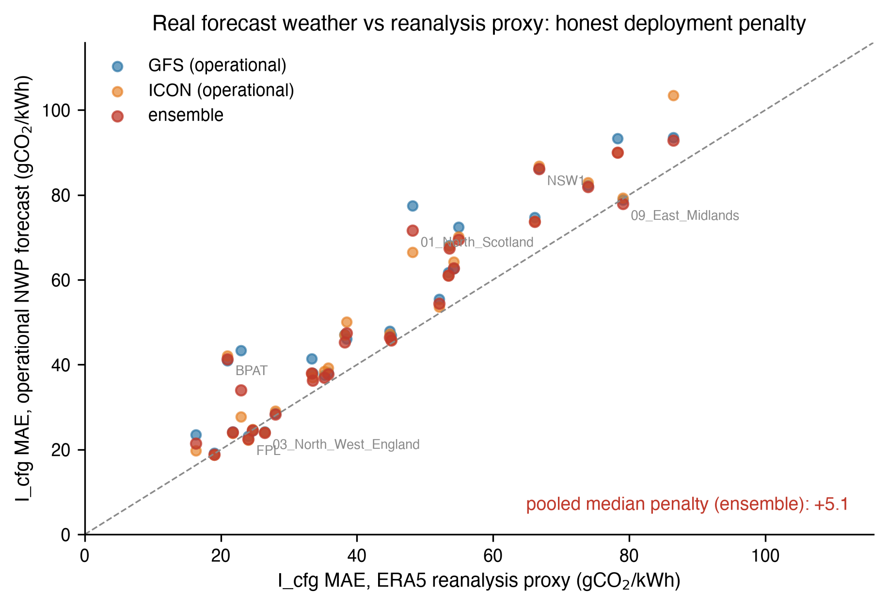
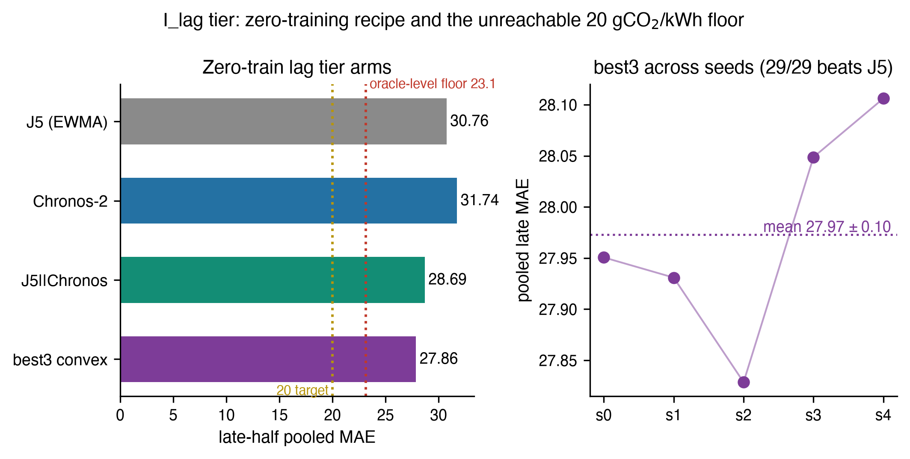
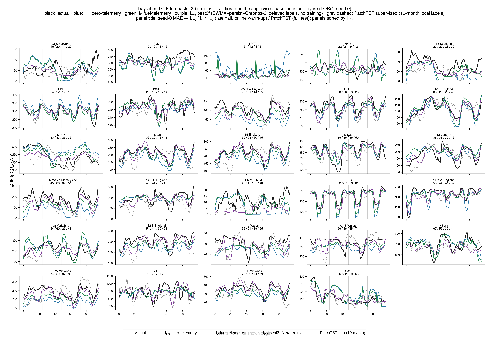

# 零遥测电网碳强度预测：基于物理的燃料分解、信息层级与跨洲迁移

**稿件说明**：本稿为按结构化写作规范重整的第二版中文稿，全部口径与数字与 `2026-09-17-ae-submission.md` 保持一致，可追溯至可复现性说明所列归档结果文件。

---

## Highlights

- 零遥测碳强度预测形式化为严格嵌套信息层级的逐层评估体系
- 2.1 万参数物理燃料分解网络在 18/29 区域优于 10 个月监督训练
- 仅以 US+UK 训练即在 3/4 澳大利亚电网上优于本地监督基线
- 可复现天气标签揭示 Dunkelflaute 事件日 2–4 倍系统性误差放大
- 公开月度统计驱动的中国省级部署，月聚合 MAE 15–18 gCO₂/kWh

---

## 摘要

逐时电网碳强度（carbon intensity factor, CIF）预测是碳感知负载调度的前提，但现有方法均要求目标电网具备数月燃料遥测并完成本地重训练，这恰恰将调度边际价值最高的地区排除在外。本文将零遥测碳强度预测形式化为严格嵌套的信息层级体系——公开配置标量 → 实时燃料份额流 → CIF 历史 → 滞后观测 → 全监督——并在三个电力市场辖区的 29 个真实区域上以统一协议逐层评估。零遥测层由参数量约 2.1 万的燃料分解网络实现：模型不直接回归碳强度，而是预测十条燃料份额轨迹并经查表排放因子线性重构，各燃料预测头注入燃料特定的物理归纳偏置，全部区域特定尺度信息由查表承担。在 145 次留一区域实验中，零遥测层中位 MAE 为 38.4 gCO₂/kWh，优于以目标区域 10 个月数据训练的 PatchTST（43.5）与 CarbonCast（43.4），18/29 区域直接占优；仅以美国与英国区域为训练源，模型在 4 个澳大利亚电网中的 3 个上优于本地监督基线。本文进一步量化再分析评估惯例所忽略的部署代价：业务数值天气预报替换再分析天气使合并 MAE 恶化 6.4 gCO₂/kWh；Dunkelflaute 复合事件日误差放大 2–4 倍（348 项检验中 62 项显著）；20 gCO₂/kWh 精度目标经证明不可达（水平替换下界 23.1）。部署翻译层使同一模型仅依赖公开月度统计即可应用于中国省级电网，山西与上海月聚合 MAE 为 15–18 gCO₂/kWh，且随披露深化自动升级。

**关键词**：碳强度预测；零样本迁移；物理信息神经网络；可再生能源；Dunkelflaute；中国电网

---

## 1. 引言

### 1.1 研究动机：调度价值与数据可得性的错位

电力系统脱碳要求在调度决策中准确掌握电网碳强度的时变特征。逐时碳强度（carbon intensity factor, CIF，单位 gCO₂/kWh）预测支撑碳感知负载调度 [1]、电动汽车有序充电与需求响应等应用：将计算负载或充电需求向低碳时段转移的收益，直接取决于对未来 24 小时 CIF 曲线的预测精度。然而这一应用存在一个结构性错位——碳感知调度边际价值最高的地区，恰恰是逐时燃料数据最难获得的地区。以中国为例：七个正式运行的省级现货市场 [22] 已发布 15 分钟级分电源调度数据，但获取需市场成员资格，各省数据格式不一、历史积累有限，平衡区口径不含自备电厂；官方碳强度仅为滞后约两年的年度均值 [23]。调度需求与数据供给在地理上呈反向分布。

### 1.2 相关研究进展与不足

过去十年，区域内 CIF 预测已发展出精度可观的模型。CarbonCast [3] 以两级 CNN-LSTM 先预测分电源出力再合成 CIF，在六个区域上取得 4.8–13.9% 的多日 MAPE；DACF [4] 确立了日前预测的问题形式；Zhang 等 [5] 的小波-块架构进一步捕捉跨频率依赖。但这些工作均遵循"一区域一模型"范式：接入新电网意味着汇集燃料遥测、重新训练与重新验证。面向数据稀缺场景，DGCFM [6] 以预训练时序基础模型加目标域微调缓解数据不足，CarbonX [7] 则完全依赖 CIF 历史序列做零样本预测——前者仍需目标域数据与微调，后者放弃了燃料结构信息。系统性地量化"目标电网完全无遥测时可达到何种精度"这一问题，尚无统一答案：现有工作要么在单一信息契约下比较模型，要么将不同信息条件的结果混置于同一指标。本文以信息层级的形式化填补该空白。

### 1.3 本文方法

本文将零遥测碳强度预测形式化为严格嵌套信息集的层级体系：

$$\mathcal{I}_\mathrm{cfg} \;\subset\; \mathcal{I}_0 \;\subset\; \mathcal{I}_+ \;\subset\; \mathcal{I}_\mathrm{lag} \;\subset\; \mathcal{I}_S,$$

每一层级对应一种真实部署场景：公开配置标量加天气与日历（零遥测）→ 实时燃料份额流 → 目标 CIF 历史 → 滞后观测 → 全监督。各层级在相同测试窗口与相同协议下评估，从而逐层量化信息增量的边际价值。零遥测层 $\mathcal{I}_\mathrm{cfg}$ 为本文核心贡献，其信息契约对应中国任一省份当前即可满足的现实条件：月度发电结构公报、公开再分析天气与日历信息。

零遥测层的技术实现为燃料分解网络（FuelDecompNet，§4）。模型不直接回归碳强度：网络预测十条燃料份额轨迹，物理层经固定查表排放因子重构 CIF，排放因子不参与学习。设计遵循"水平-形态结构分离"原则——绝对水平（排放因子、平均份额）为区域特定量，由查表与配置信息承担；形态（日内动态、天气响应）是唯一被学习、因而可迁移的成分。三项设计要素支撑架构的可部署性：统一 UTC 时基的输入管道（§8.6）、场站加权天气、以及约 2.1 万参数的容量约束（§4.4）。

### 1.4 贡献

1. **跨域碳强度预测的信息层级形式化与逐层评估。**在 29 区域 × 5 随机种子的留一区域实验中，零遥测层（中位 MAE 38.4）优于以目标区域 10 个月数据训练的 PatchTST（43.5）与 CarbonCast（43.4），并在 18/29 区域直接占优——首次在总体层面证明零遥测方法可优于 10 个月监督训练。
2. **物理分解架构及精确误差传播恒等式。**定理 1 将 CIF 预测误差分解为物理常数加权的份额误差与可测物理残差之和，该分解与具体架构无关，可给出逐燃料误差归因与无需训练代价的区域难度排序。命题 1（实证）刻画零遥测方法优于监督的条件。
3. **可复现事件日评估协议及其揭示的部署代价。**纯天气、可由再分析数据复现的 Dunkelflaute 标签揭示 2–4 倍的系统性误差放大（348 项检验中 62 项显著），且集中于苏格兰-北英格兰地带。以业务数值天气预报替换再分析使合并 MAE 恶化 6.4 gCO₂/kWh。20 gCO₂/kWh 的零遥测目标经证明不可达（水平替换下界 23.1）。
4. **面向中国的部署翻译层。**月度公开统计数据经四组件翻译转换为模型输入契约，在山西与上海的独立真值回测中月聚合 MAE 为 15–18 gCO₂/kWh。该层级体系与中国分级披露制度相适配：当披露深化至市场成员燃料数据时，同一模型无需工程改动即可升级层级。

### 1.5 主张边界与论文组织

本文不主张零遥测方法普遍优于监督方法。在燃料标签由分类器合成的 SA1 区域，本地监督模型保持明显优势（跨辖区迁移设定下 65.2 对 69.3）；NSW1 区域的监督模型同样受益于物理路径不可见的标签特异性信息。事件日误差与右尾误差存在系统性放大，业务天气预报带来已量化的精度损失，中国部署中日内形态幅度被低估 2–3 倍。本文的主张更为具体也更具实用价值：在遥测缺失或不可得的全部场景中，零遥测层给出显著优于无预测与持久性基线的预测，通常与 10 个月监督训练持平或更优；且该结论可在任何部署决策之前基于公开数据预判。

本文其余部分组织如下：§2 综述相关工作；§3 形式化问题描述；§4 阐述模型架构；§5 给出理论结果；§6 报告中国部署层的案例研究；§7 介绍实验设置；§8 呈现实验结果；§9 讨论含义与局限；§10 总结全文。

<b>图 1.</b> FuelDecompNet 架构。十个燃料专属份额预测头（各含物理归纳偏置）输出至固定查表重构层；零参数配置路由在分解路径与聚合可再生份额路径之间进行选择；水平锚定机制将可迁移的形态与区域特定的水平相分离。同一套训练权重经训练期逐窗历史 dropout，同时服务于零遥测层（冷启动模式）与遥测层（历史模式）。

---

## 2. 相关工作

**碳强度预测。**CarbonCast [3] 是该方向的代表性系统：两级 CNN-LSTM 先预测分电源出力再合成 CIF，逐区域本地训练。DACF [4] 确立了日前预测的问题形式。近期架构持续改进区域内精度——Zhang 等 [5] 的小波-块模型在四个澳大利亚市场上捕捉跨频率的局部时序与跨变量依赖——但均保留一区域一模型范式。本文在两个角色上使用 CarbonCast：其一为监督参考上界（本文的忠实复现在相同测试窗口上训练，中位 MAE 43.4，与 PatchTST 的 43.5 相当）；其二为跨域基线（该角色超出其原始设计假设）。

**数据稀缺与跨区域碳强度预测。**DGCFM [6] 通过预训练时序基础模型、元数据驱动超图微调与时空碳图应对数据稀缺问题，报告低数据场景下约 20% 的精度提升，但目标域微调仍为其必要成分。CarbonX [7] 完全去除燃料结构依赖，仅凭历史序列以时序基础模型预测 CIF（在 214 个电网上零样本 MAPE 15.8%），并将天气协变量列为未来工作。本文设定在一个方向上更为严格（基础层完全不含 CIF 历史），在另一个方向上更为丰富（允许公开配置与天气信息）。本文的解决方案是结构性的（物理层承担尺度）而非规模驱动的（基础模型容量）。

**碳感知计算与调度。**CIF 预测的下游价值已在碳感知系统中得到确认：Radovanović 等 [1] 将碳感知负载调度形式化为电力系统与数据中心的联合优化问题；Wiesner 等 [2] 表明时间负载转移的碳减排收益取决于日前碳强度曲线的可预测性。这些工作将 CIF 预测精度作为给定输入，本文则对该输入本身在无遥测条件下的可达精度给出系统回答。

**时序预测骨干与基础模型。**深度时序预测骨干经历了从长序列 Transformer（Informer [8]、Autoformer [9]）到线性复兴（DLinear [11]）与通道独立 patch 化（PatchTST [10]）的演进；分布偏移处理以 RevIN [12] 为代表。近期时序基础模型支持零样本预测：TimesFM [13] 以 decoder-only 架构在多样化语料上预训练，Chronos-2 [14] 通过组注意力的上下文学习支持零样本多变量与协变量感知预测。本文不将 Chronos-2 用作端到端替代，而是作为滞后层（§4.6）内的形态先验：其贡献以 EWMA 水平校正与持久性锚定为前提，对其输出再次调整水平反而有害。这一分工——基础模型负责形态、经典组件负责水平——本身构成一项发现。

**Dunkelflaute 与事件日分析。**风能与太阳能同时低可用期是能源系统研究的活跃议题；Kittel 与 Schill [15] 记录了现有定义在四个维度（产量参数、持续时间、空间范围、阈值类型）上的分歧，尚无标准定义形成。本文协议（§8.4）给出面向预测评估的实例化：标签纯由天气派生，任何团队均可复现，且应用于预测误差分桶而非资源评估。

**域泛化与迁移学习。**经典域适应理论 [16] 以源域风险与域间散度界定目标域风险；迁移学习综述 [17] 与对抗式域适应 [18] 建立了通用方法论。深度条件化机制——特征调制 [19]、超网络 [20]、元学习 [21]——是跨域模型的常用组件。本文的发现与之形成对照：在零遥测碳强度预测设定下，三族深度条件化机制一致降低零样本性能（§8.6），其机制为高容量条件化会记忆源域时序惯用模式，而惯用模式不可迁移。定理 1 进一步将域间散度替换为可观测的领域特定量——排放因子对比度。

**中国电网数据环境。**七个省级现货市场已正式运行（山西于 2023 年 12 月 22 日率先转正）[22]，并按 2024 年披露规则向市场成员发布 15 分钟级分电源数据；官方碳强度为滞后约两年的年度均值 [23]；月度发电统计完全公开 [24,25]。零遥测层恰好占据该制度形成的空档。本文中 ESPS 山西数据 [25] 仅用作评估侧真值，从不用作模型输入。

---

## 3. 问题形式化

### 3.1 问题设定

设区域池 $\mathcal{R}=\{R_1,\dots,R_N\}$。每个区域具有逐燃料份额矩阵 $\mathbf{S}_r \in [0,1]^{T_r \times F}$（$F{=}10$：光伏、风电、五类基荷燃料、三类火电）、CIF 序列、静态配置向量 $c_r \in \mathbb{R}^{16}$（平均可再生份额、非可再生排放因子、十燃料配置份额、年均风容量因子、年均晴空指数、燃料可得性标志、$|\varphi|/60$ 纬度带，以上均公开可得）与查表排放因子 $EF \in \mathbb{R}^{F}_{>0}$。物理恒等式按构造成立：

$$\mathrm{CIF}_t = \sum_{f=1}^{F} s_{f,t}\,EF_f. \tag{1}$$

### 3.2 信息层级

每一层级由预测起点 $t_0$ 时刻目标侧合法可得的信息定义（输入窗长 $L{=}336$ h，预测时距 $H{=}24$ h，测试期为每区域最后 20%，步长 24 h）：

| 层级 | $t_0$ 时目标侧输入 | 是否接触目标标签 |
|---|---|---|
| $\mathcal{I}_\mathrm{cfg}$（零遥测） | 配置标量；公开天气；日历（份额流置零） | 无 |
| $\mathcal{I}_0$（遥测） | + 实时燃料份额流 $s_{t_0-L+1:t_0}$ | 无 |
| $\mathcal{I}_+$（校准） | + 目标 CIF 历史（免训练校准） | 仅过去 |
| $\mathcal{I}_\mathrm{lag}$（滞后） | + 滞后 CIF 观测（免训练在线混合） | 仅过去 |
| $\mathcal{I}_S$（监督） | 10 个月目标历史，端到端训练 | 约 7008 h |

两个协议用于层级评估。**LORO**（leave-one-region-out，留一区域）：以 28 个源区域训练、1 个目标区域评估，29 个目标 × 5 个随机种子 = 145 次实验。**LOJO**（leave-one-jurisdiction-out，留一辖区）：训练源排除目标所属的整个辖区（澳大利亚目标 → 仅 US+UK 源），为跨洲迁移的严格检验。评估指标为逐层 MAE（gCO₂/kWh）；方法间比较采用配对 Wilcoxon 检验。

### 3.3 训练目标

模型仅在源区域上训练，并经逐窗历史 dropout（概率 $p_\mathrm{cold}{=}0.3$）同时服务于两种历史模式：

$$\mathcal{L} \;=\; \|\widehat{\mathrm{CIF}}-\mathrm{CIF}\|_1 \;+\; 1.0 \cdot \sum_f EF_f\,|\hat s_f - s_f| \;+\; 0.3 \cdot \|\hat r - r\|_1 \;+\; 0.5 \cdot \|\hat s^\circ - s^\circ\|_1, \tag{2}$$

其中第二项将份额误差折算为 gCO₂/kWh 量纲，第三项为聚合头监督项，第四项为逐窗去均值的形态损失项。训练 900 epochs，采用 Adam 优化器（学习率 1e-3，余弦退火），源采样按配置距离加权 $w_i = 1/(|\Delta \bar{r}_i| + 0.05)$，并使用月度滞后配置接口（每月仅使用上一月已发布的配置，对应月度公报的部署现实）。

---

## 4. 方法

§3 的层级体系提出一个明确的设计问题：零遥测层 $\mathcal{I}_\mathrm{cfg}$ 上可迁移的成分是什么，不可迁移的成分由什么机制承担。本节按"设计原则 → 分解路径 → 聚合路径 → 训练 → 校准 → 滞后混合"的顺序回答。

### 4.1 设计原则：可迁移与不可迁移成分的界定

| 误差来源 | 承担机制 | 部署代价 |
|---|---|---|
| 绝对尺度（$EF_f$：跨区域 208–1160） | 物理层查表（精确） | 一次查表 |
| 份额动态随渗透率漂移 | 配置条件化 + 距离加权采样 | 一个标量 |
| 水平与形态的耦合 | 梯度通路解耦（水平来自配置/观测，形态来自物理通道） | — |
| 未覆盖动态 | 持久性门控（仅历史模式） | 无 |

### 4.2 十头燃料分解

模型仅输出份额轨迹；CIF 重构采用式 (1) 并附加有界排放因子校正头：

$$\widehat{\mathrm{CIF}}_{t+h} \;=\; \sum_{f \in \mathcal{F}} \hat s_{f,t+h}\; EF_f\,\bigl(1 \pm 0.35 \tanh g_\theta(\cdot)\bigr), \tag{3}$$

其中 $\mathcal{F} = \{\mathrm{pv}, \mathrm{wd}\} \cup \mathcal{B} \cup \mathcal{T}$，$|\mathcal{B}|{=}5$，$|\mathcal{T}|{=}3$，$EF_f$ 为固定常数，$g_\theta$ 为输出经 tanh 有界化的轻量校正网络（允许查表因子存在 ±35% 的子燃料异质性偏差）。每个预测头编码一条物理机制假设。

**光伏头**——确定性天文通道叠加天气调制：

$$\hat s_{\mathrm{pv},t+h} = c^{\mathrm{m}}_{\mathrm{pv}} \cdot \frac{A_{t+h}}{\bar A_t} \cdot \bigl(1 + 0.4 \tanh g_\theta(w_{t+1:t+H})\bigr), \tag{4}$$

其中 $A$ 为晴空包络（纬度、日期与时刻的确定性函数），$c^{\mathrm{m}}$ 为月度配置份额，$\bar A_t$ 为窗口内均值，$g_\theta$ 为共享的有界天气修正头。光伏出力的多数可预测结构来自天文周期，天气仅调制幅度。

**风电头**——分离水平（不可迁移）与动态（可迁移）的比值结构：

$$\hat s_{\mathrm{wd},t+h} = \bar s_{\mathrm{wd}} \cdot \mathrm{clip}\!\Bigl(\frac{\mathrm{wcf}(w_{t+h})}{\mathrm{wcf}^{\mathrm{ref}}_t},\,0.2,\,3\Bigr)\cdot m_\theta(\cdot),\quad \mathrm{wcf}^{\mathrm{ref}}_t = 0.7\,\overline{\mathrm{wcf}}_{t-168:t} + 0.3\,\mathrm{wcf}^{\mathrm{yr}}, \tag{5}$$

其中 $\mathrm{wcf}(\cdot)$ 为由天气因果派生的容量因子曲线（24 h 均值与 6 h 趋势构成的运行工况特征），$\mathrm{wcf}^{\mathrm{ref}}_t$ 为风旱锚定参考（近期工况远低于年均水平时向年均回归，$\mathrm{wcf}^{\mathrm{yr}}$ 为年均值），$m_\theta$ 为零初始化的有界乘性形态修正项，截断区间防止外推发散。

**基荷头**——掩码水平统计：

$$\hat s_{b,t+h} = M_b \cdot \ell_b(c^{\mathrm{m}}, \mathrm{history}), \tag{6}$$

其中支撑掩码 $M_b = \mathbb{1}[c^{\mathrm{m}}_b > 0]$ 保证月度配置表中不存在的燃料在结构上不可能产生幻觉出力；$\ell_b$ 为月度配置份额与窗口内历史水平的凸组合统计量。

**火电头**——配置先验初始化的可调度残差：

$$\hat s_{\mathcal{T}} = 1 - \sum_{f \notin \mathcal{T}} \hat s_f,\qquad \mathrm{split}_\theta = \mathrm{softmax}\bigl(\log(c^{\mathrm{m}}_{\mathcal{T}} + 0.02) + M \odot \delta_\theta(\cdot)\bigr), \tag{7}$$

其中 $\delta_\theta$ 为零初始化的分割修正网络：新部署的模型由配置先验出发，将调度竞争作为残差学习。

### 4.3 聚合路径与零参数结构路由

对于燃料路径分解在结构上不可靠的配置——高风电占比区域（受风场代表性限制）与水电主导区域（可调度水电跟随负荷曲线，基荷头不可见）——聚合路径预测总可再生份额 $\hat r$（DLinear 骨干 [11]、logit 空间配置锚定、历史模式下持久性门控），并按 $\widehat{\mathrm{CIF}} = \hat r \cdot EF_\mathrm{ren} + (1-\hat r)\, EF_\mathrm{nr}$（其中 $EF_\mathrm{ren}{=}0$）重构。路由为配置的零参数确定性函数：

$$\pi(c) = \sigma\bigl(20\,(\tau - c_\mathrm{wd})\bigr)\cdot \sigma\bigl(30\,(0.5 - c_\mathrm{hyd})\bigr)\cdot \mathbb{1}[\mathrm{fuel}],\quad \widehat{\mathrm{CIF}} = \pi\, \widehat{\mathrm{CIF}}_\mathrm{fuel} + (1-\pi)\,\widehat{\mathrm{CIF}}_\mathrm{agg}, \tag{8}$$

其中风电路由阈值 $\tau = 1.1$（燃料路径优先；$c_\mathrm{wd} \ge \tau$ 时路由至聚合路径；该取值将燃料路径覆盖扩展至中等风电占比区域并降低高风电配置的误路由，机制分析见 §8.6），水电门 $c_\mathrm{hyd} \ge 0.5$ 具有经验支撑：在水电占比 71% 的 BPAT 区域上，聚合路径将冷启动模式 MAE 由 46.7 降至 15.2。路由决策在部署前即可审计，其仅读取公开配置数值。

### 4.4 训练与容量约束

式 (2) 的四项目标统一量纲，使梯度压力跟随误差的物理后果。消融实验表明配置距离加权采样为最强的单项训练组件（移除后性能恶化 18.5%）。冷启动 dropout 使同一套权重无需改动即同时服务于 $\mathcal{I}_\mathrm{cfg}$ 与 $\mathcal{I}_0$。全模型参数量约 2.1 万。三族深度条件化机制——特征调制（FiLM 式 [19]，约 30 倍参数量）、超网络尺度生成 [20]、元学习融合 [21]——在消融中一致降低零样本性能；其机制一致：模型容量记忆源域时序惯用模式，而惯用模式不可迁移。在零遥测预测中，模型简洁性是本文的一项发现而非局限。

### 4.5 校准层（$\mathcal{I}_+$）：免训练测试期校准

三步闭式校正仅使用 $t_0$ 之前的观测，不涉及任何梯度更新：(i) 水平锚定，将预测份额廓线重新对齐至近期观测水平；(ii) 物理残差校正，即定理 1 残差项的经验估计；(iii) 自验证多分支融合，锚定模型、lag-24 h、周滞后、7 日均值等分支按逐时距回测误差以逆幂加权融合，融合配置由固定菜单在最近 56 天上回放并逐起点自动选择。其设计思想为：零样本模型充当候选生成器，校准机制充当逐起点的自适应选择器。

### 4.6 滞后层（$\mathcal{I}_\mathrm{lag}$）：免训练在线混合

三分量凸混合——EWMA 水平校正、日内锚定持久性、Chronos-2 [14] 形态先验：

$$\hat y = w_g\,\mathrm{EWMA}(\cdot) + w_p\,\mathrm{persist}(\cdot) + w_C\,\mathrm{Chronos}\text{-}2(\cdot), \tag{9}$$

权重在早期时段以 0.05 网格拟合。由此得到三项结论：基础模型的价值以其余两个分量为前提（对 Chronos 输出再次调整水平属于重复计数且效果为负）；2048 h 长上下文优于 720/336；逐区域分支选择无增量收益——三分量结构已是该信息层级的自然形态。

---

## 5. 理论结果

§4 的架构设计由两条理论结果支撑：定理 1 说明为何物理层应承担尺度，命题 1 说明零遥测方法在何种条件下优于监督训练。二者共同将"迁移是否成功"转化为部署前可检验的量。

### 5.1 定理 1：物理层的精确误差传播

**定理 1.** 对任意燃料份额预测器 $\{\hat s_f\}$ 与式 (1) 的线性重构，

$$\widehat{\mathrm{CIF}}_t - \mathrm{CIF}_t \;=\; \sum_{f \in \mathcal{F}} (\hat s_{f,t} - s_{f,t})\,EF_f \;+\; \delta_t, \tag{10}$$

其中 $\delta_t$ 为真实份额处的重构残差（跨区进口、网损、子燃料异质性等）。在可再生/非可再生二分类特例下，恒等式退化为 $(\hat r_t - r_t)(EF_\mathrm{ren} - EF_\mathrm{nr}) + \delta_t$：CIF 误差放大增益 $L_T = |EF_\mathrm{ren} - EF_\mathrm{nr}|$ 为区域特定量且部署前已知。

*证明*：由式 (1) 的线性性，展开 $\widehat{\mathrm{CIF}} - \mathrm{CIF}$ 并在真实份额处加减重构值即得。$\blacksquare$

三个推论均经实证验证（§8.8）：(i) 误差归因与架构无关——任何基于份额的预测流水线共享该分解，本文的逐燃料版本将误差归因至增益已知的单燃料；(ii) 无训练代价的难度排序——同等份额误差下，$L_T{=}1160$ 的区域承受 $L_T{=}208$ 区域约 5.6 倍的 CIF 误差；(iii) 二分恒等式在机器精度内成立（29 区域最大残差 $1.3\times10^{-4}$），放大项平均占 CIF 误差的 71.3%，误差界的预测力 $r = 0.914$。

### 5.2 命题 1（实证）：零遥测优于监督的条件

目标区域上的监督训练可以拟合标签特异性成分——合成分类伪影、辖区特定核算规则——该成分对物理路径结构上不可见；其期望误差包含不随数据量增长而消失的标签噪声项。零遥测方法则承担随物理通道质量与配置覆盖收缩的迁移残差。本文 29 个区域的胜负格局遵循该结构：监督模型恰在燃料标签由分类器合成或含噪的区域保持优势（SA1：DUID 自分类标签；NSW1：标签特异性；二者同为 LOJO 设定下的例外），零遥测方法在遥测质量可靠、物理风通道较强的英国风带区域占优（West Midlands 最大优势 23.5 gCO₂/kWh）。本文将其表述为 29 区域上的实证命题而非已证定理，并指出该命题可在部署前基于公开元数据（标签来源与 $L_T$）检验。

---

## 6. 部署案例：中国省级电网翻译层

前述层级体系以三个英语辖区为评估场。本节将同一模型引入数据制度截然不同的中国省级电网，验证零遥测层的现实可达性：翻译层是方法的部署形态，其组件构成对信息契约差异的系统性回答。

**输入接口（全部公开、免注册）。**月度分燃料发电量表（省级统计公报，滞后约 1 个月）、省间月度受电表（电力交易中心）、ERA5 历史与日前天气 [26]、中国日历事实表（国务院节假日安排；供暖季规定：太原 11 月 1 日至 3 月 31 日，京津冀 11 月 15 日至 3 月 15 日）。

**翻译层（四组件，14 项单元测试）。**(i) 日历重映射：法定假日映射至周日通道，调休上班日映射至周一通道，模型经已学习的周末形态通道感知假日负荷形态；映射为建议性质，从不静默生效。(ii) 送端加权进口排放因子：进口电量采用送端省份月度结构隐含 CIF 的流加权平均（四川枯水期偏火电、丰水期偏水电），而非常数因子。(iii) 月度配置表：月度统计转换为 (12, 16) 配置契约，可再生部分按生态环境部口径 [23] 核算，年度份额按电量加权。(iv) 代理锚定信任门控：无 CIF 观测的省份对照独立公开统计进行审计（火电电量指数与日电煤耗量的相关性，锚定官方年度因子）；无任何代理可用时门控关闭，系统回退至年度配置，按构造保守。

**独立真值验证。**山西对照 ESPS 公开数据集 [25]（35,136 行 15 分钟市场数据，2024-01-01 至 2025-04-07，严格仅作评估真值，从不用作输入）；上海对照公开月度统计与官方年度因子；日均参考取自 Carbon Monitor [24]。在严格事前发布日历下（每个预测月仅使用预测起点之前已发布的统计）：

| 省份 | 月聚合 MAE 2023/2024 | 日均 MAE 2023/2024 | 水平替换日误差下界 2023/2024 |
|---|---|---|---|
| 山西 | **15.1 / 17.0** | 26.3 / 32.1 | 20.5 / 25.0 |
| 上海 | **18.2 / 18.2** | 21.7 / 24.0 | 15.2 / 18.2 |

全部月聚合 MAE 低于 20 gCO₂/kWh。日均误差受 Carbon Monitor 日间噪声下界约束（水平替换行代入真实月均值仍产生同等误差），因此月聚合为该层级可如实评估的报告粒度。周均 CIF 为 735.7 gCO₂/kWh、周内摆幅 313.3，光伏峰值与 CIF 谷值的对齐正确。

**边界条件。**春节与黄金周期间的负荷塌陷未在训练中出现（源域无类比形态）；北方供暖季热电联产以热定电、不遵循所建模的负荷曲线；弃风弃光约束可能中断天气-出力映射；受端省份的日内进口轨迹在月度平均中不可见；多数省份火电统计不区分煤电与气电。日内形态幅度被系统性低估 2–3 倍（模型 10–17% 对实际 27–42% 摆幅），其根源为月度表中燃料份额的季节变化幅度不足，这是该层级信息含量的实际上限，本文如实报告。预期的省份类别表现：煤电主导送端省（山西、蒙西、陕西）最优，为 17–20；水电省份居中；东部受端省（上海、江苏、浙江）最难。

<b>图 7.</b> 中国零遥测月度回测。左：山西/上海 2023–2024 月聚合 MAE，全部低于 20 gCO₂/kWh 目标。右：日内形态幅度被低估 2–3 倍，为月度统计层的信息上限。

---

## 7. 实验设置

**数据。**三个辖区的 29 个区域，全部为真实逐时数据，任何报告指标均不含合成序列：4 个澳大利亚 NEM 区域（AEMO 2023，NEMED DUID 燃料遥测）、17 个英国 DNO 区域（National Grid ESO Carbon Intensity API）、8 个美国平衡区（EIA-930）。天气数据为 Open-Meteo ERA5 再分析 [26]，对已知场群所在的 12 个区域做场站加权混合，其余 31 个覆盖点使用质心网格。中国侧设置见 §6。

**基线。**PatchTST + RevIN [10,12]（300 epochs，本地训练）、忠实复现的 CarbonCast [3]（相同测试窗口）、持久性基线（lag-24 h）、以及配置条件化的直接回归骨干 AdaptivePersistDLinear（§8.6 消融对照）。监督基线在相同测试窗口上训练（2 个随机种子，种子间差异 < 0.2 gCO₂/kWh）。

**协议。**测试期为每区域最后 20%，步长 24 h，所有方法使用相同预测起点。全部层级报告 5 个随机种子的中位数。方法比较采用配对 Wilcoxon 检验。全部遥测与天气资产经校验和完整性核验，审计记录随代码一并发布。

---

## 8. 结果

### 8.1 信息层级逐层评估（LORO）

**表 1.** 29 区域 LORO 实验，中位 MAE（gCO₂/kWh）；层级为 5 个随机种子的中位数，监督基线为 2 个种子的均值。

| 方法 / 层级 | 输入契约 | 中位 MAE | 相对监督 |
|---|---|---:|---|
| 持久性（lag-24 h） | — | 50.0 | 1.15× |
| PatchTST（监督） | 10 个月本地训练 | 43.5 | 1.00× |
| CarbonCast（监督） | 10 个月本地训练 | 43.4 | 1.00× |
| $\mathcal{I}_\mathrm{cfg}$ 零遥测 | 配置 + 天气 + 日历 | **38.4** | **0.88×**（18/29 占优） |
| $\mathcal{I}_0$ 遥测 | + 实时燃料份额 | **36.9** | **0.85×**（17/29 占优） |
| $\mathcal{I}_+$ 校准 | + CIF 历史 | 46.9 | 1.08×（相对持久性 25/29 占优） |
| $\mathcal{I}_\mathrm{lag}$ 滞后混合 | + 滞后观测 | **27.95**（后期时段） | 0.64× |

表 1 可从三个层面解读。(i) 零遥测层 38.4 低于两个监督参考：零遥测与 10 个月监督的对比在总体层面发生反转，18/29 区域直接占优。(ii) 遥测层 36.9 在 17/29 区域占优。(iii) 免训练滞后混合仅凭滞后观测即达到监督精度的 64%。校准层的评估目标是其设计目标本身——免训练恢复迁移损失——并在 25/29 区域优于持久性基线；将其与监督基线作绝对中位数比较会混淆协议口径，本文不作该比较。全部 29 区域的代表性日前预测曲线（真值、零遥测层、遥测层与监督基线的连续 96 小时逐时对比）见附录 B 图 8。

<b>图 2.</b> 29 区域信息层级逐层评估（点为区域，线为中位数）。零遥测层（38.4）低于监督 PatchTST（43.5，虚线参考）。

### 8.2 跨洲迁移（LOJO）

LORO 的源池与目标共享辖区。跨洲部署的更强检验是完全排除目标辖区：训练源仅为 US+UK，目标为全部四个澳大利亚电网。

**表 2.** 留一辖区实验：5 个随机种子的中位数；监督基线为相同测试窗口重训的 PatchTST。

| 目标 | 本文（$\mathcal{I}_+$） | 持久性 | PatchTST（监督） | 相对持久性 | 相对监督 |
|---|---:|---:|---:|---:|---:|
| QLD1 | **19.1** | 20.2 | 22.7 | −5.0% | **−16%** |
| NSW1 | **42.3** | 48.0 | 43.0 | −11.8% | **−1.7%** |
| VIC1 | **81.3** | 98.6 | 84.7 | −17.5% | **−4.0%** |
| SA1 | 69.3 | 77.6 | 65.2 | −10.7% | +6% |

仅以美国与英国区域——不同半球、不同市场设计、不同燃料结构——训练的模型，在 4 个澳大利亚电网中的 3 个上优于本地监督训练。SA1 为命题 1 预测的例外：其燃料标签由分类器合成（DUID 自分类），本地监督模型学习到物理路径结构上不可见的标签伪影。迁移结果的跨种子稳定性在 0.1 gCO₂/kWh 以内（5 个随机种子）。

<b>图 3.</b> 跨洲迁移。US+UK 训练的模型（绿色）对四个澳大利亚电网的本地监督 PatchTST；SA1 为命题 1 预测的合成标签例外。

### 8.3 配对区域分析

逐区域结果见附录 A。零遥测层的最大优势集中于英国风带区域——West Midlands −23.5、East England −17.0、England −13.4、GB −10.9——表明物理分解优于监督模型对本地噪声的拟合。最大劣势为 LORO 设定下的 NSW1（+21）与 QLD1（+11）（二者在 LOJO 设定下反转，见表 2），以及监督训练成本低且有效的低 $L_T$ 美国区域（BPAT +15.9、PJM +7.3）。两个监督参考的中位数几乎重合（43.4 对 43.5），故"监督上限约 43.5"的参考值跨架构稳定。

### 8.4 事件日协议与结果

**定义（无需市场数据即可复现）。**对每个区域与每个年份：设 $q^{w}_{20}, q^{s}_{20}$ 分别为 ERA5 [26] 日均 100 m 风速与地表短波辐射的年 20 分位数。日均风速低于 $q^{w}_{20}$ 的日期记为低风日（wind-lull），日均短波辐射低于 $q^{s}_{20}$ 的日期记为低辐照日（solar-dim），二者同时满足记为复合事件日（Dunkelflaute）；太阳阈值退化的暗冬区域仅评估低风日。标签纯由天气派生，任何团队均可再生成。预测误差按标签分桶，并以置换检验比较（29 区域 × 4 方法 = 348 项检验）。

**结果。**348 项检验中 62 项显著放大（p < 0.05 且比值 > 1）。误差放大并非区域级噪声，而呈现空间结构：苏格兰-北英格兰地带集中了极值——UK_01 复合事件 **4.19 倍**（p = 1e-4）、UK_16 低风 4.00 倍、UK_16 复合 3.69 倍、UK_02 复合 3.56 倍——澳大利亚区域同样呈现该信号（VIC1 低风日 1.51 倍）。任何零遥测方法——以及多数监督方法——在 Dunkelflaute 事件日均应预期 2–4 倍误差放大；该结论应作为碳感知调度系统的设计输入，协议已开源供复用。

<b>图 4.</b> 事件日误差放大。348 项方法-区域检验中 62 项显著（置换检验 p < 0.05）；苏格兰-北英格兰地带（红色）达 4.19 倍，呈系统性空间结构而非孤立噪声。

### 8.5 业务天气预报的精度代价

主要结果使用再分析天气（学术评估惯例），而实际部署须使用数值天气预报。固定模型与 28 个源区域及基准配置，仅替换目标侧 24 h 天气来源（历史段恒为 ERA5）：再分析天气下合并零遥测 MAE 为 43.98，业务 ensemble（GFS/ICON 混合）下为 50.41——精度损失 6.4 gCO₂/kWh，且 29 区域中仅 5 个偏好业务预报。损失高度异质：QLD1 几乎无代价（+0.2 至 +1.1），而 NSW1、UK_01、US_BPAT 承受 +19 至 +29——高风电区域的业务风况误差直接进入容量因子通道。因此本文保持再分析管线为可复现的主要口径，并将业务预报的精度损失作为部署代价如实报告。

<b>图 5.</b> 推理期业务 NWP 对再分析天气。逐区域散点（对角线上方为精度损失）；合并中位损失 +6.4 gCO₂/kWh，高风电区域最大。

### 8.6 消融实验与迁移难度结构

**数据工程主导。**全部消融中幅度最大的三项改进均非架构性：统一 UTC 时基的输入管道（时区错位配置下天文通道与光伏份额相关系数为 −0.697，统一时基后为 +0.976，校准层连带受益）；场站加权天气（质心网格天气下风电份额解释方差 R² 为 0.08–0.15，场站加权后为 0.33–0.48）；结构路由阈值 $\tau = 1.1$（相比更保守的取值，该阈值将燃料路径覆盖扩展至中等风电占比区域，并降低高风电配置的误路由）。

**模型侧消融。**冷启动 dropout（一套权重、双层级服务）、形态损失（直接优化日内形态）、EF 加权份额损失均有可测贡献；完整消融矩阵见随代码发布的结果文件。

**负结果（均在统一协议下验证）。**深度条件化（三族）、实例归一化（破坏物理水平）、donor 燃料距离加权（反向效果，p = 0.025）、单骨干联合微调（无增益）、merit-order 调度先验（无增益）、晚峰损失加权（扭曲水平）、多年训练数据（无增益）。

**直接回归对照与迁移难度结构。**为分离物理分解架构的贡献，本文以配置条件化的直接回归骨干 AdaptivePersistDLinear（DLinear 骨干直接回归 CIF，配置经条件化层注入）为对照，在相同协议下评估。对照骨干的零样本迁移难度与可再生份额呈 U 形关系（二次拟合 R² = 0.662，顶点 0.58）：化石主导的配置谱边界区域（US_FPL/PJM/ISNE，效率比 ρ ≥ 2.6）与可再生能源极端区域均系统性失败。这是直接回归架构的结构性弱点：回归骨干必须同时吸收水平（区域特定、不可迁移）与形态（可迁移），配置条件化无法在两者间建立梯度隔离，在配置谱边界处条件化外推失效。本方法的结构性改进正在于此：燃料分解骨干上该 U 形关系不再成立（R² = 0.087，顶点落于观测范围之外），边界区域的失败模式被水平-形态分离消除，迁移难度转而由定理 1 的 $L_T$ 排序刻画，可在部署前预测。此为 n = 29 的实证结论。

### 8.7 滞后层与精度下界的不可达性

免训练滞后混合：EWMA 单独为 30.76（后期时段），引入 Chronos-2 后为 28.27，三分量混合为 **27.95**（5 个随机种子 27.97 ± 0.10；最难的九个区域由 47.58 降至 43.57）。滞后混合与监督基线的逐区域曲线对比并入附录 B 图 8（紫色与灰色虚线）。残差分解表明：EWMA 水平误差为 21.0，而水平替换实验——保留 EWMA 形态、代入真实水平——给出的误差下界为 23.1。任何仅校正水平的零遥测方法因此不可能低于 23.1；在无新形态信息时，20 gCO₂/kWh 的零遥测目标不可达，而 Chronos-2 已吸收大部分可用形态先验。本文将该结论报告为对方法类的界，而非仅对本文实现的界。

<b>图 6.</b> 滞后层混合与水平替换误差下界（23.1 gCO₂/kWh）。左：合并后期时段各混合方案的 MAE。右：最优混合的 5 随机种子稳定性（27.97 ± 0.10）。

### 8.8 定理 1 验证

二分恒等式在机器精度内成立（29 区域最大残差 1.3×10⁻⁴）；放大项平均占 CIF 误差的 71.3%；误差界对区域难度的预测力 r = 0.914。燃料分解模型将归因粒度由 2 个燃料轴扩展至 10 个燃料轴，各轴增益独立已知。

---

## 9. 讨论

**层级的解读方式。**各层级均针对其自身设计目标评估：$\mathcal{I}_\mathrm{cfg}$ 与 $\mathcal{I}_0$ 相对监督基线（衡量无需训练可达到的监督精度），$\mathcal{I}_+$ 相对持久性基线（衡量免训练校准可恢复的迁移损失），$\mathcal{I}_\mathrm{lag}$ 相对水平替换下界（衡量免训练方法的上限）。层级间中位数不构成全序；若强行假设全序关系，将错估各层信息的实际价值。

**零遥测方法占优区域的成因。**其根源为归纳偏置而非模型容量：英国风带上，物理分解（容量因子结构 × 场站加权天气）优于监督模型对本地标签噪声的拟合；监督方法保持优势的区域恰为命题 1 预测的合成标签区域。该胜负格局刻画了方法边界，且可在部署前知晓。

**与中国分级披露制度的适配。**层级体系与中国式分级披露制度同构：月度公开统计使任一省份当前即可运行 $\mathcal{I}_\mathrm{cfg}$（山西/上海月聚合 MAE 15–18）；向市场成员开放燃料数据的省份可使同一模型无需工程改动升级至 $\mathcal{I}_0$；小时级 CIF 披露将自动激活校准层。部署代价按构造跟随信息可得性。

**局限。**29 区域评估池为单一评估年（2023），中国案例为 2024–2025；事件日误差放大系统性存在，零遥测层无缓解手段（右尾依赖滞后层与区间输出，后者为未来工作）；+6.4 的业务天气精度损失意味着再分析口径高估真实日前部署精度；中国层日内形态幅度低估 2–3 倍（信息上限而非模型缺陷）；合成标签区域保持监督优势；全部结果为点预测，不确定性量化为自然的后续方向，事件日分桶可为其提供现成的分层结构。

---

## 10. 结论

本文将零遥测碳强度预测形式化为逐层评估的信息层级体系，并以物理分解、约 2.1 万参数、查表尺度承担的网络实现其零遥测层。在三个辖区的 29 个真实区域上：零遥测层（中位 MAE 38.4）优于 10 个月监督训练（43.5），18/29 区域直接占优；仅以 US+UK 训练即在 3/4 澳大利亚电网上优于本地监督；真实部署代价得到量化——业务天气 +6.4、可复现协议下 2–4 倍事件日误差放大、以及排除 20 gCO₂/kWh 零遥测目标的 23.1 水平下界证明；同一模型以月度公开统计应用于中国省份，月聚合 MAE 15–18，并随披露深化自动升级。误差传播恒等式（定理 1）与胜负结构（命题 1）使部署结果可在任何投入之前基于公开数据预判。

三项后续方向自然延伸本文结果。其一，不确定性量化：事件日分桶协议提供了现成的分层结构，区间预测可使碳感知调度在右尾时段显式保守。其二，业务天气预报误差的结构性缓解：§8.5 表明损失集中于高风电区域的容量因子通道，NWP 风况误差校正与多源集合是该通道的针对性改进方向。其三，中国层级的纵向验证：随披露制度深化，同一模型在升级层级（$\mathcal{I}_0$、$\mathcal{I}_+$）上的实际表现可直接检验层级体系的预测力。代码、逐区域结果表、事件标签与完整审计记录一并发布。

---

## 可复现性说明

全部实验自仓库根目录以 `PYTHONPATH=src` 运行；关键产物如下：

| 结果 | 脚本 | 输出 |
|---|---|---|
| 29×5 LORO 层级基准（表 1） | `scripts/experiments/run_fuel_decomp_eval.py` | `results/fuel_decomp_eval_full_fd41.json` |
| 监督基线（相同测试窗口） | `scripts/experiments/gap4_supervised_baselines.py` | `results/gap4_supervised_vs_fd41.json` |
| LOJO 跨洲迁移（表 2） | `run_fuel_decomp_eval.py`（辖区排除）+ `lojo_ensemble.py` | `results/lojo_au_full.json`、`results/lojo_ensemble.json` |
| 事件日分桶（§8.4） | `scripts/experiments/dunkelflaute_buckets.py` | `results/dunkelflaute_buckets.json` |
| 业务天气精度代价（§8.5） | `scripts/experiments/fd47_nwp_fut_weather.py` | `results/fd47_nwp_fut_weather.json` |
| 滞后层与水平下界（§8.7） | `scripts/experiments/fd50p_blend2.py` | `results/fd50p_blend2.json`、`results/fd50p3_seeds.json` |
| 定理 1 验证（§8.8） | `scripts/verify/theorem1_physics_bound.py` | `results/theorem1_validation.json` |
| 中国部署层（§6） | `src/transcif/data/cn_deploy.py` | 14 项单元测试 |

全部遥测与天气资产经校验和完整性核验，完整审计记录随代码发布，以保证任何报告数字可复现。

## 附录 A. 逐区域结果（LORO）

层级列为 5 个随机种子的中位数；监督列为 2 个种子的均值。Δ% 为零遥测层相对监督 PatchTST 的变化（负值表示零遥测更优）。18/29 区域偏向零遥测层。

| 区域 | 持久性 | PatchTST | CarbonCast | $\mathcal{I}_\mathrm{cfg}$ | $\mathcal{I}_0$ | $\mathcal{I}_+$ | Δ% |
|---|---:|---:|---:|---:|---:|---:|---:|
| NSW1 | 48.0 | 43.0 | 42.5 | 76.7 | 64.2 | 46.1 | +78 |
| QLD1 | 20.2 | 22.7 | 19.7 | 38.4 | 34.1 | 26.7 | +69 |
| SA1 | 77.6 | 65.2 | 72.8 | 80.3 | 73.0 | 60.8 | +23 |
| VIC1 | 98.6 | 84.7 | 89.0 | 83.0 | 89.5 | 98.9 | −2 |
| UK_01 北苏格兰 | 35.0 | 38.3 | 40.1 | 47.5 | 45.6 | 34.7 | +24 |
| UK_02 南苏格兰 | 22.1 | 21.3 | 18.5 | 17.3 | 20.5 | 21.8 | −19 |
| UK_03 西北英格兰 | 29.3 | 24.6 | 26.9 | 23.5 | 18.7 | 28.0 | −5 |
| UK_05 约克郡 | 50.0 | 43.5 | 38.2 | 55.1 | 62.5 | 46.4 | +27 |
| UK_06 北威尔士与默西赛德 | 54.4 | 52.1 | 45.0 | 41.6 | 33.5 | 51.9 | −20 |
| UK_07 南威尔士 | 76.2 | 74.9 | 68.3 | 63.6 | 56.3 | 72.7 | −15 |
| UK_08 西米德兰兹 | 81.5 | 81.8 | 70.5 | 71.6 | 58.3 | 78.2 | −12 |
| UK_09 东米德兰兹 | 91.8 | 80.3 | 80.4 | 77.2 | 67.7 | 86.4 | −4 |
| UK_10 东英格兰 | 61.1 | 49.7 | 50.0 | 32.7 | 27.8 | 58.0 | −34 |
| UK_11 西南英格兰 | 53.0 | 56.3 | 55.8 | 50.8 | 43.7 | 50.2 | −10 |
| UK_12 南英格兰 | 57.4 | 56.9 | 55.5 | 49.3 | 39.5 | 55.1 | −13 |
| UK_13 伦敦 | 52.7 | 49.4 | 51.6 | 37.5 | 37.5 | 53.1 | −24 |
| UK_14 东南英格兰 | 50.7 | 48.9 | 50.1 | 42.9 | 42.8 | 50.9 | −12 |
| UK_15 英格兰 | 48.6 | 45.2 | 49.5 | 35.0 | 28.7 | 48.3 | −23 |
| UK_16 苏格兰 | 35.3 | 31.6 | 31.0 | 20.9 | 21.0 | 34.6 | −34 |
| UK_17 威尔士 | 73.0 | 64.1 | 83.7 | 49.5 | 48.4 | 69.4 | −23 |
| UK_18 GB（大不列颠） | 46.0 | 42.7 | 43.4 | 31.8 | 25.2 | 45.7 | −25 |
| US_BPAT | 6.3 | 5.7 | 5.2 | 21.5 | 12.4 | 6.3 | +280 |
| US_CISO | 27.4 | 30.4 | 31.8 | 50.9 | 36.9 | 25.6 | +68 |
| US_ERCO | 64.8 | 49.9 | 49.4 | 37.6 | 37.4 | 60.6 | −25 |
| US_FPL | 13.4 | 15.7 | 12.2 | 22.7 | 19.1 | 12.9 | +45 |
| US_ISNE | 16.0 | 13.8 | 13.2 | 25.9 | 22.4 | 15.4 | +88 |
| US_MISO | 55.6 | 39.8 | 36.1 | 31.8 | 31.1 | 46.9 | −20 |
| US_NYIS | 14.6 | 12.0 | 12.7 | 19.9 | 19.6 | 13.6 | +67 |
| US_PJM | 15.6 | 12.5 | 17.0 | 19.8 | 20.0 | 14.2 | +58 |

US_BPAT（水电占比 71%）说明了路由器的作用：遥测与校准层下由聚合路径承担（12.4 / 6.3），而无任何历史流的冷启动模式为水电主导配置的已知难点。

## 附录 B. 29 区域日前预测曲线

图 8 将信息层级的三层与监督基线置于同一张图：每区域取测试段中部的连续 4 个日前起点（步长 24 h），拼接为 96 小时曲线。黑色为真值，蓝色为零遥测层 $\mathcal{I}_\mathrm{cfg}$，绿色为遥测层 $\mathcal{I}_0$，紫色为免训练滞后层 $\mathcal{I}_\mathrm{lag}$（三分量混合 best3f：EWMA 校正的零遥测输出、持久性与 Chronos-2 形态先验，凸权重仅在早半段拟合，在线预热占用早半段），灰色虚线为以目标区域 10 个月标签训练的 PatchTST 监督基线。面板标题第二行为 seed-0 MAE——$\mathcal{I}_\mathrm{cfg}$ / $\mathcal{I}_0$ / $\mathcal{I}_\mathrm{lag}$（后半段）/ PatchTST（全测试段），四种口径已逐项标明，面板按 $\mathcal{I}_\mathrm{cfg}$ MAE 升序排列（附录 A 的逐区域数值为 5 随机种子中位数，二者口径已在图注中标明）。

全部曲线均由归档结果逐位复现：零遥测层与遥测层取自 FD-47 天气研究的 ERA5 代理臂缓存，该臂与 FD-41 官方管线一致（合并 seed-0 $\mathcal{I}_\mathrm{cfg}$ MAE 43.98，表 1 同口径）；滞后混合由 FD-50p 归档按官方配方复现（seed-0 后半段合并 MAE 27.95）；监督序列按 gap4 官方协议重训生成缓存（seed-0 合并 MAE 43.35，29 区逐区与归档结果一致），无需现场训练即可重绘。

曲线的定性结论与表 1 及 §8.7 一致。零遥测与遥测层：在低 $L_T$ 与英国风带区域（南苏格兰、伦敦、东英格兰等），零遥测层与真值的日内形态对齐良好，多数时段与遥测层曲线重合；在配置谱边界区域（NSW1、VIC1、SA1），零遥测层的水平偏差主导误差，遥测层通过历史份额流恢复水平后显著贴近真值——这正是式 (8) 结构路由与定理 1 水平-形态分解所刻画的机制。滞后层与监督基线：在滞后观测信息充足的区域（US_BPAT、US_NYIS 等），免训练混合几乎与真值重合并明显优于监督曲线；在标签含分类伪影或配置谱边界区域（VIC1、SA1），二者的误差来源不同——监督模型受水平偏移主导，滞后混合受形态误差主导，与 §8.7 残差分解一致。

<b>图 8.</b> 29 区域日前 CIF 预测曲线：信息层级三层与监督基线（LORO，seed 0）。每面板为测试段中部连续 4 个日前起点拼接的 96 小时：黑色为真值，蓝色为零遥测层 $\mathcal{I}_\mathrm{cfg}$，绿色为遥测层 $\mathcal{I}_0$，紫色为滞后层 best3f（EWMA+持久性+Chronos-2，权重早半段拟合，后半段 MAE 口径），灰色虚线为 PatchTST 监督（10 个月本地标签，全测试段 MAE 口径）；浅灰竖线为日前起点边界。面板按全测试段 $\mathcal{I}_\mathrm{cfg}$ MAE 升序排列。

## 参考文献

1. Radovanović, A., Koningstein, R., Schneider, I., et al., 2023. Carbon-aware computing for datacenters. IEEE Transactions on Power Systems 38(2), 1270–1280.
2. Wiesner, T., Behnert, C., Bruns, L., et al., 2021. Let's wait awhile: how temporal workload shifting can reduce carbon emissions in the cloud. In: Proc. ACM e-Energy '21, pp. 207–218.
3. Maji, D., Shenoy, P., Sitaraman, R.K., 2022. CarbonCast: multi-day forecasting of grid carbon intensity. In: Proc. ACM BuildSys '22, pp. 198–207. doi:10.1145/3563357.3564079.
4. Maji, D., Sitaraman, R.K., Shenoy, P., 2022. DACF: day-ahead carbon intensity forecasting of power grids using machine learning. In: Proc. ACM e-Energy '22, pp. 188–192. doi:10.1145/3538637.3538849.
5. Zhang, B., Tian, H., Berry, A., Roussac, A.C., 2026. Improving day-ahead grid carbon intensity forecasting by joint modeling of local-temporal and cross-variable dependencies across different frequencies. In: Proc. AAAI 2026, pp. 39585–39593. doi:10.1609/aaai.v40i46.41310.
6. Zhang, X., Zhou, T., He, F., Deng, Y., Wang, D., 2026. Toward green computing: general carbon intensity forecasting via dual graph empowered time series foundation model. In: Proc. ACM Web Conference (WWW '26), pp. 9015–9023. doi:10.1145/3774904.3793051.
7. Maji, D., Yang, K., Shenoy, P., Sitaraman, R.K., Srivastava, M., 2025. CarbonX: an open-source tool for computational decarbonization using time series foundation models. arXiv:2510.01521.
8. Zhou, H., Zhang, S., Peng, J., Zhang, S., Li, J., Xiong, H., Zhang, W., 2021. Informer: beyond efficient transformer for long sequence time-series forecasting. In: Proc. AAAI 2021. doi:10.1609/aaai.v35i8.17325.
9. Wu, H., Xu, J., Wang, J., Long, M., 2021. Autoformer: decomposition transformers with auto-correlation for long-term series forecasting. In: Proc. NeurIPS 2021.
10. Nie, Y., Nguyen, N.H., Sinthong, P., Kalagnanam, J., 2023. A time series is worth 64 words: long-term forecasting with transformers. In: Proc. ICLR 2023.
11. Zeng, A., Chen, M., Zhang, L., Xu, Q., 2023. Are transformers effective for time series forecasting? In: Proc. AAAI 2023.
12. Kim, T., Kim, I., Yun, Y., Park, H., Jeong, M., Yun, S., Hwang, J., Ha, J.W., 2022. Reversible instance normalization for accurate time-series forecasting against distribution shift. In: Proc. ICLR 2022.
13. Das, A., Kong, W., Leach, A., et al., 2024. A decoder-only foundation model for time-series forecasting. In: Proc. ICML 2024.
14. Ansari, A.F., Schchur, O., Küken, J., et al., 2025. Chronos-2: from univariate to universal forecasting. arXiv:2510.15821.
15. Kittel, M., Schill, W.-P., 2024. Measuring the Dunkelflaute: how (not) to analyze variable renewable energy shortage. arXiv:2402.06758.
16. Ben-David, S., Blitzer, J., Crammer, K., Kulesza, A., Pereira, F., Vaughan, J.W., 2010. A theory of learning from different domains. Machine Learning 79, 151–175.
17. Pan, S.J., Yang, Q., 2010. A survey on transfer learning. IEEE Transactions on Knowledge and Data Engineering 22(10), 1345–1359.
18. Ganin, Y., Lempitsky, V., 2015. Unsupervised domain adaptation by backpropagation. In: Proc. ICML 2015.
19. Perez, E., Strub, F., de Vries, H., Dumoulin, V., Courville, A., 2018. FiLM: visual reasoning with a general conditioning layer. In: Proc. AAAI 2018.
20. Ha, D., Dai, A., Le, Q.V., 2016. HyperNetworks. arXiv:1609.09106.
21. Finn, C., Abbeel, P., Levine, S., 2017. Model-agnostic meta-learning for fast adaptation of deep networks. In: Proc. ICML 2017.
22. 国家发展改革委, 国家能源局, 2023. 电力现货市场基本规则（试行）. 发改能源规〔2023〕1217号.
23. 生态环境部, 2024. 关于发布 2022 年电力二氧化碳排放因子的公告. 2024年12月.
24. Liu, Z., Ciais, P., Deng, Z., et al., 2020. Carbon Monitor, a near-real-time daily dataset of global CO₂ emission from fossil fuel and cement production. Scientific Data 7, 392. doi:10.1038/s41597-020-00708-7.
25. Liu, Y. (yingyueliuhui), 2025. ESPS-Probabilistic-Forecasting: Shanxi electricity spot market dataset. GitHub repository.
26. Hersbach, H., Bell, B., Berrisford, P., et al., 2020. The ERA5 global reanalysis. Quarterly Journal of the Royal Meteorological Society 146, 1999–2049.
